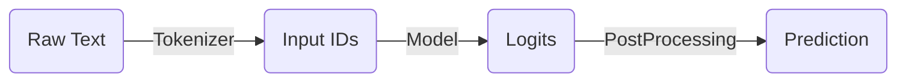

# Transformers

## 基础组件

### Pipeline

Pipline 是将数据预处理、模型调用和结果后处理三部分组装成的管线（流水线）。



Pipeline 的使用：

```python
from transformers import AutoModelForSequenceClassification, AutoTokenizer

pipe = pipeline("text-classification",model="uer/roberta-base-finetuned-dianping-chinese")

pipe("我觉得不太行")
```

Pipeline 封装的步骤包含：

- 初始化 Tokenizer

  ```python
  tokenizer = AutoTokenizer.from_pretrained("uer/roberta-base-finetuned-dianping-chinese")
  ```

- 初始化 Model

  ```python
  model = AutoModelForSequenceClassification.from_pretrained("uer/roberta-base-finetuned-dianping-chinese")
  ```

- 数据预处理

  ```python
  input_text = "我觉得不太行"
  inputs = tokenizer(input_text, return_tensor="pt")
  ```

- 模型预测

  ```python
  res = model(**inputs).logits
  ```

- 结果后处理

  ```python
  pred = torch.argmax(torch.softmax(logits, dim=-1)).item()
  outputs = model.config.id2label.get(pred)
  ```

Pipline 支持的任务类型包含：

| 名称                           | 任务类型   |
| ------------------------------ | ---------- |
| text-classification            | text       |
| token-classification           | text       |
| question-answering             | text       |
| fill-mask                      | text       |
| summarization                  | text       |
| translation                    | text       |
| text2text-generation           | text       |
| text-generation                | text       |
| conversational                 | text       |
| table-question-answering       | text       |
| zero-shot-classification       | text       |
| automatic-speech-recognition   | multimodal |
| feature-extraction             | multimodal |
| audio-classification           | audio      |
| visual-question-answering      | multimodal |
| document-question-answering    | multimodal |
| zero-shot-image-classification | multimodal |
| zero-shot-audio-classification | multimodal |
| image-classification           | image      |
| zero-shot-object-detection     | multimodal |
| video-classification           | video      |

### Tokenizer

Tokenizer 封装了数据预处理的步骤。

数据预处理过程包含：

- 分词：使用分词器对文本数据进行分词
- 构建词典：根据分词结果，构建词典映射
- 数据转换：将文本序列映射为数字序列
- 数据填充与截断：填充过短的数据，截断过长的数据，维持输入到模型的 batch 内数据维度大小一致 

### Model

[模型仓库](https://huggingface.co/models)

Transformer 架构的模型包含编码器和解码器，均由 Transformer Block 堆叠而成。Transformer Block 由多头自注意力层和 FFN 组成。编码器接收输入并构建其完整特征表示，解码器使用编码特征预测目标序列。

| 模型类型                         | 常用预训练模型                    | 适用任务                         |
| -------------------------------- | --------------------------------- | -------------------------------- |
| 编码器模型，自编码模型           | ALBERT, BERT, DistilBERT, RoBERTa | 文本分类、命名实体识别、阅读理解 |
| 解码器模型，自回归模型           | GPT, GPT-2, Bloom, LLaMA          | 文本生成                         |
| 编码器解码器模型，序列到序列模型 | BART, T5, Marian, mBART, GLM      | 文本摘要、机器翻译               |

直接调用不带 Head 的模型，输出编码结果。

```python
model = AutoModel.from_pretrianed("rbt3")
model(**input)
```

Model Head 是模型的任务头，用于将模型的编码结果进行映射，以解决不同的结果。

```python
clz_model = AutoModelForSequenceClassification("rbt3", num_labels=10)  # ForXXX后缀代表不同的任务头
clz_model(**input)
```

### Datasets

Datasets 库是一个数据集加载库，可以从本地或 HuggingFace Hub 加载数据集。[公开数据集](https://huggingface.co/datasets)

datasets 支持的功能包括：

- 加载数据集

  ```python
  from datasets import load_dataset
  
  datasets = load_dataset("madao33/new-title-chinese")     # 加载在线数据集
  boolq_dataset = load_dataset("super_glue", "boolq")      # 加载数据集集合中的某一项任务
  datasets = load_dataset("csv", data_files="./xxxx.csv")  # 加载本地数据集
  ```

- 划分数据集

  ```python
  dataset = datasets["train"]
  dataset.train_test_split(test_size=0.3)
  dataset.train_test_split(test_size=0.1, stratify_by_column="label")  # 对于分类问题，指定参数使标签均衡
  ```

- 数据清洗

  ```python
  datasets["train"].select([0, 1])  # 选取部分数据集
  filter_dataset = datasets["train"].filter(lambda example: "中国" in example["title"])  # 定义规则过滤数据集
  ```

- 数据映射

  ```python
  def add_prefix(example):
      example["title"] = 'Prefix: ' + example["title"]
      return example
  
  prefix_dataset = datasets.map(add_prefix)
  ```

- 保存和加载

  ```python
  preprocess_dataset.save_to_disk("./processed_data")  # 保存到本地
  load_dataset = load_from_disk("./processed_data")    # 从本地加载
  ```

### Evaluate

evaluate 库是一个机器学习模型评估函数库，可以加载各种任务的评估函数。[评估函数](https://huggingface.co/evaluate-metric)

使用评估函数的过程包括：

- 加载评估函数

  ```python
  import evaluate
  
  accuracy = evaluate.load("accuracy")
  ```

- 查看函数文档

  ```python
  print(accuracy.description)         # 查看函数说明
  print(accuracy.inputs_description)  # 查看输入要求
  ```

- 评估指标计算

  ```python
  # 全局计算
  score = accuracy.compute(references=[0, 1, 2, 0, 1, 2], predictions=[0, 1, 1, 2, 1, 0])
  # 迭代计算
  for ref, pred in  zip([[0, 1], [0, 1]], [[1, 0], [0, 1]]):
      accuracy.add_batch(references=ref, predictions=pred)
  accuracy.compute()
  # 多个评估指标计算
  clf_matrics = evaluate.combine(["accuracy", "f1", "recall", "precision"])
  clf_matrics.compute(references=[0, 1, 2, 0, 1, 2], predictions=[0, 1, 1, 2, 1, 0])
  ```

- 评估结果可视化

  ```python
  # evaluate 目前只支持雷达图
  from evaluate.visualization import radar_plot
  
  plot = radar_plot(data=data, model_names=model_names)
  ```

### Trainer

Trainer 封装了完整的训练、评估逻辑，并集成了多种后端，可以快捷地启动模型的单机/分布式训练。

调用 Trainer 训练的过程如下：

- 数据预处理

  ```python
  tokenizer = AutoTokenizer.from_pretrained("hfl/rbt3")
  
  def process_func(example):
      tokenized_example = tokenizer(example["review"], max_length=128, truncation=True)
      tokenized_example["labels"] = example["label"]
      return tokenized_example
  
  tokenized_datasets = datasets.map(process_func, 
                                    batched=True, 
                                    remove_columns=datasets["trian"].column_names)
  ```

- 创建模型

  ```python
  model = AutoModelForSeqenceClassification.from_pretrianed("hfl/rbt3")
  ```

- 创建评估函数

  ```python
  clf_metrics = evaluate.combine(["accuracy", "f1"])
  ```

- 设置训练参数  

  ```python
  train_args = TrainingArguments(output_dir="./checkpoints", 
                                 per_device_train_batch_size=64, 
                                 per_device_eval_batch_size=128, 
                                 learning_rate=2e-5, 
                                 weight_decay=0.01, 
                                 logging_steps=10, 
                                 evaluation_strategy="epoch", 
                                 save_strategy="epoch", 
                                 save_total_limit=3, 
                                 metric_for_best_model="f1", 
                                 load_best_model_at_end=True)
  print(train_args)  # 其它参数可以打印查看
  ```

- 创建 Trainer

  ```python
  trainer = Trainer(model=model, 
                    args=train_args, 
                    train_dataset=tokenized_datasets["train"], 
                    eval_dataset=tokenized_datasets["test"], 
                    data_collator=DataCollatorWithPadding(tokenizer=tokenizer), 
                    compute_matrics=clf_metrics)
  ```

- 启动训练

  ```python
  trainer.train()
  ```

- 模型评估

  ```python
  trainer.evaluate()                             # 默认在eval_dataset上进行评估
  trianer.evaluate(tokenized_datasets["trian"])  # 在训练集上评估
  ```

- 模型预测

  ```python
  trainer.predict(tokenized_datasets["test"])
  ```

## 模型训练

### 解决方案

基于 Transformers 的解决方案：

1. 导入相关包
2. 加载数据集 --> Datasets
3. 数据集划分 --> Datasets
4. 数据集预处理 --> Tokenizer + Datasets
5. 创建模型 --> Model
6. 设置评估函数 --> Evaluate
7. 配置训练参数 --> TrainingArguments
8. 创建训练器 --> Trainer + Data Collator
9. 模型训练、评估 --> Trainer
10. 模型推理 --> Pipeline

### 显存优化

显存占用分析：

- 模型权重：模型参数量 * 参数大小（int8、fp16、fp32）
- 优化器状态：模型参数量 * 参数大小 * 2（AdamW优化器）
- 梯度：模型参数量 * 参数大小
- 前向激活值：取决于序列长度、隐层维度、BatchSize等多个因素

显存优化思路：

1. 冻结参数微调（BitFit）
2. 低精度训练