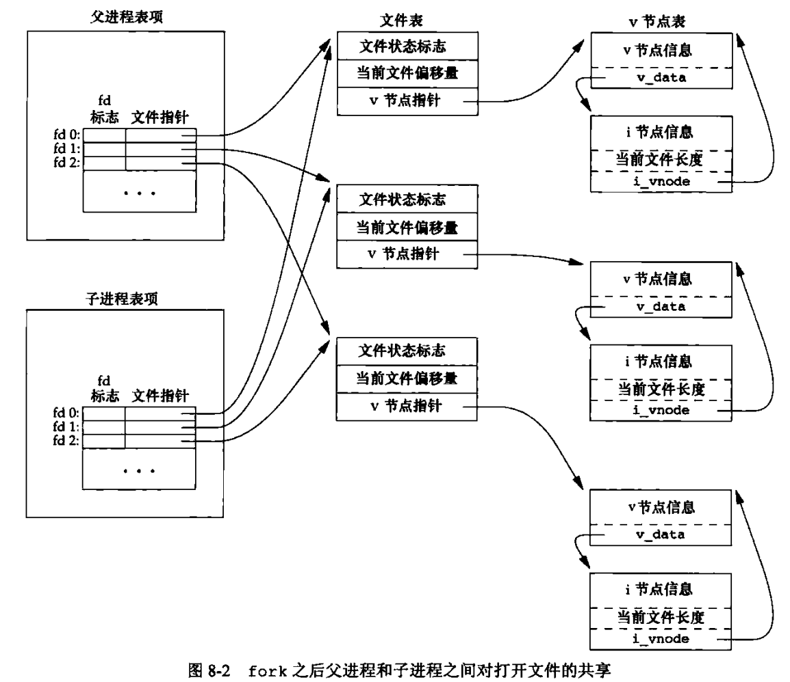
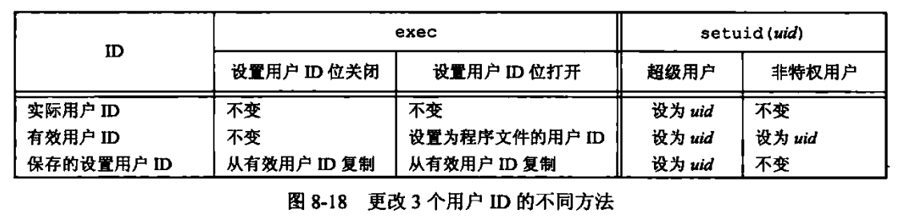

# Unix高级环境编程

## 目录

[第3章 文件IO](#第3章-文件io)  
[第4章 文件和目录](#第4章-文件和目录)  
[第5章 标准IO库](#第5章-标准io库)  
[第6章 系统数据文件和信息](#第6章-系统数据文件和信息)  
[第7章 进程环境](#第7章-进程环境)  
[第8章 进程控制](#第8章-进程控制)

## 第3章 文件IO

### 文件描述符

文件描述符fd是一个非负整数，本质上是一个索引值。当打开一个文件时，内核向进程返回一个文件描述符，IO函数对文件进行操作时，将其作为参数传入IO函数，用文件描述符来标识该文件。

### IO函数

#### 基本IO函数

打开文件  
`int open(const char *path, int aflag, .../*mode_t mode*/);`
`int openat(int fd, const char *path, int aflag, .../*mode_t mode*/);`  
创建文件  
`int creat(const char * pathname, mode_tmode);`  
关闭文件  
`int close(int fd);`  
改变偏移量  
`off_t lseek(int fildes, off_t offset, int whence);`  
读文件  
`ssize_t read(int fd, void * buf , size_t count);`  
写文件  
`ssize_t write (int fd, const void * buf, size_t count);`  

#### 文件共享

复制文件描述符  
`int dup (int oldfd);`  
`int dup2(int odlfd,int newfd);`  

#### IO同步

将修改过的数据块缓冲区放入到设备写队列  
`int sync(void);`  
将fd对应的文件数据写入磁盘  
`int fsync(int fd);`
`int fdatasync(int fd);        // 不更新文件属性`  

#### 其他函数

改变已经打开文件的属性  
`int fcntl(int fd, int cmd, ...);`
杂物箱  
`int ioctl(int fd, int request, ...);`

## 第4章 文件和目录

### 文件属性

获取文件属性stat  
`int stat(const char *restrict pathname, struct stat *restrict buf);`  
`int fstat(int fd, struct stat *buf);`  
`int lstat(const char *restrict pathname, struct stat *restrict buf);`  
`int fstatat(int fd, const char *restrict pathname, struct stat *restrict buf, int flag);`  
stat结构体定义

```cpp
struct stat {
    mode_t     st_mode;       //文件类型、模式和权限
    ino_t      st_ino;        //i节点编号
    dev_t      st_dev;        //设备号码
    dev_t      st_rdev;       //特殊设备号码
    nlink_t    st_nlink;      //文件的硬链接数
    uid_t      st_uid;        //文件所有者
    gid_t      st_gid;        //文件所有者对应的组
    off_t      st_size;       //文件长度（单位：字节）
    time_t     st_atime;      //文件最后被访问的时间
    time_t     st_mtime;      //文件最后被修改的时间
    time_t     st_ctime;      //i节点状态最后改变时间
    blksize_t  st_blksize;    //文件内容对应的块大小
    blkcnt_t   st_blocks;     //文件内容对应的块数量
};
```

#### 文件类型（包含在st_mode中）

* 普通文件
* 目录文件
* 块特殊文件
* 字符特殊文件
* FIFO
* 套接字
* 符号链接

#### 文件访问权限（包含在st_mode中）

9个访问权限位

* 用户读、写、执行
* 组读、写、执行
* 其他读、写、执行  

访问权限测试  
`int access(const char *pathname, int mode);`  
`int faccessat(int fd, const char* pathname, int mode, int flag);`  
创建屏蔽字  
`mode_t umask(mode_t cmask);`  
访问权限更改  
`int chmod(const char *pathname, mode_t mode);`  
`int fchmod(int fd, mode_t mode);`  
`int fchmodat(int fd, const char* pathname, mode_t mode, int flag);`

#### 黏着位（包含在st_mode中）

如果对目录设置了黏着位，只有满足下列条件之一的用户，才能删除或重命名此目录下的文件。

* 拥有此文件
* 拥有此目录
* 是超级用户

#### 设备号

st_dev记录文件的主、次设备号信息

* 主设备号标识设备驱动程序
* 次设备号标识特定的子设备
  
st_rdev记录字符特殊文件和块特殊文件的设备号

#### 用户ID、组ID（st_uid，st_gid）  

更改文件的用户ID和组ID  
`int chown(const char *pathname, uid_t owner, gid_t group);`  
`int fchown(int fd, uid_t owner, gid_t group);`  
`int fchownat(int fd, const char *pathname, uid_t   owner, gid_t group, int flag);`  
`int lchown(const char *pathname, uid_t owner, gid_t group);`

#### 文件长度

打开文件时将长度截断为0（指定O_TRUNC）  
`int fd = open(const char *path, O_TRUNC);`
指定长度截断文件  
`int truncate(const char *pathname, off_t length);`  
`int ftruncate(int fd, off_t length);`

#### 文件中的空洞

当设置的偏移量超过文件尾端，并写入数据后，造成文件空洞。  
空洞使文件长度增加，但是不占用磁盘空间。  

#### 文件时间

更改文件时间  
`int futimens(int fd, const struct timespec times[2]);`  
`int utimensat(int fd, const char *path, const struct timespec times[2], int flag);`  
`int utimes(const char *pathname, const struct timeval time[2]);`

### 文件系统

#### 硬链接

创建硬链接（目录项）  
`int link(const char *existingpath, const char *newpath);`  
`int linkat(int efd, const char *existingpath, int nfd, const char *newpath, int flag);`  
删除目录项  
`int unlink(const char *pathname);`  
`int unlinkat(int fd, const char *pathname, int flag);`  
重命名文件或目录  
`int rename(const char *oldname, const char *newname);`  
`int rename(int oldfd, const char *oldname, int newfd, const char *newname);`  

#### 符号链接

优点：可跨分区建立，可对目录建立  
创建符号链接  
`int symlink(const char *actualpath, const char *sympath);`  
`int symlinkat(const char *actualpath, int fd, const char *sympath);`  
读取符号链接  
`ssize_t readlink(const char *restrict pathname, char *restrict buf, size_t bufsize);`  
`ssize_t readlinkat(int fd, const char *restrict pathname, char *restrict buf, size_t bufsize);`  

### 文件目录

创建目录  
`int mkdir(const char *pathname, mode_t mode);`  
`int mkdirat(int fd, const char *pathname, mode_t mode);`  
删除空目录  
`int rmdir(const char *pathname);`  
改变当前工作目录  
`int chdir(const char *pathname);`  
`int fchdir(int fd);`  
获取工作目录的绝对路径  
`char *getcwd(char *buf, size_t size);`  
打开目录流  
`DIR *opendir(const char *pathname);`  
`DIR *fdopendir(int fd);`  
读取目录流  
`struct dirent *readdir(DIR *dp);`  
重置目录流读取位置  
`void rewinddir(DIR *dp);`  
获取目录流位置  
`long telldir(DIR *dp);`  
设置目录流位置  
`void seekdir(DIR *dp,long loc);`  
关闭目录流  
`int closedir(DIR *dp);`

## 第5章 标准IO库

### 流和FILE对象

流的定向  

```cpp
int fwide(FILE *fp, int mode);
// mode为正，指定流为宽定向
// mode为负，指定流为字节定向
// mode为0，不指定流定向，返回该流定向的值
```

标准输入、标准输出和标准错误  

```cpp
// 头文件<stdio.h>预定义了3个流
// 通过文件指针stdin, stdout, stderr加以引用
```

打开流

```cpp
#include <stdio.h>
FILE *fopen(const char *restrict pathname, const char *restrict type);
// 打开路径为pathname的文件
FILE *freopen(const char *restrict pathname, const char *restrict type, FILE *restrict fp);
// 在一个指定的流上打开一个文件
FILE *fdopen(int fd, const char *type);
// 取已有的描述符，使一个标准IO流与其相结合
```

获取文件描述符

```cpp
int fileno(FILE *fp);
```

### 读和写流

输入函数

```cpp
#include <stdio.h>
int getc(FILE *fp);
int fgetc(FILE *fp);   // getc可被实现为宏，fgetc不能
int getchar(void);     // getchar等于getc(stdin)

char *fgets(char *restrict buf, int n, FILE *restrict fp); // 读入一行到缓冲区
char *gets(char *buf)  // 弃用
```

输入结束

```cpp
#include <stdio.h>
int ferror(FILE *fp);    // 判断出错
int feof(FILE *fp);      // 判断到达尾端
void clearerr(FILE *fp); // 清除错误和EOF标志
```

输出函数

```cpp
#include <stdio.h>
int putc(int c, FILE *fp);
int fputc(int c, FILE *fp);
int putchar(int c);     // 与输入函数相同

int fputs(const char *restrict str, FILE *restrict fp); // 将一个null字节终止的字符串写入到指定的流
int puts(const char *str); // 将字符串写入到标准输出
```

二进制IO

```cpp
#include <stdio.h>
size_t fread(void *restrict ptr, size_t size, size_t nobj, FILE *restrict fp);
size_t fwrite(const void *restrict ptr, size_t size, size_t nobj, FILE *restrict fp);
// size为每个数组元素的长度，nobj为读或写的元素个数
```

### 缓冲

缓冲类型

* 全缓冲：在填满标准IO缓冲区后才进行实际IO操作
* 行缓冲：遇到换行符时才进行IO操作
* 不带缓冲：立即进行IO操作

打开或关闭缓冲

```cpp
#include <stdio.h>

void setbuf(FILE *restrict fp, char *restrict buf);
// 打开时，buf指向缓冲区；关闭时，buf设置为NULL

int setvbuf(FILE *restrict fp, char *restrict buf, int mode, size_t size);
// mode参数设置缓冲类型：
    _IOFBF     全缓冲
    _IOLBF     行缓冲
    _IONBF     不带缓冲
```

强制冲洗流

```cpp
int fflush(FILE *fp);
// 该函数使流中未写的数据被传送至内核
// 若fp设置为NULL，则冲洗所有输出流
```

### 定位流

ftell和fseek

```cpp
#include <stdio.h>
long ftell(FILE *fp);     // 返回当前文件位置
int fseek(FILE *fp, long offset, int whence);
/* whence: 
SEEK_SET： 文件开头
SEEK_CUR： 当前位置
SEEK_END： 文件结尾 */

void rewind(FILE *fp);    // 将流设置至起始位置 
```

ftello和fseeko

```cpp
#include <stdio.h>
off_t ftello(FILE *fp);
int fseeko(FILE *fp, off_t offset, int whence);
// 用off_t代替了长整型
```

fgetpos和fsetpos

```cpp
// 移植到非Unix系统的程序应使用fgetpos和fsetpos
int fgetpos(FILE *restrict fp, fpos_t *restrict pos);
int fsetpos(FILE *fp, const fpos_t pos); 
```

### 格式化IO

格式化输出

```cpp
#include <stdio.h>
int printf(const char *restrict format, ...);
int fprintf(FILE *restrict fp, const char *restrict format, ...);
int dprintf(int fd, const char *restrict format, ...);
int sprintf(char *restrict buf, const char *restrict format, ...);
int snprintf(char *restrict buf, size_t n, const char *restrict format, ...);
```

格式化输入

```cpp
#include <stdio.h>
int scanf(const char *restrict format, ...);
int fscanf(FILE *restrict fp, const char *restrict format, ...);
int sscanf(const char *restrict buf, const char *restrict format, ...);
```

### 临时文件

创建一个临时文件

```cpp
#include <stdio.h>
char *tmpnam(char *ptr);    // 返回指向唯一路径名的指针
FILE *tmpfile(void);        // 返回匿名文件指针
```

```cpp
#include <stdlib.h>
char *mkdtemp(char *template);  // 创建一个临时目录
int mkstemp(char *template);    // 创建一个临时文件
```

### 内存流

创建内存流

```cpp
#include <stdio.h>
FILE *fmemopen(void *restrict buf, size_t size, const char *restrict type);
```

```cpp
#include <stdio.h>
FILE *open_memstream(char **bufp, size_t *sizep);
```

```cpp
#include <wchar.h>
FILE *open_wmemstream(wchar_t **bufp, size_t *sizep);
```

## 第6章 系统数据文件和信息

### 口令文件

口令文件位置  
`/etc/passwd`  
口令结构

```cpp
struct passwd {
 char   *pw_name;       /* username */
 char   *pw_passwd;     /* user password */
 uid_t   pw_uid;        /* user ID */
 gid_t   pw_gid;        /* group ID */
 char   *pw_gecos;      /* real name */
 char   *pw_dir;        /* home directory */
 char   *pw_shell;      /* shell program */
};
```

查看口令文件项

```cpp
#include <pwd.h>
// 通过uid或用户名查看对应记录项
struct passwd *getpwuid(uid_t uid);
struct passwd *getpwnam(const char *name);
```

查看整个口令文件

```cpp
#include <pwd.h>
// 每次调用查看下一条记录项
struct passwd *getpwent(void);
void setpwent(void);    // 反绕文件
void endpwent(void);    // 关闭口令文件
```

阴影口令

```cpp
// 加密口令存放在阴影口令文件/etc/shadow
struct spwd {
    char *sp_namp;       /* 用户登录名 */
    char *sp_pwdp;       /* 加密口令 */
    long int sp_lstchg;  /* 上次更改口令以来的时间 */
    long int sp_min;     /* 进过多少天后可以更改 */
    long int sp_max;     /* 要求更改的剩余天数 */
    long int sp_warn;    /* 到期警告的天数 */
    long int sp_inact;   /* 账户不活动之前尚余天数 */
    long int sp_expire;  /* 账户到期天数 */
    unsigned long int sp_flag; /* 保留 */
};
```

访问阴影口令

```cpp
#include <shadow.h>
// 与访问口令函数类似
struct spwd *getspnam(const char *name);
struct spwd *getspent(void);
void setspent(void);
void endspent(void);
```

### 组文件

group结构

```cpp
#include <sys/types.h>
#include <grp.h>
struct group
{
  char *gr_name;      /* 组名 */
  char *gr_passwd;     /* 密码 */
  __gid_t gr_gid;      /* 组ID */
  char **gr_mem;      /* 组成员名单 */
}
```

访问组结构

```cpp
#include <grp.h>
struct group *getgrgid(gid_t gid);
struct group *getgrnam(const char *name);

struct group *getgrent(void);
void setgrent(void);
void endgrent(void);
```

获取组ID

```cpp
#include <unistd.h>
int getgroups(int getgidsize, gid_t grouplist[]);
// 将进程所属用户各附属组ID填入grouplist中
```

设置组ID

```cpp
#include <grp.h>
int setgroups(int ngroups, const gid_t grouplist[]);
int initgroups(const char *username, gid_t basegid);
```

### 登录记录

utmp文件记录当前登录系统的各个用户

```cpp
struct utmp
{
  char ut_line[8];     /* 设备名 */
  char ut_name[8];     /* 用户名 */
  long ut_time;
}
```

### 系统标识

返回主机和操作系统有关信息

```cpp
#include <sys/utsname.h>
int uname(struct utsname *name);
```

utsname结构

```cpp
struct utsname
{
    char sysname[];        //当前操作系统名
    char nodename[];       //网络上的名称
    char release[];        //当前发布级别
    char version[];        //当前发布版本
    char machine[];        //当前硬件体系类型
}
```

### 时间和日期

获取当前时间

```cpp
#include <time.h>
time_t time(time_t *calptr);
```

获取指定时钟的时间

```cpp
#include <sys/time.h>
int clock_gettime(clockid_t clock_id, struct timespec *tsp);
int clock_getres(clockid_t clock_id, struct timespec *tsp);  // 将timespec结构初始化为clock_id对应的精度
```

对特定的时钟设定时间

```cpp
#include <sys/time.h>
int clock_settime(clockid_t clock_id, struct timespec *tsp);
```

分解时间格式tm

```cpp
struct tm {
    int tm_sec;       /* 秒 – 取值区间为[0,59] */
    int tm_min;       /* 分 - 取值区间为[0,59] */
    int tm_hour;      /* 时 - 取值区间为[0,23] */
    int tm_mday;      /* 一个月中的日期 */
    int tm_mon;       /* 月份（0代表一月）  */
    int tm_year;      /* 年份，实际年份减去1900 */
    int tm_wday;      /* 星期 – 取值区间为[0,6] */
    int tm_yday;      /* 从每年的1月1日开始的天数 */
    int tm_isdst;     /* 夏令时标识符 */
};
```

日历时间和分解时间的转换

```cpp
#include <time.h>
struct tm *gmtime(const time_t *calptr);
struct tm *localtime(const time_t *calptr);
time_t mktime(struct tm *tmptr);
```

格式化输出时间

```cpp
#include <time.h>
size_t strftime(char *str, size_t maxsize, const char *format, const struct tm *timeptr)
size_t strftime_l(char *strDest, size_t maxsize, const char *format, const struct tm *timeptr,  locale_t locale);
```

## 第7章 进程环境

### 进程终止

正常中止  

1. 从main返回
2. 调用exit
3. 调用_exit或_Exit
4. 最后一个线程从其启动例程返回
5. 从最后一个线程调用pthread_exit  

异常终止

1. 调用abort
2. 接到一个信号
3. 最后一个线程对取消请求做出响应

#### 退出函数

3个函数用于正常终止一个程序：_exit和_Exit立刻进入内核，exit则先执行一些清理处理，然后返回内核。

```cpp
#include <stdlib.h>
void exit(int status);
void _Exit(int status);
#include <unistd.h>
void _exit(int status);
```

一个进程可以至多登记32个函数，这些函数将有exit自动调用，称为“终止处理程序”。调用atexit函数来登记这些函数。

```cpp
#include <stdlib.h>
int atexit(void (*func)(void));
```

### 命令行参数

argv[argc]是一个空指针，在循环遍历参数时可以：

```cpp
for(int i = 0; argv[i] != NULL; i++){ ... }
```

### 环境表

每个程序接收一张环境表，是一个字符指针数组。全局变量environ包含了该指针数组的地址。  
`extern char **environ;`


#### 环境变量

环境字符串的形式是：`name=value`  
应当使用getenv获取value值，而不是访问environ

```cpp
#include <stdilb.h>
char *getenv(const char *name);
```

设置环境变量

```cpp
#include <stdlib.h>
// 取name=value形式的字符串放入环境表中，若name已存在，删除其定义
int putenv(char *str);
// 将name设置成value，若rewrite非0，删除现有定义
int setenv(const char *name, const char *value, int rewrite);
// 删除name的定义
int unsetenv(const char *name);
```

### 存储空间

C程序的存储空间由下列几部分组成：

* 正文段
* 初始化程序段
* 未初始化程序段
* 栈
* 堆


#### 存储空间分配

```cpp
#include <stdlib.h>
// 分配指定字节数的存储区，该存储区的初始值不确定
void *malloc(size_t size);
// 为指定数量指定长度的对象分配空间，初始化为全0
void *calloc(size_t nobj, size_t size);
// 改变以前分配区的长度
void *realloc(void *ptr, size_t newsize);

void free(void *ptr);
```

### 跳转

goto语句不能跨越函数，执行这种类型他跳转功能的是setjmp和longjmp

```cpp
#include <setjmp.h>
int setjmp(jmp_buf env);
void longjmp(jmp_buf env, int val)
```

### 资源限制

查询和更改资源限制

```cpp
#include <sys/resource.h>
int getrlimit(int resource, struct rlimit *rlptr);
int setrlimit(int resource, const struct rlimit *rlptr);
```

资源限制结构

```cpp
struct rlimit{
    rlim_t rlim_cur;      // 软限制
    rlim_t rlim_max;      // 硬限制
}
```

在更改资源限制时，必须遵守下列规则：

* 任何一个进程都可以将软限制值更改为小于等于其硬限制值
* 任何一个进程都可以降低其硬限制值
* 只有超级用户进程可以提高其硬限制值

## 第8章 进程控制

### 进程标识

每个进程有一个非负整型表示的唯一进程ID，下列函数返回进程ID和其他标识符

```cpp
#include <unistd.h>
pid_t getpid(void);       // 调用进程ID
pid_t getppid(void);      // 调用进程的父进程ID
uid_t getuid(void);       // 调用进程的实际用户ID
uid_t geteuid(void);      // 调用进程的有效用户ID
gid_t getgid(void);       // 调用进程的实际组ID
gid_t getegid(void);      // 调用进程的有效组ID
```

### 子进程

进程可以调用fork函数创建一个子进程

```cpp
#include <unistd.h>
pid_t fork(void);
// 子进程返回0，父进程返回子进程ID
```

#### 数据空间

* 子进程是父进程的一个副本，共享正文段，但不共享数据空间、堆和栈  
* 子进程中变量的改变不影响父进程的变量的值

#### 进程文件共享

* 父进程所有的文件描述符都被复制到子进程中  
* 相同的文件描述符指向同一个文件表项  
* 父子进程共享同一个文件偏移量



#### 父子进程差异

* fork()的返回值不同
* 进程ID不同
* 父进程ID不同
* 子进程的tms_utime、tms_stime、tms_cutime和tms_ustime设置为0
* 子进程不继承父进程的文件锁
* 子进程的未处理闹钟被清除
* 子进程的未处理信号机设置为空集

#### 退出状态

父进程通过wait获取子进程状态  

* 如果所有子进程还在运行，则阻塞
* 如果一个子进程已经终止，则取得终止状态立即返回
* 如果没有任何子进程，则立即出错返回

```cpp
#include <sys/wait.h>
// 函数返回终止进程的pid，并将终止状态存放在statloc中
// 终止状态用4个宏来查看
pid_t wait(int *statloc);
pid_t waitpid(pid_t pid, int *statloc, int options);

// waitid用两个单独的参数表示要等待的子进程所属的类型
int waitid(idtype_t idtype, id_t id, siginfo_t *infop, int options);
// 另外还有wait3, wait4，提供的功能更多
```

### 进程替换

exec函数将磁盘上的新程序替换当前进程的正文段、数据段、堆段和栈段，不改变进程ID

```cpp
#include <unistd.h>
int execl(const char *pathname, const char *arg0, ...);
int execv(const char *pathname, char *const argv[]);
int execle(const char *pathname, const char *arg0, ...);
int execve(const char *pathname, char *const argv[], char *const envp[]);
int execlp(const char *filename, const char *arg0, ...);
int execvp(const char *filename, char *const argv[]);
int fexecve(int fd, char *const argv[], char *const envp[]);
// 只有execve是系统调用
// 字母p表示该函数取filename作为参数，并用PATH环境变量寻找可执行文件；字母l表示取一个参数表；字母v表示取一个argv矢量；字母e表示取一个envp数组，不使用当前环境
```


#### 解释器文件

exec函数可以执行解释器文件，其起始行的形式为：  
`! pathname [optional-argument]`  
内核使exec函数执行pathname指定的文件

### 访问控制
>
> 特权及访问控制，是基于用户ID和组ID的
>
可用setuid设置有效/实际用户ID和组ID

```cpp
#include <unistd.h>
int setuid(uid_t uid);
int setgid(gid_t gid);
```

* 如进程有超级用户特权，则将实际用户ID、有效用户ID及保存的设置用户ID设置成uid
* 若用户没有超级用户特权，但uid等于实际用户ID或保存的设置用户ID，则只能更改有效用户ID
* 若上面两个条件都不满足，则errno设置为EPERM，返回-1


seteuid和setupid只更改有效用户ID和有效组ID

```cpp
#include <unistd.h>
int seteuid(uid_t uid);
int setepid(pid_t pid);
```

* 非特权用户可将其有效用户ID设置为实际用户ID和保存的设置用户ID
* 特权用户可将有效用户ID设置为uid

getlogin函数获取登录名

```cpp
#include <nnistd.h>
char *getlogin(void);
```

### shell命令

system函数执行一个命令字符串

```cpp
#include <stdlib.h>
int system(const char *cmdstring);
```

system函数的实现调用了fork, exec和waitpid，有3个返回值：

* 当fork失败或waitpid返回EINTR之外的出错，返回-1
* 当exec失败（表示不能执行shell），返回值如shell执行exit(127)
* 当3个函数都返回成功，返回shell的终止状态

### 进程会计

超级用户启动一个带路径名参数的accton命令启用和禁用进程会计。启用进程会计选项后，每当进程结束时会计就写一个会计记录，会计记录的结构如下：

```cpp
struct acct
{
  char ac_flag;          /* Flags. */
  u_int16_t ac_uid;      /* Real user ID. */
  u_int16_t ac_gid;      /* Real group ID. */
  u_int16_t ac_tty;      /* Controlling terminal. */
  u_int32_t ac_btime;    /* Beginning time. */
  comp_t ac_utime;       /* User time. */
  comp_t ac_stime;       /* System time. */
  comp_t ac_etime;       /* Elapsed time. */
  comp_t ac_mem;         /* Average memory usage. */
  comp_t ac_io;          /* Chars transferred. */
  comp_t ac_rw;          /* Blocks read or written.*/
  char ac_comm[8];       /* command name */
};
```

### 进程调度
>
> 进程可以通过nice值选择以更低优先级运行，ncie值越小，优先级越高，只有特权进程允许提高调度权限
>
进程可以通过nice函数获取和更改nice值

```cpp
#include <unistd.h>
int nice(int incr);
// 返回新的nice值
```

getpriority可以获取一组相关进程的nice值

```cpp
#include <unistd.h>
int getpriority(int which, id_t who);
```

setpriority可为进程、进程组和所有属于特定用户ID的进程设置优先级

```cpp
#include <unistd.h>
int setpriority(int which, id_t who, int value);
```

### 进程时间

可用times函数获取3个时间：墙钟时间、用户cpu时间和系统cpu时间

```cpp
#include <sys/times.h>
clock_t times(struct tms *buf);
// 函数返回墙钟时间
```

tms结构如下：

```cpp
struct tms{
  clock_t tms_utime;     // 用户CPU时间
  clock_t tms_stime;     // 系统CPU时间
  clock_t tms_cutime;    // 终止的子进程，用户CPU时间
  clock_t tms_cstime;    // 终止的子进程，系统CPU时间
}；
```
