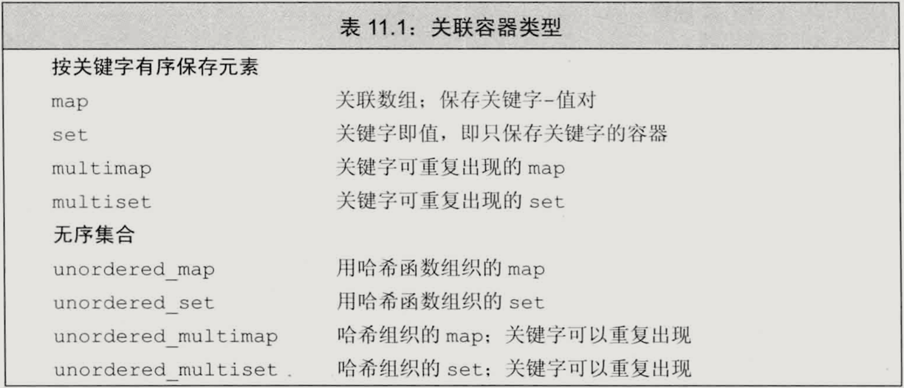

# 第11章 关联容器
两个主要的关联容器类型是`map`和`set`：`map`中的元素是键值对，关键字起到索引的作用；`set`中的元素只包含一个关键字，可以高效查询一个关键字是否在`set`中。
## 关联容器类型

无序容器不使用比较运算符来组织元素，而是对关键字使用哈希函数来组织。无序容器提供了与有序容器相同的操作。
## 关联容器操作
### pair类型
一个pair类型对象保存两个数据成员，分别命名为`first`和`second`。
```
pair<T1, T2> p = {v1, v2};
std::cout << p.first << p.second;
```
定义当`first`和`second`成员分别相等时，两个`pair`相等。
```
p1 == p2;
p1 != p2;
```
### 元素类型
对于`set`类型，`key_type`和`value_type`是一样的；在`map`中，每个元素是一个`pair`对象。
```
// 对于map<string, int>
// map<string, int>::key_type是string类型
// map<string, int>::value_type是pair<const string, int>类型
```
### 迭代器
`map`类型的迭代器是一个类型为`pair`的引用：
```
auto map_it = m.begin();
std::cout<< map.it->first;  // 可以获取元素
map_it++;                   // 可以通过迭代器改变元素
```
### 添加元素
向`map`中插入一个`pair`类型的元素：
```
// 向map中插入pair的四种方法
map<string, int> m;
m.insert({"word", 1});
m.insert(make_pair("word", 1));
m.insert(pair<string, int>("word", 1));
m.insert(map<string, int>::value_type("word", 1));
```
或用下标操作添加元素：
```
m["apple"] = 6;
```
### 删除元素
关联容器提供`erase`操作：
1. 接受`key_type`类型的元素k，删除所有关键字为k的元素，返回实际删除的元素数量。
2. 接受一个迭代器p，删除迭代器指定的元素，返回指向p之后的迭代器。
3. 接受两个迭代器p和e，删除p和e之间的所有元素，返回迭代器e。
### 访问元素
1. `find`操作返回一个迭代器：若找到，返回指向指定key的迭代器；否则，返回m.end()。
2. `count`操作返回容器内该关键字数量。
3. 下标操作`m[k]`返回关键字为k的元素；若k不在容器中，添加一个关键字为k的元素并初始化。