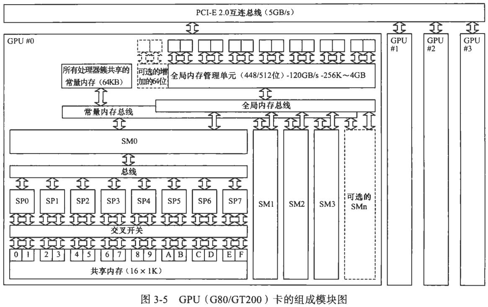

# CUDA 并行程序设计-GPU 编程指南

## 目录

[第 3 章 CUDA 硬件概述](#第-3-章-cuda-硬件概述)  
[第 6 章 CUDA 内存处理](#第-6-章-cuda-内存处理)  
[第 8 章 多 CPU 和多 GPU 解决方案](#第-8-章-多-cpu-和多-gpu-解决方案)  
[第 9 章 应用程序性能优化](#第-9-章-应用程序性能优化)

## 第 3 章 CUDA 硬件概述

GPU的硬件有以下几个关键模块组成：

* 内存
* 流处理器簇
* 流处理器

GPU实际上是一个SM阵列，每个SM有N个SP。

## 第 6 章 CUDA 内存处理

## 第 8 章 多 CPU 和多 GPU 解决方案

## 第 9 章 应用程序性能优化
