# 计算机视觉

## 目录

[图像分类](#图像分类)  
[目标检测](#目标检测)  
[图像描述](#图像描述)  
[图像生成](#图像生成)  
[NLP](#nlp)  
[CS231n](#cs231n)

## 图像分类

图像分类：从已知的类别标签中为给定的输入图像选定一个类别标签。

数据驱动的图像分类方法：

1. 数据集构建
2. 分类器设计与学习\*  
   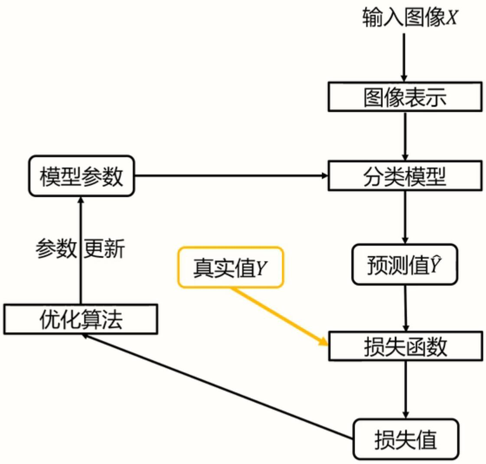
3. 分类器决策  
   

### 数据集划分和预处理

#### 数据集划分

所有带标签数据（数据集）划分为训练集、验证集和测试集。

-   训练集用于给定的超参数时分类器参数的学习；
-   验证集用于选择超参数；
-   测试集评估泛化能力；

**K 折交叉验证**

如果数据很少，那么验证集包含的样本可能会太少，从而无法在统计上代表数据。可以使用 K 折交叉验证。

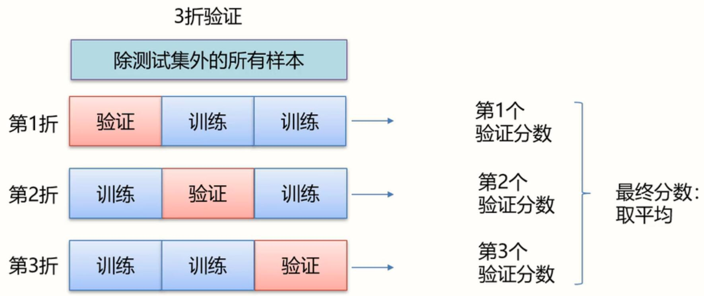

_每次取验证集之前可以打乱全部数据，称为带有打乱数据的重复 K 折验证。_

#### 数据预处理

**去均值**

去均值是指从数据集中每个数据点中减去该数据集的均值，使得处理后的数据均值为 0。它的主要目的是消除数据的偏移量（bias），使数据围绕零分布。

**归一化**

归一化是指将数据缩放到一个特定的范围，一般是 [0, 1] 或 [-1, 1]。其主要目的是消除不同特征之间的量级差异，使所有特征具有相同的尺度。

**去相关**

去相关是指通过线性变换，将一组随机变量转换成一组不相关的随机变量。去相关的主要目的是消除不同特征之间的线性相关性，从而使得特征之间变得独立。

_如果有大量数据在某一个维度上接近，那么去相关能起到降维的作用。_

**白化**

白化是指对一组随机变量进行线性变换，使得变换后的数据既去均值又去相关，同时每个特征的方差为 1。白化后的数据称为“白噪声”，它的协方差矩阵是单位矩阵。

### 线性分类器

线性分类器是一种线性映射，将输入的图像特征映射为类别分数。通过层级结构（神经网络）或者高位映射（支撑向量机）可以形成功能强大的非线性模型。


决策过程


_权值向量$w_i$可以被看作一种模板，输入图像与评估模板的匹配程度越高，分类器输出的分数就越高。_

_从几何角度看，分数等于 0 的线就是决策面，落在不同决策面内的向量被分为不同类。_

#### 支撑向量机损失

损失函数的一般定义：

$$
L = \frac{1}{N} \sum_{i} L_i \left( f(x_i, W), y_i \right)
$$

损失函数是一个函数，用于度量给定分类器的预测值与真实值的不一致程度，其输出通常是一个非负实值。

其输出的非负实值可以作为反馈信号来对分类器参数进行调整，以降低当前示例对应的损失值，提升分类器的分类效果。

**多类支撑向量机损失**


_正确类别的得分比不正确类别的得分高出 1 分，就没有损失；否则就会产生损失。_

**正则项与超参数**

正则项损失：正则项让损失函数对权值有一定的偏好。

$$
L(W) = \frac{1}{N} \sum_{i} L_i \left( f(x_i, W), y_i \right) + \lambda \textcolor{red}{R(W)}
$$

_R(W)为正则项，是一个与权值有关，跟图像数据无关的函数；λ 为超参数，是在开始学习过程之前设置值的参数。_

L2 正则项：

$$
R(W) = \sum_k \sum_l W_{k,l}^2
$$

_L2 正则损失对大数值权值进行惩罚，鼓励分类器将所有维度的特征都用起来，而不是依赖其中少数几维特征。_

#### 梯度下降优化算法

损失函数 L 是一个与参数 W 有关的函数，优化的目标是找到使损失函数 L 达到最优的参数 W。

优化目标：

$$
\frac{\partial L}{\partial W} = 0
$$

**梯度下降**：利用所有样本计算损失并更新梯度。

```
while true
    权值的梯度 ← 计算梯度(损失, 训练样本, 权值)
    权值 ← 权值 – 学习率 * 权值的梯度
```

解析法计算梯度：

例如：找出函数 $L(w) = w^2$ 在 w=1 时的导数并计算其值。

$∇L(w) = 2w$

$∇_{w=1}L(w) = 2$

_当样本量很大时，权值的梯度计算量很大。为了减少计算量，可以采取随机梯度下降或小批量梯度下降。_

**随机梯度下降**：每次随机选择一个样本，计算损失并更新梯度。

```
while true
    数据 ← 从训练数据采样(训练数据,1)
    权值的梯度 ← 计算梯度(损失, 训练样本, 权值)
    权值 ← 权值 – 学习率 * 权值的梯度
```

**小批量梯度下降**：

```
while true
    数据 ← 从训练数据采样(训练数据,批量大小)
    权值的梯度 ← 计算梯度(损失, 训练样本, 权值)
    权值 ← 权值 – 学习率 * 权值的梯度
```

术语：

-   iteration：表示 1 次迭代，每次迭代更新 1 次网络结构的参数；
-   batch-size：1 次迭代所使用的样本量；
-   epoch：1 个 epoch 表示过了 1 遍训练集中的所有样本。

### 全连接神经网络

全连接神经网络（也叫多层感知机）级联多个变换（线性分类器）来实现输入到输出的映射。可以解决线性不可分问题。

全连接神经网络组成：一个输入层、一个输出层及多个隐层；

两层全连接网络：


（隐层）神经元个数越多、（隐层）层数越多，分界面就可以越复杂，在训练集上的分类能力就越强；但是过拟合风险增加。

#### 激活函数

激活函数作用于每个神经元。如果缺少激活函数，全连接神经网络将退化成一个线性分类器。

部分激活函数：

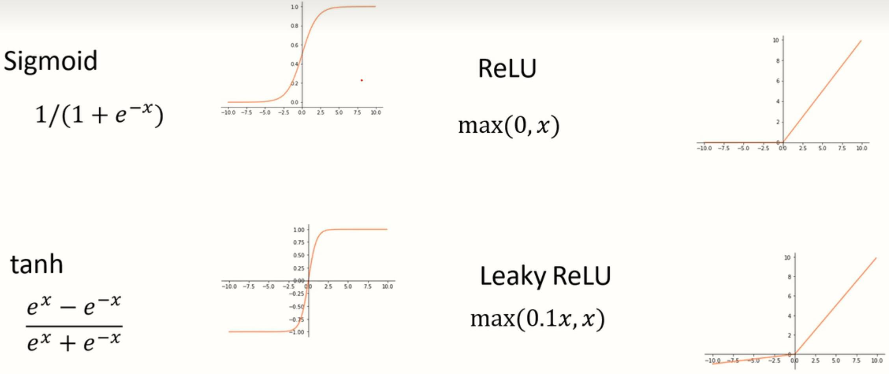

激活函数可以分为两大类：

1. 饱和激活函数：当 x 趋近无穷时，导数趋近于 0；
2. 非饱和激活函数：不满足以上条件的激活函数。

相对于饱和激活函数，使用非饱和激活函数的优势在于两点：

1. 非饱和激活函数能解决深度神经网络（层数非常多）带来的梯度消失问题；
2. 使用非饱和激活函数能加快收敛速度。

[pytorch 提供的激活函数](https://pytorch.org/docs/stable/nn.html#non-linear-activations-weighted-sum-nonlinearity)

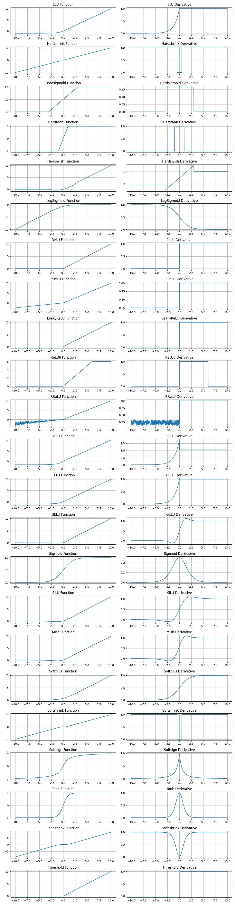

#### 交叉熵损失

利用 SOFTMAX 函数可以输出分类器预测分布，再利用交叉熵损失可以度量预测分布与真实分布的不相似性。

**SOFTMAX**

$Softmax(x_i) = \frac{exp(x_i)}{\sum_j exp(x_j)}$


**交叉熵损失**

交叉熵：$H(p, q) = -\sum_i p(x_i) \log q(x_i)$

真实分布为 one-hot 形式（一个位置为 1，其他全为 0）时，交叉熵损失简化为：$L_i = - \log q_j$ ，其中 j 为真实类别。

#### 计算图与反向传播

任意复杂的函数，都可以用**计算图**的形式表示。

在整个计算图中，每个门单元都会得到一些输入，然后，进行下面两个计算：

1. 这个门的输出值
2. 其输出值关于输入值的局部梯度。

利用链式法则，门单元应该将回传的梯度乘以它对其的输入的局部梯度，从而得到整个网络的输出对该门单元的每个输入值的梯度。

链式法则的乘法特性会导致**梯度爆炸**和**梯度消失**。

解决方案：限制学习率在某个较小的区间防止步长过大；尽量选择 ReLU，相对于 Sigmoid/tanh，ReLU 函数或者 Leakly ReLU 函数的梯度不为 0。

#### 梯度算法改进

**动量法**：利用累加历史梯度信息更新梯度，减少震荡，加速通往谷低。

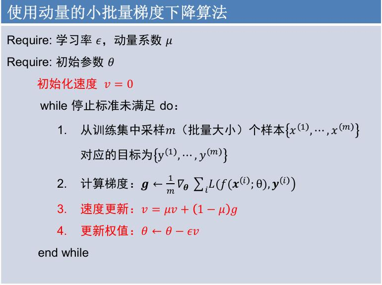

由于动量的存在，算法可以冲出局部最小点以及鞍点，找到更优的解。

**自适应梯度法**：自适应梯度法通过减小震荡方向步长，增大平坦方向步长来减小震荡，加速通往谷底方向。RMSProp 方法是一种自适应梯度方法：

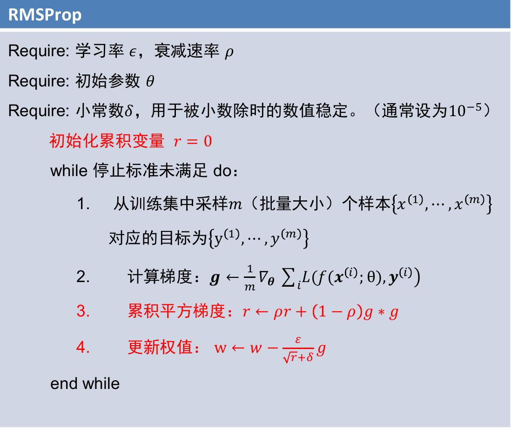

**Adam** 算法结合了动量和自适应梯度的思想：


### 训练过程

#### 权值初始化

**随机权值初始化**：权值采样自 N(0, k)高斯分布。当 k 太小时，输入信息无法传播到输出层；当 k 太大时，神经元饱和，局部梯度为 0，无法更新。有效的初始化方法应该使网络各层的激活值和局部梯度的方差在传播过程中尽量保持一致（N(0, 1)），以保持网络中正向和反向数据流动。

**Xavier 初始化**：权值采样自 N(0, 1/N)高斯分布。

**HE 初始化(MSRA)**：权值采样自 N(0, 2/N)高斯分布。

总结：

1. 好的初始化方法可以防止前向传播过程中的信息消失，也可以解决反向传递过程中的梯度消失。
2. 激活函数选择双曲正切或者 Sigmoid 时，建议使用 Xaizer 初始化方法；
3. 激活函数选择 ReLU 或 LeaklyReLU 时，推荐使用 He 初始化方法。

#### 批归一化

为了使每一层神经元的输出保持均值和方差相等，可以在全连接层和非线性激活之间插入一个**批归一化**操作（减均值除方差），保证每一层的输出均值为 0，方差为 1。再通过平移缩放决定数据分布的均值与方差。

_注意：均值和方差参数应该根据不同网络进行学习。_

#### 过拟合与欠拟合

欠拟合：模型描述能力太弱，以至于不能很好地学习到数据中的规律。产生欠拟合的原因通常是模型过于简单。

**过拟合**：学习时选择的模型所包含的参数过多，以至于出现这一模型对已知数据预测的很好，但对未知数据预测得很差的现象。这种情况下模型可能只是记住了训练集数据，而不是学习到了数据特征。


训练初期：优化和泛化是正相关的。训练集上的误差越小，验证集上的误差也越小，模型的泛化能力逐渐增强；  
训练后期：模型在验证集上的错误率不再降低，转而开始变高。模型出现过拟合，开始学习仅和训练数据有关的模式。

应对过拟合：

最优方案——获取更多的训练数据（困难）。

次优方案——调节模型允许存储的信息量或者对模型允许存储的信息加以约束。

1. 调节模型大小
2. 约束模型权重，即权重正则化（L1、L2 正则化）
3. 随机失活（Dropout）

**L2 正则化**：对于大数值的权值向量进行惩罚，鼓励更加分散的权重向量。

$$
L(W) = \frac{1}{N} \sum_{i} L_i \left( f(x_i, W), y_i \right) + \lambda \textcolor{red}{R(W)}
$$

$$
\text{L2 正则项：} R(W) = \sum_{k} \sum_{l} W_{k,l}^2
$$

**随机失活**：让隐层的神经元以一定的概率（随机失活比率）不被激活。

1. 随机失活使得每次更新梯度时参与计算的网络参数减少了，降低了模型容量，所以能防止过拟合。
2. 随机失活鼓励权重分散，从这个角度来看随机失活也能起到正则化的作用，进而防止过拟合。
3. Dropout 可以看作多个小网络的集成。

#### 神经网络中的超参数

超参数：

-   网络结构：隐层神经元个数，网络层数，非线性单元选择等。
-   优化相关：学习率，Dropout 比率，正则项强度等。

**超参数优化方法**

网格搜索法：

1. 每个超参数分别取几个值，组合这些超参数值，形成多组超参数；
2. 在验证集上评估每组超参数的模型性能；
3. 选择性能最优的模型所采用的那组值作为最终的超参数的值。

随机搜索法（更优）：

1. 参数空间内随机取点，每个点对应一组超参数；
2. 在验证集上评估每组超参数的模型性能；
3. 选择性能最优的模型所采用的那组值作为最终的超参数的值。


**超参数搜索策略**

基于随机搜索法，由粗到精，缩小搜索范围：

1. 粗搜索：利用随机法在较大范围里采样超参数，训练一个周期，依据验证集正确率缩小超参数范围。
2. 精搜索：利用随机法在前述缩小的范围内采样超参数，运行模型五到十个周期，选择验证集上精度最高的那组超参数。

**超参数的标尺空间**

对于学习率、正则项强度这类超参数，在对数空间上进行随机采样更合适。

### 卷积神经网络

卷积神经网络的组成：

-   卷积层（CONV）
-   激活层（RELU）
-   池化层（POOL）
-   全连接层（FC）

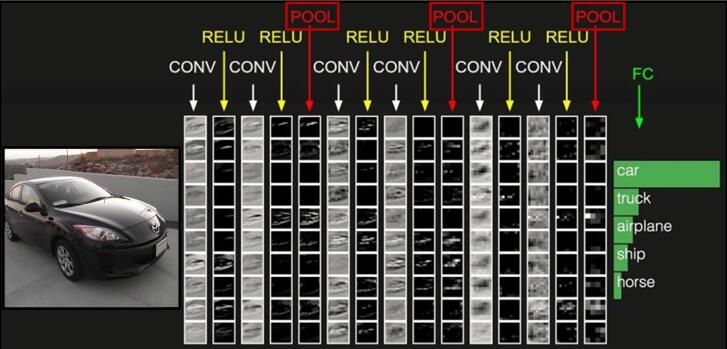

#### 卷积与噪声

令 𝐹 为图像，𝐻 为卷积核（模板），𝐹 与 𝐻 的卷积记为 𝑅 = 𝐹 ∗ H

$$
R_{ij} = \sum_{u,v} H_{i-u,j-v} F_{u,v}
$$

卷积的性质：

-   叠加性：$filter(f_1+f_2) = filter(f_1)+filter(f_2)$
-   平移不变性：$filter(shift(f))=shift(filter(f))$
-   交换律：$a*b=b*a$
-   结合律：$a*(b*c)=(a*b)*c$
-   分配律：$a*(b+c)=(a*b)+(a*c)$
-   标量：$ka*b=a*kb=k(a*b)$

卷积操作后的图像要小于输入时图像，通过**边界填充**，我们可以实现卷积前后图像的尺寸不变；

噪声：

-   椒盐噪声：黑色像素和白色像素随机出现。
-   脉冲噪声：白色像素随机出现。
-   高斯噪声：噪声强度变化服从高斯分布（正态分布）。

_对于前两者建议使用中值滤波器，对于高斯噪声可以使用高斯卷积核来进行去噪。_

**中值滤波器**：对卷积核区域数值进行排序，用中值替换原图像像素点。（非线性滤波器）

**高斯卷积核**：根据邻域像素与中心的远近程度分配权重。（线性滤波器）

1. 确定卷积核的尺寸，比如 5×5（尺寸越大越平滑）
2. 设置高斯函数的标准差，比如 σ=1（σ 越大越平滑）  
   $G_{\sigma} = \frac{1}{2\pi\sigma^2} e^{-\frac{x^2 + y^2}{2\sigma^2}}$
3. 计算卷积核各个位置权重值
4. 对权重进行归一化

_经验法则：将卷积核的半窗宽度设置为 3σ，最终模板尺寸为 2×3σ+1。_

#### 边缘提取

边缘：图像中亮度明显而急剧变化的点。

边缘提取的目的：

-   编码图像中的语义与形状信息
-   相对于像素表示，边缘表示更加紧凑

边缘的种类：

-   表面法向不连续
-   深度不连续
-   表面颜色不连续
-   光照不连续

梯度指向图像灰度变换最快的方向，用**梯度的模**可以显示图像的边缘。

$$
||∇f|| = \sqrt{(\frac{∂f}{∂x})^2 + (\frac{∂f}{∂y})^2}
$$

**高斯一阶偏导卷积核**：对高斯卷积核求一阶偏导，可以选择图像关注的（垂直、水平方向）边缘。

$$
\frac{d}{dx} (f \cdot g) = f \cdot \frac{d}{dx} g
$$

_高斯卷积核的方差小，关注细粒度的边缘；方差大，关注粗粒度的边缘。_

**Canny 边缘检测器**：

1. 用高斯一阶偏导核卷积图像
2. 计算每个点的梯度幅值和方向
3. 非极大值抑制：将宽的“边缘”细化至单个像素宽度
4. 连接与阈值（去噪）：定义高和低两个阈值，使用高阈值开始边缘曲线，使用低阈值继续边缘曲线

#### 纹理表示

基于**卷积核组**的纹理表示：利用卷积核组提取图像中的纹理基；利用基元的统计信息来表示图像中的纹理。

1. 设计卷积核组；
2. 利用卷积核组对图像进行卷积操作获得对应的特征响应图组；
3. 利用特征响应图的某种统计信息来表示图像中的纹理。

_忽略基元位置，关注出现了哪种基元对应的纹理以及基元出现的频率。_

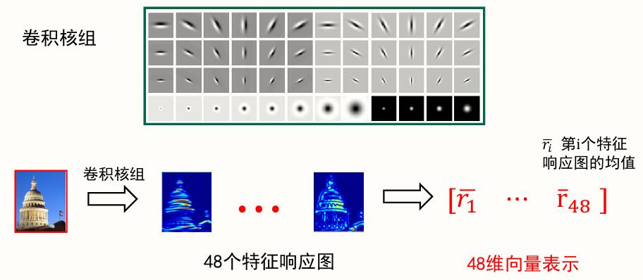

#### 卷积层

全连接神经网络的隐层神经元和上层每一个参数连接，当图像直接利用原始像素展开为列向量时，参数过多。运用基于卷积核组的纹理表示，就能提取图像特征，减少全连接层的输入参数。

卷积网络中的卷积操作：

$$
W^T x + b
$$

1. 将卷积核展成一个 5x5x3 的向量，同时将其覆盖的图像区域按相同的展开方式展成 5x5x3 的向量；
2. 计算两者的点乘；
3. 在点乘的结果上加上偏移量，得到一个实数；
4. 对图像所有区域进行卷积，得到特征响应图；
5. 对每一个卷积核重复 1~4，得到特征相应图组。


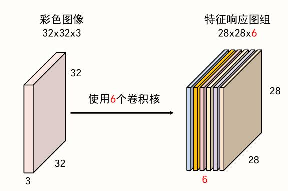

-   特征响应图组深度等于卷积核的个数；
-   不同的特征响应图反映了输入图像对不同卷积核的响应结果；
-   同一特征响应图上不同位置的值表示输入图像上不同位置对同一卷积核的响应结果。

给定输入数据矩阵时，影响输出的**特征图组尺寸**大小的因素：

1. 卷积核的宽、高；
2. 是否采用边界填充操作；
3. 卷积步长；
4. 该层的卷积核个数。

卷积神经网络中，卷积核可以按照指定的间隔进行卷积操作，这个间隔就是**卷积步长**。

输入数据矩阵尺寸： W1×H1×D1  
输出特征图组尺寸： W2×H2×D2  
卷积层的 4 个超参数：卷积层尺寸 F，卷积步长 S，零填充数量 P，卷积核个数 K  
特征图组尺寸计算如下：

$$
W2=(W1-F+2P)/S+1\\
H2=(H2-F+2P)/S+1\\
D2=K
$$

#### 池化层

池化的作用：对每一个特征响应图独立进行，降低特征响应图组中每个特征响应图的宽度和高度，减少后续卷积层的参数的数量，降低计算资源耗费，进而控制过拟合。

池化操作：对特征响应图某个区域进行池化就是在该区域上指定一个值来代表整个区域。

常见的池化操作：

-   最大池化：使用区域内的最大值来代表这个区域；
-   平均池化：采用区域内所有值的均值作为代表。

池化层的超参数：池化窗口和池化步长。


#### 损失函数&优化算法

损失函数：交叉熵损失

优化算法：SGD、带动量的 SGD 以及 ADAM

#### 样本增强

数据增强：从现有的训练样本中生成更多的训练数据，利用多种能够生成可信图像的随机变换来增加样本。

-   随机缩放&抠图
-   色彩抖动
-   其他方案：平移、旋转、拉伸、径向畸变、裁剪……

### 经典网络解析

#### AlexNet

主要贡献：

1. 提出了一种卷积层加全连接层的卷积神经网络结构；
2. 首次使用 ReLU 函数做为神经网络的激活函数；
3. 首次提出 Dropout 正则化来控制过拟合；
4. 使用加入动量的小批量梯度下降算法加速了训练过程的收敛；
5. 使用数据增强策略极大地抑制了训练过程的过拟合；
6. 利用了 GPU 的并行计算能力，加速了网络的训练与推断。

结构：AlexNet 共 8 层，包含 5 个卷积层（CONV）和 3 个全连接层（FC）

_层数统计说明：计算网络层数时仅统计卷积层和全连接层。_

-   CONV1：96 个 11×11×n 卷积核，步长为 4，没有零填充，得到 96 个特征图，每个元素经过 ReLU 函数输出；
-   MAX POOL1：窗口大小 3×3，步长为 2，降低特征图尺寸；
-   NORM1：局部响应归一化层（弃用）；
-   CONV2：256 个 5×5×96 卷积核，步长为 1，使用零填充 p=2，增大感受野；
-   MAX POOL2
-   NORM2
-   CONV3：384 个 3×3×256 卷积核，步长为 1，使用零填充 p=1；
-   CONV4：384 个 3×3×384 卷积核，步长为 1，使用零填充 p=1；
-   CONV5：256 个 3×3×384 卷积核，步长为 1，使用零填充 p=1；
-   MAX POOL3
-   FC6：将 6×6×256 特征响应图组转为列向量，输入 9216 维向量；
-   FC7
-   FC8

_重要说明：用于提取图像特征的卷积层以及用于分类的全连接层是同时学习的；卷积层与全连接层在学习过程中会相互影响、相互促进。_

重要技巧：

1. Dropout 策略防止过拟合；
2. 使用加入动量的随机梯度下降算法，加速收敛；
3. 验证集损失不下降时，手动降低 10 倍的学习率；
4. 采用样本增强策略增加训练样本数量，防止过拟合；
5. 集成多个模型，进一步提高精度。

#### ZFNet

与 AlexNet 网络结构基本一致，主要改进：

1. 将第一个卷积核大小改成了 7×7；
2. 将第二、第三个卷积层的步长设置为 2；
3. 增加了第三、第四个卷积层的卷积核个数。

#### VGG

主要贡献：

1. 使用尺寸更小的 3×3 卷积核串联来获得更大的感受野；
2. 深度更深，非线性更强，网络参数更少；
3. 去掉了 AlexNet 中的局部响应归一化（LRN）层。

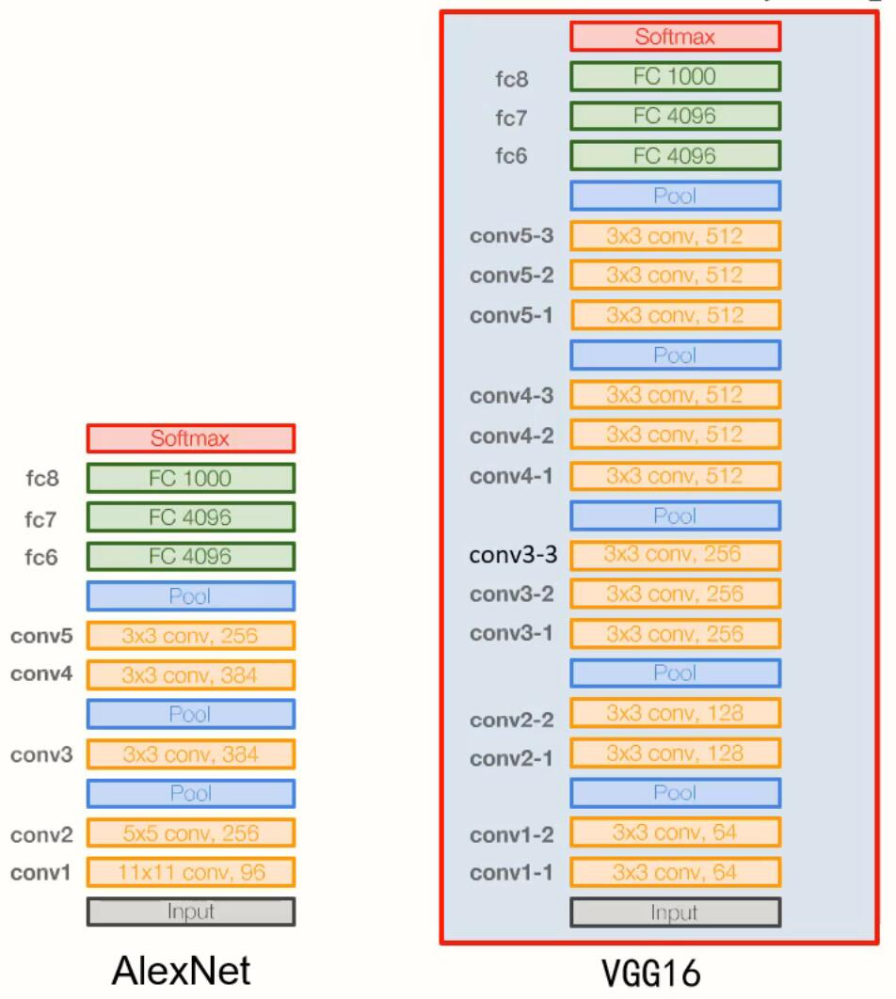

VGG16：

-   13 个卷积层与 3 个全连接层；
-   分为 5 段，每一段中卷积层的卷积核个数均相同；
-   所有卷积层均采用 3×3 的卷积核及 ReLU 激活函数；
-   池化层均采用最大池化，窗口大小 2×2，步长为 2；
-   经过一次池化操作，卷积层的卷积核个数就增加一倍；
-   全连接层也使用了 Dropout 策略。

#### GoogleNet

主要贡献：

1. 提出了一种 Incepetion 结构，保留输入信号中的更多特征信息；
2. 去掉了 AlexNet 的前两个全连接层，并采用了平均池化；
3. 引入了辅助分类器，克服了梯度消失问题。

串联结构（如 VGG）存在的问题——后面的卷积层只能处理前层输出的特征图，若前层丢失重要信息，后层无法找回。Incerption 模块增加了卷积层的宽度，保留了更多特征：

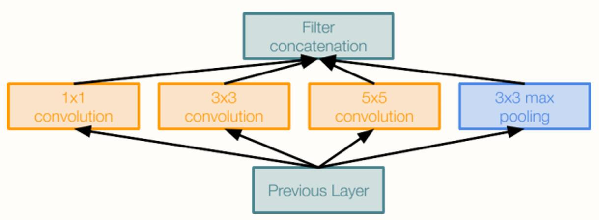

_GoogleNet 堆叠了 9 个 Incerption 模块。_

VGG 的第一个全连接层参数占了整个网络 74%的参数，需 dropout 策略应对过拟合。GoogLeNet 采用平均池化，对每一个特征图取平均值，全连接层输入参数等于特征图数量，参数总量不到 500 万，无须使用 Dropout 策略。另外，平均池化丢失了语义结构的空间位置信息，有助于提升卷积层提取到特征的平移不变性。


#### ResNet

主要贡献：

1. 提出了一种残差模块，通过堆叠残差模块可以构建任意深度的神经网络，而不会出现“退化”现象；
2. 提出了批归一化方法来对抗梯度消失，该方法降低了网络训练过程对于权重初始化的依赖；

**残差模块**

假设卷积层学习的变换为 𝐹(𝑋)，残差结构的输出是 𝐻(𝑋)，则有：  
𝐻(𝑋) = 𝐹(𝑋) + 𝑋  
𝐹(𝑋) = 𝐻(𝑋) - 𝑋

_F(X)是输出和输入的差，因此称为残差。_

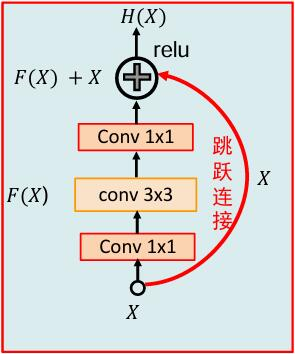

1. 残差结构能够避免普通的卷积层堆叠存在信息丢失问题，保证前向信息流的顺畅。
2. 残差结构能够应对梯度反传过程中的梯度消失问题，保证反向梯度流的通顺。

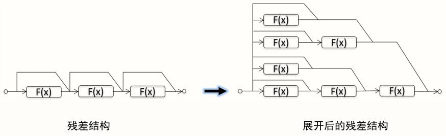

_残差网络可以看作是一种集成模型。_

#### 小结

-   介绍了 5 种经典的卷积神经网络 AlexNet、ZFNet、VGG、GoogLeNet 和 ResNet；
-   残差网络和 Inception V4 是公认的推广性能最好的两个分类模型；
-   特殊应用环境下的模型：面向有限存储资源的 SqueezeNet 以及面向有限计算资源的 MobileNet 和 ShuffleNet

## 目标检测

### 语义分割

语义分割思路：

-   滑动窗口：将图像划分为多个窗口，利用 CNN 对中心点像素分类。
-   全卷积：让整个网络只包含卷积层，并在网络中嵌入“下采样”和“上采样”，一次性输出所有像素的类别预测。

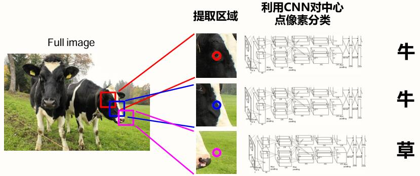
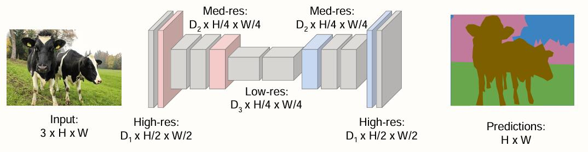

#### 上采样

反池化操作：反池化（UnPooling）、反最大池化（Max Unpooling）

可学习的上采样: **转置卷积**


### 单目标（分类+定位）

1. 建立并训练图像分类模型；
2. 添加边界盒任务；
3. 使用多任务损失进行训练。

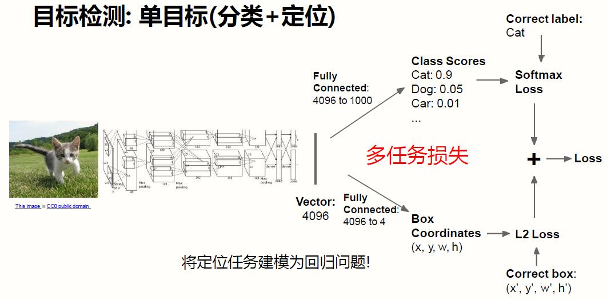

### 多目标

#### R-CNN

_区域建议（Selective Search）：找出所有潜在可能包含目标的区域。_

1. 用 Selective Search 产生感兴趣区域；
2. 对区域进行缩放；
3. 将图像区域送入卷积网络进行特征提取；
4. 使用支持向量机对区域进行分类。


_问题：卷积计算次数多，计算速度慢。_

#### Fast R-CNN

1. 利用卷积网络对全图提取特征；
2. 对特征图产生感兴趣区域；
3. 裁剪、缩放特征；
4. 区域分类网络（FCs）；
5. 目标类别 + 边界框偏差。


**区域裁剪**

Rol Pool：将候选区域投影到特征图上，进行规整操作，再将其粗略分成相等的 7×7 个子区域，对每个子区域进行最大池化。保证处理后的所有区域特征尺寸都是相同的。

Rol Align：将候选区域投影到特征图上，不进行规整操作，用四个点对齐区域，对每个子区域进行最大池化。

#### Faster R-CNN

问题：Selective Search 消耗大量时间，远超过分类的时间。

解决方案：基于 Fast R-CNN 增加区域建议网络层（Region Proposal Network）。

1. 用 3×3 的 n 个卷积核对图像进行卷积；
2. 对特征图的每个位置（锚点区域）进行分类（是/不是目标）；

四种损失联合训练：

1. RPN 分类损失（目标/非目标）；
2. RPN 边界框坐标回归损失；
3. 候选区域分类损失；
4. 最终边界框坐标回归损失。

#### 影响精度的因素

**主干网络**

VGG16、ResNet-101、Inception V2、Inception V3、Inception、ResNet、MobileNet

**基础架构**

两阶段网络：

-   第一阶段：每张图运行一次
    1. 主干网络
    2. 区域建议网络
-   第二阶段：每个区域运行一次
    1. 提取区域特征
    2. 预测目标类别
    3. 预测边界框偏移量

一阶段目标检测：YOLO/SSD/RetinaNet

混合：R-FCN

**图像尺寸**

**区域建议个数**

**经验结论**

-   Faster R-CNN 速度偏慢，但是精度高；
-   SSD 速度快，但是精度有所欠缺；
-   主干网越宽、深度越深，对性能的帮助越大。

### 实例分割

**Mask R-CNN**

基于 Fast R-CNN 加入了额外的卷积核（Mask Prediction）。

## 图像描述

### 可视化

## 图像生成

生成模型：给定训练集，产生与训练集同分布的新样本。

**无监督学习**

-   有监督学习：数据(x, y) ，其中 x 表示样本, y 表示标签，学习 x -> y 的映射；
-   无监督学习：数据 x，找出隐含在数据里的模式或者结构，例如聚类，降维，特征学习，密度估计等。

无监督学习的核心问题——密度估计问题：希望学到一个模型$P_{model}(x)$，其与训练样本的分布$P_{data}(x)$相近。

典型思路：

-   显式的密度估计：显式地定义并求解分布$P_{model}(x)$；
-   隐式的密度估计：学习一个模型$P_{model}(x)$，而无需显式地定义它。

### PixelRNN 与 PixelCNN

显式的密度模型。利用链式准则将图像 x 的生成概率转变为每个像素生成概率的乘积（似然函数），利用似然函数可以有效评估模型性能。

$$
p(x) = \prod_{i=1}^{n}p(x_i|x_1,...,x_{i-1})
$$

_图像 x 的极大似然估计 = 对给定已经生成的像素的时生成第 i 个像素的条件概率就进行累乘。_

PixelRNN 将像素看成一个序列，从左上角开始产生像素，利用 RNN（LSTM）的序列描述能力来逐个生成新的像素（序列学习速度慢）。

PixelCNN 基于已生成的像素，从左上角开始产生像素，利用 CNN 来生成新的像素（改善了训练速度，但是图像生成仍然很慢）。

### VAE（变分自编码器）

**自编码器**利用重构损失来训练低维的特征表示。

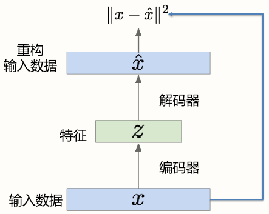

-   编码器：已训练完毕的编码器可以作为有监督学习的初始特征提取模型。
-   解码器：已训练完毕的解码器可以根据特征生成高维数据。


_引入噪声，在编码附近都学习到图像。_

### GAN（生成对抗网络）

生成网络：期望能够产生尽量真实的图片，进而骗过判别器；  
判别网络：期望能够准确地区分真假图片。


采用 minimax 的方式联合训练：

$$
min_{\theta_g} max_{\theta_d} [ E_{x~p_{data}} log D_{\theta_d} (x) + E_{z~p(z)} log (1-D_{\theta_d}(G_{\theta_g}(z))) ]
$$

-   判别器($θ_d$) 希望最大化目标函数使得 D(x)接近于 1（真实样本），而 D(G(z)) 接近于 0（假样本）
-   生成器($θ_g$)希望最小化目标函数使得 D(G(z)) 尽量接近于 1 ，即希望判别器认为生成器产生的图像 G(z) 为真实图片。

交替完成：

1. 判别器的梯度上升  
   $max_{\theta_d} [ E_{x~p_{data}} log D_{\theta_d} (x) + E_{z~p(z)} log (1-D_{\theta_d}(G_{\theta_g}(z))) ]$
2. 生成器的梯度下降  
   $min_{\theta_g}[E_{z~p(z)} log (1-D_{\theta_d}(G_{\theta_g}(z)))]$

**卷积生成对抗网络（DCGAN）**

DCGAN 提出了四种经验准则：

1. 使用卷积操作替代池化层；
2. 去除全连接层；
3. 使用批归一化；
4. 使用恰当的激活函数
    - 生成网络使用 ReLU，输出层采用 Tanh
    - 判别器使用 LeaklyReLU

**GAN 优化问题（LSGAN、WGAN）**

LSGAN：将判别器任务由分类改为回归，用 LS 散度替代 JS 散度。

WGAN：采用 Wasserstein 距离替代 JS 散度，解决了传统 GAN 中梯度消失和模式塌陷的问题。

**条件 GAN**

条件 GAN 的几种实现方案：

-   cGAN
-   SGAN
-   InfoGAN
-   ACGAN

## NLP

### 循环神经网络（RNN）

### 注意力机制

### Transformer

任务：机器翻译。

基本组成：

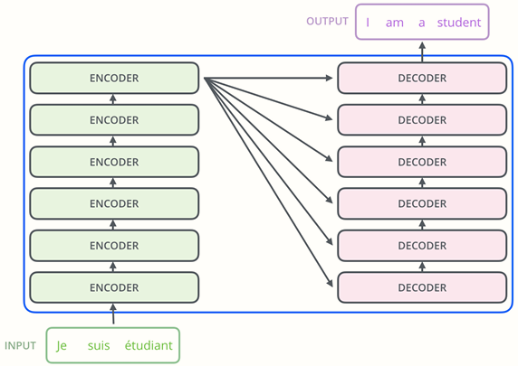

1. 编码器：提取输入语言的特征；
2. 解码器：将特征解码为目标语言。

详细架构：

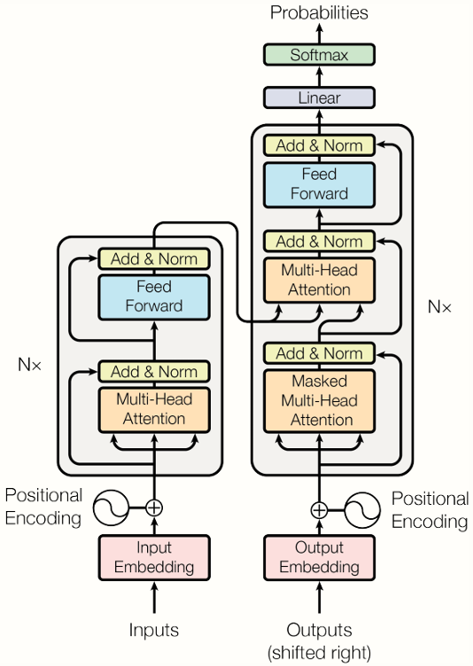

**输入输出**

输入：待翻译句子（单词的 one-hot 表示） + 已翻译词汇  
输出：（下一个）单词的概率

**嵌入层**

通过一个变换将单词的 one-hot 表示映射到连续空间上，其维度与模型维度$d_{model}$维度一致。嵌入维度：$d_{model}=512$

**编码器**

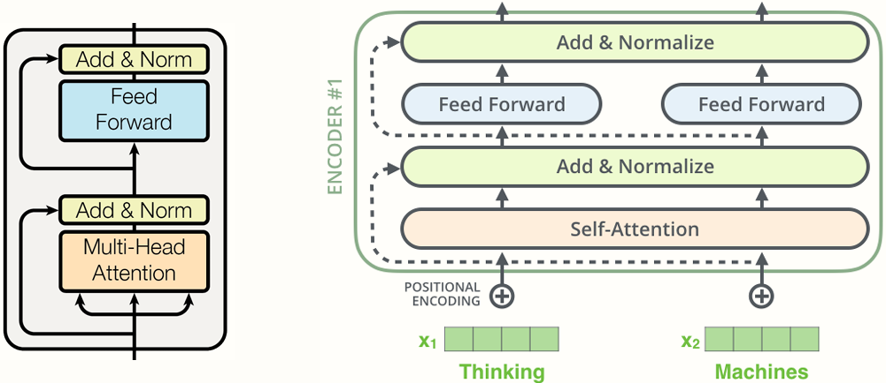

特征提取过程：

1. 输入单词经过自注意力层（多头注意力）；
2. 残差 + 归一化操作；
3. 经过前馈网络（全连接网络）；
4. 残差 + 归一化操作。

**解码器**


解码过程：

1. 输入特征经过注意力层（Mask 屏蔽多余特征）；
2. 残差 + 归一化操作；
3. 传入 LSTM 传递的时序信息；
4. 注意力 + 残差 + 归一化操作；
5. 经过前馈网络（全连接网络）；
6. 残差 + 归一化操作。

## CS231n

### Assignment 1

**K-近邻（kNN）算法**

用 kNN 分类器对测试数据进行分类：

1. 计算所有测试样本和所有训练样本之间的距离；
2. 对于每个测试样本，我们找到 k 个最接近的样本，并让它们为标签投票。

关键代码：

```py
class KNearestNeighbor(object):
    def __init__(self):
        pass

    # 将训练数据集和标签分别存入X_train和y_train中
    def train(self, X, y):
        self.X_train = X
        self.y_train = y

   # 对输入样本进行预测
    def predict(self, X, k=1, num_loops=0):
        # 计算测试样本和训练集距离
        if num_loops == 0:
            dists = self.compute_distances_no_loops(X)
        elif num_loops == 1:
            dists = self.compute_distances_one_loop(X)
        elif num_loops == 2:
            dists = self.compute_distances_two_loops(X)
        else:
            raise ValueError("Invalid value %d for num_loops" % num_loops)

        # 利用k个最近的标签进行投票，返回结果
        return self.predict_labels(dists, k=k)

   # 使用两层循环计算样本距离
    def compute_distances_two_loops(self, X):
        num_test = X.shape[0]
        num_train = self.X_train.shape[0]
        dists = np.zeros((num_test, num_train))

        for i in range(num_test):
            for j in range(num_train):
                # 逐个计算每个测试样本和训练集中每个样本的L2距离
                dists[i, j] = np.sqrt(np.sum(np.power(X[i] - self.X_train[j], 2)))

        return dists

    # 使用一层循环计算样本距离
    def compute_distances_one_loop(self, X):
        num_test = X.shape[0]
        num_train = self.X_train.shape[0]
        dists = np.zeros((num_test, num_train))

        for i in range(num_test):
            # 每轮循环计算一个测试样本和全部训练样本的L2距离
            dists[i, :] = np.sqrt(np.sum(np.power(self.X_train - X[i], 2), axis=1))

        return dists

    # 不使用循环计算样本距离
    def compute_distances_no_loops(self, X):
        num_test = X.shape[0]
        num_train = self.X_train.shape[0]
        dists = np.zeros((num_test, num_train))

        # 向量化
        xx = np.sum(np.power(X, 2), axis=1).reshape((X.shape[0], 1))
        yy = np.sum(np.power(self.X_train, 2), axis=1).reshape(
            (1, self.X_train.shape[0])
        )
        xy = X @ self.X_train.T
        # 用x^2+y^2-2xy来代替计算差值的平方
        dists = np.sqrt(-2 * xy + xx + yy)

        return dists

    # 选择k个最近的样本进行投票
    def predict_labels(self, dists, k=1):
        num_test = dists.shape[0]
        y_pred = np.zeros(num_test)
        for i in range(num_test):
            # 对距离进行排序，选择k个距离最近的标签
            closest_y = self.y_train[np.argsort(dists[i])[:k]]
            # 对k个标签进行计数，选择数量最多的一个
            y_pred[i] = Counter(closest_y).most_common(1)[0][0]

        return y_pred
```

**支持向量机**

使用多类别支持向量机进行分类：

1. 实现一个完全向量化的损失函数，用于支持向量机（SVM）；
2. 实现完全向量化的解析梯度表达式；
3. 使用数值梯度来检查你的实现；
4. 使用验证集来调整学习率和正则化强度；
5. 使用随机梯度下降（SGD）来优化损失函数。

svm 损失函数：$L_i=\sum_{j\neq y_i}\max (0,s_j-s_{y_i}+\Delta)=\sum_{j\neq y_i}\max (0,w_j\cdot x^T_i-w_{y_j}\cdot x^T_i+\Delta)$

根据链式求导法则：$dL/dW = dL/ds \cdot ds/dW$，当损失为 0 时，梯度为 0；当损失>0 时：  
$dL/ds_j = 1$  
$dL/ds_{y_i} = -1$  
$ds/dW = x_i^T$

损失和梯度计算：

```py
# 朴素的svm损失
def svm_loss_naive(W, X, y, reg):
    dW = np.zeros(W.shape)
    # compute the loss and the gradient
    num_classes = W.shape[1]
    num_train = X.shape[0]
    loss = 0.0
    for i in range(num_train):
        scores = X[i].dot(W)
        correct_class_score = scores[y[i]]
        for j in range(num_classes):
            if j == y[i]:
                continue
            # 当前类别得分 - 正确类别得分 + 1
            margin = scores[j] - correct_class_score + 1  # note delta = 1
            if margin > 0:
                loss += margin
                # 正确分类的梯度减去X[i]
                dW[:, y[i]] -= X[i].T
                # 错误分类的梯度加上X[i]
                dW[:, j] += X[i].T

    loss /= num_train
    dW /= num_train

    # 添加L2正则项，reg为超参数
    loss += reg * np.sum(W * W)
    # 加上正则项的梯度
    dW += 2 * reg * W

    return loss, dW

def svm_loss_vectorized(W, X, y, reg):
    loss = 0.0
    dW = np.zeros(W.shape)  # (3072,10)
    N = X.shape[0]

    # 向量化计算loss
    scores = X @ W  # (N,10)
    correct_labels_scores = scores[range(N), y].reshape(N, 1)  # (N,1)
    margins = np.maximum(scores - correct_labels_scores + 1, 0)  # (N,10)
    margins[range(N), y] = 0  # 将正确标签位置的margins设置为0
    loss = np.sum(margins) / N + reg * np.sum(W * W)

    # 向量化计算梯度
    margins[margins > 0] = 1  # 对于每一个有损失的位置，他对W错误分类位置的梯度影响是+X[i]
    margins[range(N), y] = -np.sum(margins, axis=1)  # 对W正确分类位置的影响是-X[i]
    dW += X.T @ margins / N + 2 * reg * W

    return loss, dW
```

线性分类器的训练：

```py
class LinearClassifier(object):
    def __init__(self):
        self.W = None

    def train(
        self,
        X,
        y,
        learning_rate=1e-3,
        reg=1e-5,
        num_iters=100,
        batch_size=200,
        verbose=False,
    ):
        num_train, dim = X.shape
        num_classes = (
            np.max(y) + 1
        )  # assume y takes values 0...K-1 where K is number of classes
        if self.W is None:
            # lazily initialize W
            self.W = 0.001 * np.random.randn(dim, num_classes)

        # 随机梯度下降SGD
        loss_history = []
        for it in range(num_iters):
            X_batch = None
            y_batch = None

            # 从训练样本中随机取batch_size个样本用于训练
            mask = np.random.choice(num_train, batch_size)
            X_batch = X[mask]
            y_batch = y[mask]

            # 计算损失值和梯度
            loss, grad = self.loss(X_batch, y_batch, reg)
            loss_history.append(loss)

            self.W -= learning_rate * grad  # 利用梯度×学习率更新权值

            if verbose and it % 100 == 0:
                print("iteration %d / %d: loss %f" % (it, num_iters, loss))

        return loss_history

    def predict(self, X):
        y_pred = np.zeros(X.shape[0])
        pass
        return y_pred

    def loss(self, X_batch, y_batch, reg):
        pass

class LinearSVM(LinearClassifier):
    """ A subclass that uses the Multiclass SVM loss function """

    def loss(self, X_batch, y_batch, reg):
        return svm_loss_vectorized(self.W, X_batch, y_batch, reg)


class Softmax(LinearClassifier):
    """ A subclass that uses the Softmax + Cross-entropy loss function """

    def loss(self, X_batch, y_batch, reg):
        return softmax_loss_vectorized(self.W, X_batch, y_batch, reg)
```

**Softmax 分类器**

与 svm 练习类似，我们需要实现 Softmax 损失函数，并实现其解析梯度表达式。

Softmax 函数能将一组评分归一化为一组概率，定义为：$softmax(s_i)=\frac{e^{s_i}}{\sum^N_{j=1}e^{s_j}}$

损失函数为：$L=\frac{1}{N}\sum_i -\log(\frac{e^{s_{y_i}}}{\sum_j e^{s_j}})+R(W)$

其中，$L_i=-\log(\frac{e^{s_{y_i}}}{\sum_j e^{s_j}})=-S_{y_i}+\log \sum_j e^{s_j}$

$\frac{\partial L_i}{\partial S_j}(j\neq y_i)=\frac{e^{s_j}}{\sum_j e^{s_j}}=p_j$

$$
\frac{\partial L_i}{\partial W_j}=\begin{cases}
p_j * X_i,& j\neq y_i\\
(p_j - 1)* X_i,& j=y_i
\end{cases}
$$

Softmax 损失和解析梯度计算：

```py
# 朴素softmax损失计算
def softmax_loss_naive(W, X, y, reg):
    loss = 0.0
    dW = np.zeros_like(W)
    N = X.shape[0]
    classes = W.shape[1]
    scores = X @ W

    for i in range(N):
        # loss += np.log(np.sum(np.exp(scores[i, :])) / np.exp(scores[i, y[i]]))
        p = np.exp(scores[i, :]) / np.sum(np.exp(scores[i, :]))  # softmax概率
        loss += -np.log(p[y[i]])

        # 梯度计算
        for j in range(classes):
            p_j = p[j]
            if j == y[i]:
                dW[:, j] += (p_j - 1) * X[i]
            else:
                dW[:, j] += (p_j) * X[i]

    loss = loss / N + reg * np.sum(W * W)
    dW = dW / N + 2 * reg * W

    return loss, dW

# 向量化softmax损失计算
def softmax_loss_vectorized(W, X, y, reg):
    loss = 0.0
    dW = np.zeros_like(W)
    N = X.shape[0]
    scores = X @ W
    p = np.exp(scores) / np.sum(np.exp(scores), axis=1, keepdims=True)
    # 计算loss函数
    loss += np.sum(-np.log(p[range(N), y]))

    # 计算梯度
    p[range(N), y] -= 1
    dW = X.T @ p

    loss = loss / N + reg * np.sum(W * W)
    dW = dW / N + 2 * reg * W

    return loss, dW
```

训练和验证，选择最优的参数：

```py
results = {}
best_val = -1   # The highest validation accuracy that we have seen so far.
best_svm = None # The LinearSVM object that achieved the highest validation rate.

learning_rates = [5e-8, 1e-7, 5e-5]
regularization_strengths = [1e4, 5e4, 1e5]

for lr in learning_rates:
    for reg in regularization_strengths:
        # 对于每一组参数
        softmax = Softmax()
        softmax.train(X_train, y_train, learning_rate=lr, reg=reg, num_iters=1000)  # 在训练集上训练

        # 计算在训练集上的精度
        y_train_pred = softmax.predict(X_train)
        y_train_accuracy = np.mean(y_train_pred == y_train)

        # 计算在验证集上的精度
        y_val_pred = softmax.predict(X_val)
        y_val_accuracy = np.mean(y_val_pred == y_val)

        # 存储每一组参数的结果
        results[(lr, reg)] = y_train_accuracy, y_val_accuracy
        if y_val_accuracy > best_val:
            best_val = y_val_accuracy
            best_softmax = softmax

# 选择最好的参数组合，计算在测试集上的精度
y_test_pred = best_softmax.predict(X_test)
test_accuracy = np.mean(y_test == y_test_pred)
print('softmax on raw pixels final test set accuracy: %f' % (test_accuracy, ))
```

**全连接神经网络**

模块化实现一个全连接网络。对于每一层，需要实现一个前向传播和反向传播函数。前向传播函数返回输出和 cache（用于计算梯度），反向传播函数返回 dx 和 dw。

layers：

```py
# 只进行Z=W•X+b的仿射变换层
def affine_forward(x, w, b):
    out = x.reshape((x.shape[0], -1)) @ w + b
    cache = (x, w, b)
    return out, cache

def affine_backward(dout, cache):
    x, w, b = cache

    dx = (dout @ w.T).reshape(x.shape)
    dw = x.reshape((x.shape[0], -1)).T @ dout
    db = np.sum(dout, axis=0)

    return dx, dw, db

# ReLU层
def relu_forward(x):
    out = np.maximum(0, x)
    cache = x
    return out, cache

def relu_backward(dout, cache):
    dx, x = None, cache
    dx = np.multiply(dout, (x > 0))
    return dx

# SVM层
def svm_loss(x, y):
    # loss
    N = x.shape[0]
    correct_scores = x[range(N), y].reshape(x.shape[0], -1)
    margins = np.maximum(0, x - correct_scores + 1)
    margins[range(N), y] = 0
    loss = np.sum(margins) / N

    # grad
    margins[margins > 0] = 1
    margins[range(N, y)] = -np.sum(margins, axis=1)
    dx = margins / N

    return loss, dx

# softmax层
def softmax_loss(x, y):
    # loss
    N = x.shape[0]
    scores = np.exp(x - x.max(axis=1, keepdims=True))  # 防止指数爆炸
    p = scores / np.sum(scores, axis=1, keepdims=True)
    loss = np.sum(-np.log(p[range(N), y])) / N

    # grad
    p[range(N), y] -= 1
    dx = p / N

    return loss, dx
```

实现两层的网络，分别使用 ReLU 和 Softmax 激活函数，结构为 affine-ReLU-affine-Softmax：

```py
class TwoLayerNet(object):
    def __init__(
        self,
        input_dim=3 * 32 * 32,
        hidden_dim=100,
        num_classes=10,
        weight_scale=1e-3,
        reg=0.0,
    ):
        self.params = {}
        self.reg = reg

        # 参数初始化
        self.params["W1"] = np.random.normal(
            loc=0.0, scale=weight_scale, size=(input_dim, hidden_dim)
        )
        self.params["b1"] = np.zeros((hidden_dim,))

        self.params["W2"] = np.random.normal(
            loc=0.0, scale=weight_scale, size=(hidden_dim, num_classes)
        )
        self.params["b2"] = np.zeros((num_classes,))

    def loss(self, X, y=None):
        scores = None

        W1 = self.params["W1"]
        W2 = self.params["W2"]
        b1 = self.params["b1"]
        b2 = self.params["b2"]

        a1_out, a1_cache = affine_relu_forward(X, W1, b1)
        a2_out, a2_cache = affine_forward(a1_out, W2, b2)
        scores = a2_out

        if y is None:
            return scores

        loss, grads = 0, {}
        loss, da2_out = softmax_loss(scores, y)
        loss += 0.5 * self.reg * (np.sum(W1 * W1) + np.sum(W2 * W2))

        da1_out, dW2, db2 = affine_backward(da2_out, a2_cache)
        dX, dW1, db1 = affine_relu_backward(da1_out, a1_cache)

        dW1 += self.reg * W1
        dW2 += self.reg * W2

        # 保存梯度
        grads["W1"] = dW1
        grads["W2"] = dW2
        grads["b1"] = db1
        grads["b2"] = db2

        return loss, grads
```

**提取特征**

方向梯度直方图（HOG）捕捉图像的纹理，同时忽略颜色信息；颜色直方图（HSV）代表输入图像的颜色，同时忽略纹理。将二者结合提取图像的特征，从而提升训练的效果。

HOG 特征的计算过程：

1. 图像预处理；
2. 计算 x 和 y 方向上的梯度；
3. 将梯度转化为方向$\arctan \frac{dy}{dx}$和变化速度$\sqrt{{dx}^2+{dy}^2}$；
4. 构建桶数为 9 的梯度方向直方图，并进行均值滤波；
5. 将三维的直方图展开为一维数组，作为 HOG 特征向量返回。

HSV 特征的计算过程：

1. 图像预处理；
2. 将图像转换为 HSV 颜色空间；
3. 构建颜色直方图；
4. 返回颜色特征向量。

### Assignment 2

**优化随机梯度下降算法**

SGD

```py
# learning_rate（lr）为超参数
w += - lr * dw
```

SGD + Momentum

```py
# momentum（mu）为超参数
v = mu * v - lr * dw
w += v
```

RMSprop

```py
# lr, decay_rate, epsilon（eps）为超参数
cache = decay_rate * cache + (1 - decay_rate) * dx**2
x += - learning_rate * dx / (np.sqrt(cache) + eps)
```

Adam

```py
# t为循环下降轮次
# lr, eps, beta1, beta2为超参数
m = beta1*m + (1-beta1)*dx
mt = m / (1-beta1**t)
v = beta2*v + (1-beta2)*(dx**2)
vt = v / (1-beta2**t)
x += - learning_rate * mt / (np.sqrt(vt) + eps)
```

_批归一化 Batch Normalization_

批归一化方法通过将样本分布线性变换为高斯分布，加速网络的收敛过程。批归一化的计算步骤如下：

1. 计算小批量样本的均值和方差  
   $\mu_B=\frac{1}{m}\sum^m_{i=1}x_i$  
   $\sigma^2_B=\frac{1}{m}\sum^m_{i=1}(x_i-\mu_B)^2$
2. 归一化  
   $\hat{x_i}=\frac{x_i-\mu_B}{\sqrt{\sigma^2_B+\epsilon}}$
3. 缩放和平移  
   $y_i=\gamma\hat{x_i}+\beta$

计算图：


链式求导：

$$
\begin{align}

\frac{\partial \ell}{\partial \hat{x}_i} = \frac{\partial \ell}{\partial y_i} \cdot \gamma\\

\frac{\partial \ell}{\partial \sigma_B^2} = \sum_{i=1}^m \frac{\partial \ell}{\partial \hat{x}_i} \cdot(x_i - \mu_B) \cdot \left(-\frac{1}{2}\right) \cdot (\sigma_B^2 + \epsilon)^{-3/2}\\

\frac{\partial \ell}{\partial \mu_B} = \left( \sum_{i=1}^m \frac{\partial \ell}{\partial \hat{x}_i} \cdot \left(\frac{-1}{\sqrt{\sigma_B^2 + \epsilon}}\right) \right) + \frac{\partial \ell}{\partial \sigma_B^2} \cdot \frac{\sum_{i=1}^m -2(x_i - \mu_B)}{m}\\

\frac{\partial \ell}{\partial x_i} = \frac{\partial \ell}{\partial \hat{x}_i} \cdot \frac{1}{\sqrt{\sigma_B^2 + \epsilon}} + \frac{\partial \ell}{\partial \sigma_B^2} \cdot \frac{2(x_i - \mu_B)}{m} + \frac{\partial \ell}{\partial \mu_B} \cdot \frac{1}{m}\\

\frac{\partial \ell}{\partial \gamma} = \sum_{i=1}^m \frac{\partial \ell}{\partial y_i} \cdot \hat{x}_i\\

\frac{\partial \ell}{\partial \beta} = \sum_{i=1}^m \frac{\partial \ell}{\partial y_i}

\end{align}
$$

### Assignment 3
