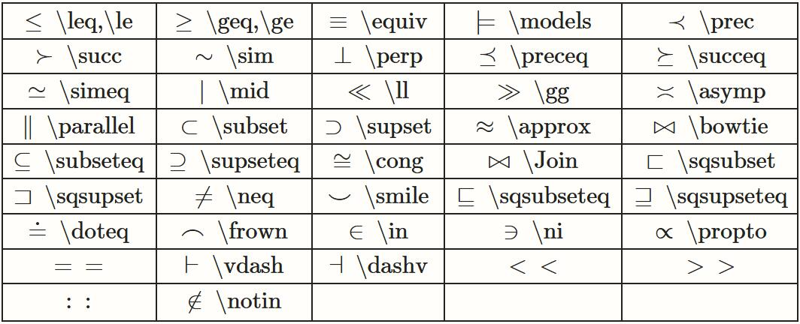
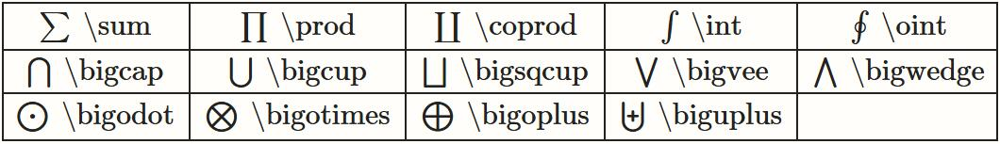
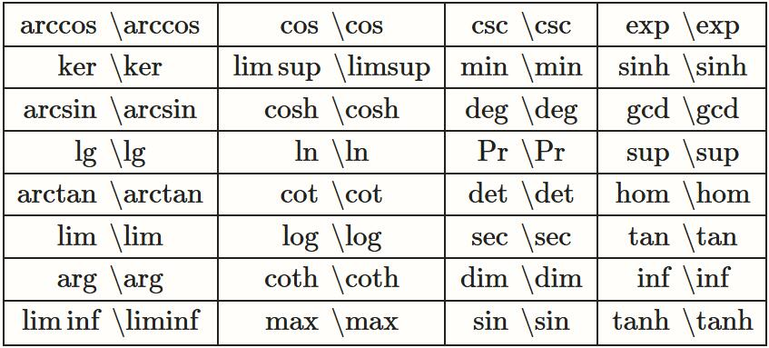

# Latex

## 目录

[Latex 语法](#latex-语法)  
[Latex 模板](#latex-模板)  
[Latex 编辑器](#latex-编辑器)

## Latex 语法

### 论文章节标识

使用`\section{章标题内容}`、`\subsection{节标题内容}`、`\subsubsection{小节标题内容}`分别开启新的章、节、小节，LaTeX 会自动为章节编号。

### 字体命令

使用`\textit{内容}`、`\textbf{内容}`等设置斜体、粗体样式，更多颜色下划线等样式命令请参考 LaTeX 手册。

### 公式

在公式代码前后分别添加`$`，效果为段落内公式；公式代码前后分别由`$$`和`$$`包裹，排版效果为不带编号的单独一行公式。

LaTeX 中最常用的特殊符号是 {} 和 \，{} 会把包含在中间的元素看成一个整体，\ 后面则接一些字母用来表示符号。

#### 基本数学符号

强调


希腊字母


二元运算


关系运算



大尺寸运算符



箭头符号


分隔符号


杂类符号


曲线函数符号



#### 数学公式的构造

数学公式一般包含一定的数学结构，例如分号、开根号等等，LaTeX 也提供了相应的符号：


#### 数学公式的排版

分段函数

```latex
y=\begin{cases}
-x,& x\leq 0 \\
x,& x>0
\end{cases}
```

$$
y=\begin{cases}
-x,& x\leq 0 \\
x,& x>0
\end{cases}
$$

公式组

```latex
// 对齐的公式组
\begin{align}
a &= b+c+d \\
x &= y+z
\end{align}
```

$$
\begin{align}
a &= b+c+d \\
x &= y+z
\end{align}
$$

```latex
// 无需对齐的公式组
\begin{gather}
a = b+c+d \\
x = y+z
\end{gather}
```

$$
\begin{gather}
a = b+c+d \\
x = y+z
\end{gather}
$$

## Latex 模板

LaTeX 论文模板文件一般包括.tex .cls .bib .bst .eps 等类型文件
.tex 文件为 latex 源文件
.cls 文件是 latex2e 的全文样式文件，决定了论文最终的排版效果
.bib 文件是参考文献的数据库，保存有参考文献的元数据
.bst 文件是用 bibtex 处理参考文献\*.bib 文件时的输出格式模板，即定义了参考文献的排版效果
.eps 文件即 LaTeX 插入的图片文件格式

## Latex 编辑器

### Overleaf

Overleaf 是一款在线 Latex 编辑器，允许使用 LaTeX 创建复杂的文档并在线合作编辑。

#### 官网

[英文官网](https://www.overleaf.com/)  
[中文官网](https://cn.overleaf.com/)
