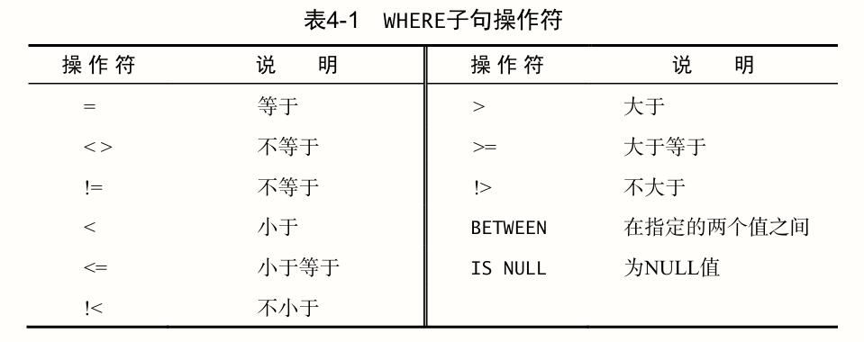
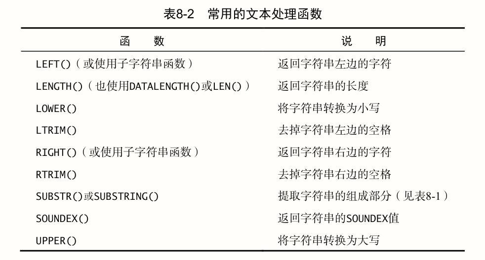

# SQL 必知必会

## 目录

[第 1 课 了解 SQL](#第-1-课-了解-sql)  
[第 2 课 检索数据](#第-2-课-检索数据)  
[第 3 课 排序检索数据](#第-3-课-排序检索数据)  
[第 4 课 过滤数据](#第-4-课-过滤数据)  
[第 5 课 高级数据过滤](#第-5-课-高级数据过滤)  
[第 6 课 用通配符进行过滤](#第-6-课-用通配符进行过滤)  
[第 7 课 创建计算字段](#第-7-课-创建计算字段)  
[第 8 课 使用函数处理数据](#第-8-课-使用函数处理数据)  
[第 9 课 汇总数据](#第-9-课-汇总数据)  
[第 10 课 分组数据](#第-10-课-分组数据)  
[第 11 课 使用子查询](#第-11-课-使用子查询)  
[第 12 课 联结表](#第-12-课-联结表)  
[第 13 课 创建高级联结](#第-13-课-创建高级联结)  
[第 14 课 组合查询](#第-14-课-组合查询)  
[第 15 课 插入数据](#第-15-课-插入数据)  
[第 16 课 更新和删除数据](#第-16-课-更新和删除数据)  
[第 17 课 创建和操纵表](#第-17-课-创建和操纵表)  
[第 18 课 使用视图](#第-18-课-使用视图)  
[第 19 课 使用存储过程](#第-19-课-使用存储过程)  
[第 20 课 管理事务处理](#第-20-课-管理事务处理)  
[第 21 课 使用游标](#第-21-课-使用游标)  
[第 22 课 高级 SQL 特性](#第-22-课-高级-sql-特性)  
[常用 SQL 语句速查](#常用-sql-语句速查)

## 第 1 课 了解 SQL

数据库（database）是以某种有组织的方式存储的数据集合。表（table）是一种结构化的文件，可用来存储某种特定类型的数据。数据库中的每个表都有一个唯一的名字来标识自己。关于数据库和表的布局及特性的信息称为模式（schema）。

列（column）是表中的一个字段，数据类型（datatype）定义了列可以存储哪些数据种类。

行（row）是表中的一条记录（record），表中每一行都应该有一列（或几列）可以唯一标识自己的主键（primary key）。表中主键应该满足以下条件：

1. 任意两行都不具有相同的主键值；
2. 每一行都必须具有一个主键值（主键列不允许空值 NULL）；
3. 主键列中的值不允许修改或更新；
4. 主键值不能重用（如果某行从表中删除，它的主键不能赋给以后的新行）。

在使用多列作为主键时，上述条件必须应用到所有列，所有列值的**组合**必须是唯一的（但其中单个列的值可以不唯一）。

SQL 是 Structured Query Language（结构化查询语言）的缩写，是一种专门用来与数据库沟通的语言。

## 第 2 课 检索数据

### SELECT 语句

`SELECT` 语句的用途是从一个或多个表中检索信息。用法为 `SELECT 列名 FROM 表名`，多个列名之间用逗号 `,` 分隔。`DISTINCT` 关键字指示数据库只返回不同的值。限制最多返回多少行在各种数据库中的这一 SQL 实现并不相同，MySQL 中需要使用 `LIMIT` 子句，如 `SELECT prod_name FROM Products LIMIT 4 OFFSET 3;` 指示返回从第 3 行起的最多 4 行数据，可以简化为 `LIMIT 3, 4`（小心，反着的）。  
_注意：行列的下标从 0 开始。_

### 使用注释

行内注释

```sql
SELECT prod_name    -- 这是一条注释
FROM products;

# 在一行的开始处使用#，这一整行都将作为注释。（有些DBMS不支持）
```

多行注释

```sql
/* 第一行注释
第二行注释 */
SELECT prod_name
FROM products;
```

## 第 3 课 排序检索数据

### ORDER BY 子句

为了明确地排序用 SELECT 语句检索出的数据，可使用 `ORDER BY` 子句取一个或多个列的名字，据此对输出进行排序。

```sql
SELECT prod_name
FROM Products
ORDER BY prod_name;
```

_注意：在指定一条 ORDER BY 子句时，应该保证它是 SELECT 语句中最后一条子句。如果它不是最后的子句，将会出错。_

要按多个列排序，只须指定这些列名，列名之间用逗号分开即可。

```sql
SELECT prod_id, prod_price, prod_name
FROM Products
ORDER BY prod_price, prod_name;    -- 首先按价格，然后按名称排序。
```

### 指定排序方向

默认的排序顺序是升序排序，为了进行降序排序，需要指定 `DESC` 关键字。

```sql
SELECT prod_id, prod_price, prod_name
FROM Products
ORDER BY prod_price DESC;    -- 如果想在多个列上进行降序排序，必须对每一列指定DESC关键字。
```

_注意：对文本性数据进行排序时，是否区分大小写取决于数据库的设置方式。大多数数据管理系统将'A'和'a'视为相同。_

## 第 4 课 过滤数据

只检索所需数据需要指定搜索条件（search criteria），搜索条件也称为过滤条件（filter condition）。

### WHERE 子句

在 SELECT 语句中，数据根据 WHERE 子句中指定的搜索条件进行过滤。

```sql
SELECT prod_name, prod_price
FROM Products
WHERE prod_price = 3.49;
```

_提示：数据也可以在应用层过滤。但是，优化数据库后可以更快速有效地对数据进行过滤。而让客户端应用（或开发语言）处理数据库的工作将会极大地影响应用的性能，并且使所创建的应用完全不具备可伸缩性。此外，如果在客户端过滤数据，服务器不得不通过网络发送多余的数据，这将导致网络带宽的浪费。_

WHERE 子句支持的条件操作符如下：



_注意：表 4-1 中列出的某些操作符是冗余的（如 <> 与 != 相同，!< 相当于 >=）。并非所有 DBMS 都支持这些操作符。想确定你的 DBMS 支持哪些操作符，请参阅相应的文档。_

在使用 BETWEEN 时，必须指定两个值——所需范围的低端值和高端值。这两个值必须用 AND 关键字分隔。BETWEEN 匹配范围中所有的值，包括指定的开始值和结束值。

```sql
SELECT prod_name, prod_price
FROM Products
WHERE prod_price BETWEEN 5 AND 10;
```

在创建表时，表设计人员可以指定其中的列能否不包含值。在一个列不包含值时，称其包含空值 NULL。SELECT 语句有一个特殊的 WHERE 子句 IS NULL，可用来检查具有 NULL 值的列。

```sql
SELECT prod_name
FROM Products
WHERE prod_price IS NULL;
```

## 第 5 课 高级数据过滤

### 组合 WHERE 子句

用来联结或改变 WHERE 子句中的子句的关键字，也称为逻辑操作符（logical operator）。

#### AND 操作符

要通过不止一个列进行过滤，可以使用 AND 操作符给 WHERE 子句附加条件。AND 是用在 WHERE 子句中的关键字，用来指示检索满足所有给定条件的行。

```sql
FROM Products
WHERE vend_id = 'DLL01' AND prod_price <= 4;
```

#### OR 操作符

OR 操作符与 AND 操作符正好相反，它指示 DBMS 检索匹配任一条件的行。

```sql
SELECT prod_id, prod_price, prod_name
FROM Products
WHERE vend_id = 'DLL01' OR vend_id = 'BRS01';
```

#### 求值顺序

WHERE 子句可以包含任意数目的 AND 和 OR 操作符。允许两者结合以进行复杂、高级的过滤。AND 在求值过程中优先级更高，如果希望手动调整求值顺序，解决方法是使用圆括号对操作符进行明确分组。

```sql
SELECT prod_name, prod_price
FROM Products
WHERE (vend_id = 'DLL01' OR vend_id = 'BRS01')
AND prod_price >= 10;
```

#### 条件范围

IN 操作符用来指定条件范围，范围中的每个条件都可以进行匹配。IN 取一组由逗号分隔、括在圆括号中的合法值。

```sql
SELECT prod_name, prod_price
FROM Products
WHERE vend_id  IN ('DLL01','BRS01')
ORDER BY prod_name;

/* 相同的功能：
SELECT prod_name, prod_price
FROM Products
WHERE vend_id = 'DLL01' OR vend_id = 'BRS01'
ORDER BY prod_name; */
```

IN 操作符优点如下：

- 在有很多合法选项时，IN 操作符的语法更清楚，更直观。
- 在与其他 AND 和 OR 操作符组合使用 IN 时，求值顺序更容易管理。
- IN 操作符一般比一组 OR 操作符执行得更快。
- IN 的最大优点是可以包含其他 SELECT 语句，能够更动态地建立 WHERE 子句。

#### 否定条件

NOT 操作符总是与其他操作符一起使用，用于否定其后所跟的任何条件。

```sql
SELECT prod_name
FROM Products
WHERE NOT vend_id = 'DLL01'
ORDER BY prod_name;
```

## 第 6 课 用通配符进行过滤

### LIKE 操作符

通配符（wildcard）是用来匹配值的一部分的特殊字符。利用通配符，可以创建比较特定数据的搜索模式（由字面值、通配符或两者组合构成的搜索条件）。`LIKE` 子句指示 DBMS，后跟的搜索模式利用通配符匹配而不是简单的相等匹配进行比较。

#### 百分号通配符

最常使用的通配符是百分号（%）。在搜索串中，%表示任何字符出现任意次数。

```sql
SELECT prod_id, prod_name
FROM Products
WHERE prod_name LIKE 'Fish%';    -- 找出所有以词Fish起头的产品
```

通配符可在搜索模式中的任意位置使用，并且可以使用多个通配符。

```sql
SELECT prod_id, prod_name
FROM Products
WHERE prod_name LIKE '%bean bag%';
```

_注意：通配符%除了能匹配一个或多个字符外，%还能匹配 0 个字符。%代表搜索模式中给定位置的 0 个、1 个或多个字符。_

#### 下划线通配符

另一个有用的通配符是下划线（\_）。下划线的用途与%一样，但它只匹配单个字符，而不是多个字符。

```sql
SELECT prod_id, prod_name
FROM Products
WHERE prod_name LIKE '__ inch teddy bear';
```

#### 方括号通配符

方括号（[]）通配符用来指定一个字符集，它必须匹配指定位置（通配符的位置）的一个字符。

```sql
SELECT cust_contact
FROM Customers
WHERE cust_contact LIKE '[JM]%'    -- 找出所有名字以J或M起头的联系人
ORDER BY cust_contact;
```

此通配符可以用前缀字符^（脱字号）来否定。

```sql
SELECT cust_contact
FROM Customers
WHERE cust_contact LIKE '[^JM]%'    -- 查询匹配以J和M之外的任意字符起头的任意联系人
ORDER BY cust_contact;
```

### 使用通配符的技巧

SQL 的通配符很有用。但这种功能是有代价的，即通配符搜索一般比前面讨论的其他搜索要耗费更长的处理时间。这里给出一些使用通配符时要记住的技巧：

- 不要过度使用通配符。如果其他操作符能达到相同的目的，应该使用其他操作符。
- 在确实需要使用通配符时，也尽量不要把它们用在搜索模式的开始处。把通配符置于开始处，搜索起来是最慢的。
- 仔细注意通配符的位置。如果放错地方，可能不会返回想要的数据。

## 第 7 课 创建计算字段

计算字段是运行时在 SELECT 语句内创建的，作用是检索出转换、计算或格式化过的数据。

### 拼接

将值联结到一起（将一个值附加到另一个值）构成单个值。

_提示：一般来说，在数据库服务器上完成转换和格式化工作操作比在客户端应用程序中完成要快得多。_

#### +和||操作符

```sql
SELECT vend_name + '(' + vend_country + ')'
-- SELECT vend_name || '(' || vend_country || ')'
FROM Vendors
ORDER BY vend_name;
```

_注意：SQL Server 使用+号。DB2、Oracle、PostgreSQL 和 SQLite 使用||。在 MySQL 和 MariaDB 中，必须使用特殊的函数。_

#### Concat 语句

```sql
-- 使用 MySQL 或 MariaDB 时需要使用的语句
SELECT Concat(vend_name, ' (', vend_country, ')')
FROM Vendors
ORDER BY vend_name;
```

#### TRIM

许多数据库（不是所有）保存填充为列宽的文本值，而实际上你要的结果不需要这些空格。为正确返回格式化的数据，必须去掉这些空格。这可以使用 SQL 的 RTRIM()函数来完成。

```sql
SELECT RTRIM(vend_name) + ' (' + RTRIM(vend_country) + ')'
FROM Vendors
ORDER BY vend_name;
```

_提示：大多数 DBMS 都支持 RTRIM()（正如刚才所见，它去掉字符串右边的空格）、LTRIM()（去掉字符串左边的空格）以及 TRIM()（去掉字符串左右两边的空格）。_

### 使用别名

SELECT 语句可以很好地拼接地址字段，但是新计算列没有名字，导致客户端没有办法引用它。为了解决这个问题，SQL 支持列别名。**别名**（alias）是一个字段或值的替换名，有时也称为**导出列**（derived column），用 AS 关键字赋予。

```sql
SELECT RTRIM(vend_name) + ' (' + RTRIM(vend_country) + ')'
AS vend_title
FROM Vendors
ORDER BY vend_name;
```

_注意：在很多 DBMS 中，AS 关键字是可选的，不过最好使用它，这被视为一条最佳实践。_

_提示：别名还有其他用途。常见的用途包括在实际的表列名包含不合法的字符（如空格）时重新命名它；在原来的名字含混或容易误解时扩充它。_

_注意：别名的名字既可以是一个单词，也可以是一个字符串。如果是后者，字符串应该括在引号中。虽然这种做法是合法的，但不建议这么去做。多单词的名字可读性高，不过会给客户端应用带来各种问题。因此，别名最常见的使用是将多个单词的列名重命名为一个单词的名字。_

### 算数计算

可以使用'+', '-', '\*', '/' 输出一个计算列。

```sql
SELECT prod_id,
       quantity,
       item_price,
       quantity * item_price AS expanded_price
FROM OrderItems
WHERE order_num = 20008;
```

## 第 8 课 使用函数处理数据

与几乎所有 DBMS 都等同地支持 SQL 语句（如 SELECT）不同，每一个 DBMS 都有特定的函数。事实上，只有少数几个函数被所有主要的 DBMS 等同地支持。大多数 SQL 支持实现以下类型的函数：

- 用于处理文本字符串（如删除或填充值，转换值为大写或小写）的文本函数。
- 用于在数值数据上进行算术操作（如返回绝对值，进行代数运算）的数值函数。
- 用于处理日期和时间值并从这些值中提取特定成分（如返回两个日期之差，检查日期有效性）的日期和时间函数。
- 用于生成美观好懂的输出内容的格式化函数（如用语言形式表达出日期，用货币符号和千分位表示金额）。
- 返回 DBMS 正使用的特殊信息（如返回用户登录信息）的系统函数。

### 文本处理函数



_注意：这些函数仅适用于文本数据类型。_

### 日期和时间处理函数

日期和时间采用相应的数据类型存储在表中，每种 DBMS 都有自己的特殊形式。日期和时间值以特殊的格式存储，以便能快速和有效地排序或过滤，并且节省物理存储空间。

_注意：应用程序一般不使用日期和时间的存储格式，因此日期和时间函数总是用来读取、统计和处理这些值。由于这个原因，日期和时间函数在 SQL 中具有重要的作用。遗憾的是，它们很不一致，可移植性最差。_

```sql
SELECT order_num
FROM Orders
WHERE DATEPART(yy, order_date) = 2020;
-- SQL Server中的按年份查找
```

_注意：关于你的 DBMS 具体支持的日期 − 时间处理函数，请参阅相应的文档。_

### 数值处理函数

数值处理函数仅处理数值数据。这些函数一般主要用于代数、三角或几何运算。


_提示：在主要 DBMS 的函数中，数值函数是最一致、最统一的函数。_

## 第 9 课 汇总数据

我们经常需要汇总数据而不用把它们实际检索出来，为此 SQL 提供了专门的函数。使用这些函数，SQL 查询可用于检索数据，以便分析和报表生成。这种类型的检索例子有：

- 确定表中行数（或者满足某个条件或包含某个特定值的行数）；
- 获得表中某些行的和；
- 找出表列（或所有行或某些特定的行）的最大值、最小值、平均值。

### 聚集函数


#### AVG 函数

AVG()通过对表中行数计数并计算其列值之和，求得该列的平均值。AVG()可用来返回所有列的平均值，也可以用来返回特定列或行的平均值。

```sql
SELECT AVG(prod_price) AS avg_price
FROM Products
WHERE vend_id = 'DLL01';
```

_注意：AVG()只能用来确定特定数值列的平均值，而且列名必须作为函数参数给出。为了获得多个列的平均值，必须使用多个 AVG()函数。_

_说明：AVG 函数忽略值为 NULL 的行。_

#### COUNT 函数

COUNT()函数进行计数。可利用 COUNT()确定表中行的数目或符合特定条件的行的数目。COUNT()函数有两种使用方式：

- 使用 COUNT(\*) 对表中行的数目进行计数，不管表列中包含的是空值（NULL）还是非空值。
- 使用 COUNT(column) 对特定列中具有值的行进行计数，忽略 NULL 值。

```sql
-- 返回Customers表中顾客的总数
SELECT COUNT(*) AS num_cust
FROM Customers;
```

_说明：如果指定列名，则 COUNT() 函数会忽略指定列的值为 NULL 的行，但如果 COUNT() 函数中用的是星号（\*），则不忽略。_

```sql
-- 返回电子邮件不为空的客户数量
SELECT COUNT(cust_email) AS num_cust
FROM Customers;
```

#### MAX 和 MIN 函数

MAX()返回指定列中的最大值。

```sql
SELECT MAX(prod_price) AS max_price
FROM Products;
```

_提示：虽然 MAX() 一般用来找出最大的数值或日期值，但许多（并非所有）DBMS 允许将它用来返回任意列中的最大值，包括返回文本列中的最大值。在用于文本数据时，MAX() 返回按该列排序后的最后一行。_

MIN()的功能正好与 MAX()功能相反，它返回指定列的最小值。

_说明：MAX() 和 MIN() 函数忽略列值为 NULL 的行。_

#### SUM 函数

SUM()用来返回指定列值的和。

```sql
SELECT SUM(item_price * quantity) AS total_price
FROM OrderItems
WHERE order_num = 20005;
```

_提示：如本例所示，利用标准的算术操作符，所有聚集函数都可用来执行多个列上的计算。_

_说明：SUM() 函数忽略列值为 NULL 的行。_

### 聚集不同值

对聚集函数，可以指定 DISTINCT 参数，只包含不同的值。

_说明：如果不指定 DISTINCT，则默认为 ALL（对所有行执行计算）。_

```sql
SELECT AVG(DISTINCT prod_price) AS avg_price
FROM Products
WHERE vend_id = 'DLL01';
```

_注意：DISTINCT 不能用于 COUNT(\*)。_

### 组合聚集函数

```sql
SELECT COUNT(*) AS num_items,
MIN(prod_price) AS price_min,
MAX(prod_price) AS price_max,
AVG(prod_price) AS price_avg
FROM Products;
```

_注意：在指定别名以包含某个聚集函数的结果时，不应该使用表中实际的列名。_

## 第 10 课 分组数据

### GROUP BY 子句

使用分组可以将数据分为多个逻辑组，对每个组进行聚集计算。分组是使用 SELECT 语句的 GROUP BY 子句建立的。

```sql
SELECT vend_id, COUNT(*) AS num_prods
FROM Products
GROUP BY vend_id;
-- 对每个vend_id而不是整个表计算num_prods一次
```

GROUP BY 子句的一些重要的规定：

- GROUP BY 子句可以包含任意数目的列，因而可以对分组进行嵌套，更细致地进行数据分组。
- 如果在 GROUP BY 子句中嵌套了分组，数据将在最后指定的分组上进行汇总。换句话说，在建立分组时，指定的所有列都一起计算（所以不能从个别的列取回数据）。
- GROUP BY 子句中列出的每一列都必须是检索列或有效的表达式（但不能是聚集函数）。如果在 SELECT 中使用表达式，则必须在 GROUP BY 子句中指定相同的表达式。不能使用别名。
- 大多数 SQL 实现不允许 GROUP BY 列带有长度可变的数据类型（如文本或备注型字段）。
- 除聚集计算语句外，SELECT 语句中的每一列都必须在 GROUP BY 子句中给出。
- 如果分组列中包含具有 NULL 值的行，则 NULL 将作为一个分组返回。如果列中有多行 NULL 值，它们将分为一组。
- GROUP BY 子句必须出现在 WHERE 子句之后，ORDER BY 子句之前。

### HAVING 子句

除了能用 GROUP BY 分组数据外，SQL 还允许用 HAVING 过滤分组，规定包括哪些分组、排除哪些分组。

_说明：事实上，目前为止所学过的所有类型的 WHERE 子句都可以用 HAVING 来替代。唯一的差别是，WHERE
过滤行，而 HAVING 过滤分组。_

```sql
SELECT cust_id, COUNT(*) AS orders
FROM Orders
GROUP BY cust_id
HAVING COUNT(*) >= 2;
```

_注意：WHERE 在数据分组前进行过滤，HAVING 在数据分组后进行过滤。如果不指定 GROUP BY，则大多数 DBMS 会同等对待它们。_

同时使用 WHERE 和 HAVING：

```sql
SELECT vend_id, COUNT(*) AS num_prods
FROM Products
WHERE prod_price >= 4
GROUP BY vend_id
HAVING COUNT(*) >= 2;
```

_注意：一般在使用 GROUP BY 子句时，应该也给出 ORDER BY 子句。这是保证数据正确排序的唯一方法。千万不要仅依赖 GROUP BY 排序数据。_

### SELECT 子句顺序


## 第 11 课 使用子查询

SQL 允许创建子查询（subquery），即嵌套在其他查询中的查询。

### 利用子查询进行过滤

在 WHERE 子句中，子查询常用于 IN 操作符中：

```sql
-- 查询订购物品 RGAN01 的所有顾客
SELECT cust_id
FROM Orders
WHERE order_num IN (SELECT order_num
                    FROM OrderItems
                    WHERE prod_id = 'RGAN01');
```

_注意：在 SELECT 语句中，子查询总是从内向外处理。_

### 作为计算字段

使用子查询的另一方法是创建计算字段：

```sql
-- 显示 Customers 表中每个顾客的订单总数
SELECT cust_name,
       cust_state,
       (SELECT COUNT(*)
        FROM Orders
        WHERE Orders.cust_id = Customers.cust_id) AS orders
FROM Customers
ORDER BY cust_name;
```

_提示：在有可能混淆列名时必须使用**完全限定列名**，即用一个句点分隔表名和列名。_

## 第 12 课 联结表

如果数据存储在多个表中，使用联结（join）可以在一条 SELECT 语句中关联表。

```sql
SELECT vend_name, prod_name, prod_price
FROM Vendors, Products
WHERE Vendors.vend_id = Products.vend_id;
```

_提示：如果不使用 WHERE 子句进行过滤，会返回两个表的笛卡儿积。_

上述联结称为等值联结（equijoin），它基于两个表之间的相等测试，这种联结也称为内联结（inner join）。对于内联结，也可以明确指定联结的类型：

```sql
SELECT vend_name, prod_name, prod_price
FROM Vendors
INNER JOIN Products ON Vendors.vend_id = Products.vend_id;
```

联结多个表的基本规则也相同：

```sql
SELECT prod_name, vend_name, prod_price, quantity
FROM OrderItems, Products, Vendors
WHERE Products.vend_id = Vendors.vend_id
AND OrderItems.prod_id = Products.prod_id
AND order_num = 20007;
```

_注意：DBMS 在运行时关联指定的每个表，以处理联结。这种处理可能非常耗费资源，因此应该注意，不要联结不必要的表。联结的表越多，性能下降越严重。_

_注意：许多 DBMS 对联结约束中表的数目有限制。_

## 第 13 课 创建高级联结

SQL 除了可以对列名和计算字段使用别名，还允许给表名起别名。这样便于在查询中多次使用相同的表。

```sql
SELECT cust_name, cust_contact
FROM Customers AS C, Orders AS O, OrderItems AS OI
WHERE C.cust_id = O.cust_id
AND OI.order_num = O.order_num
AND prod_id = 'RGAN01';
```

_注意：表别名只在查询执行中使用。与列别名不一样，表别名不返回到客户端。_

除了内联结，还可以使用三种其他联结：

### 自联结

需要使用子查询在相同表中检索数据时，可以使用自联结代替子查询：

```sql
-- 使用子查询
SELECT cust_id, cust_name, cust_contact
FROM Customers
WHERE cust_name = (SELECT cust_name
                   FROM Customers
                   WHERE cust_contact = 'Jim Jones');

-- 使用自联结
SELECT c1.cust_id, c1.cust_name, c1.cust_contact
FROM Customers AS c1, Customers AS c2
WHERE c1.cust_name = c2.cust_name
 AND c2.cust_contact = 'Jim Jones';
```

在以上查询中，WHERE 首先联结两个表，然后按第二个表中的 cust_contact 过滤数据，返回所需的数据。

_提示：许多 DBMS 处理联结远比处理子查询快得多。_

### 自然联结

自然联结要求你只能选择那些唯一的列，一般通过对一个表使用通配符（SELECT \*），而对其他表的列使用明确的子集来完成。事实上，我们迄今为止建立的每个内联结都是自然联结，很可能永远都不会用到不是自然联结的内联结。

```sql
SELECT C.*, O.order_num, O.order_date,
OI.prod_id, OI.quantity, OI.item_price
FROM Customers AS C, Orders AS O,
OrderItems AS OI
WHERE C.cust_id = O.cust_id
AND OI.order_num = O.order_num
AND prod_id = 'RGAN01';
```

### 外联结

许多联结将一个表中的行与另一个表中的行相关联，但有时候需要包含没有关联行的那些行。

```sql
-- 以下是一个内联结，检索所有顾客及其订单
SELECT Customers.cust_id, Orders.order_num
FROM Customers
INNER JOIN Orders ON Customers.cust_id = Orders.cust_id;

-- 以下是一个外联结，检索包括没有订单顾客在内的所有顾客
SELECT Customers.cust_id, Orders.order_num
FROM Customers
LEFT OUTER JOIN Orders ON Customers.cust_id = Orders.cust_id;
-- RIGHT 指出的是 OUTER JOIN 右边的表，而 LEFT 指出的是 OUTER JOIN 左边的表
```

## 第 14 课 组合查询

SQL 允许执行多个查询（多条 SELECT 语句），并将结果作为一个查询结果集返回。这些组合查询通常称为并（union）或复合查询（compound query）。

_提示：多数情况下，组合相同表的两个查询所完成的工作与具有多个 WHERE 子句条件的一个查询所完成的工作相同。换句话说，任何具有多个 WHERE 子句的 SELECT 语句都可以作为一个组合查询。_

利用 UNION，可给出多条 SELECT 语句，将它们的结果组合成一个结果集。

```sql
SELECT cust_name, cust_contact, cust_email
FROM Customers
WHERE cust_state IN ('IL','IN','MI')
UNION
SELECT cust_name, cust_contact, cust_email
FROM Customers
WHERE cust_name = 'Fun4All';
```

_注意：多数好的 DBMS 使用内部查询优化程序，在处理各条 SELECT 语句前组合它们。理论上讲，这意味着从性能上看使用多条 WHERE 子句条件还是 UNION 应该没有实际的差别。_

_注意：UNION 中的每个查询必须包含相同的列、表达式或聚集函数（不过，各个列不需要以相同的次序列出）。_

_注意：只能在最后一行使用一次 ORDER BY 语句。DBMS 将用它来排序所有 SELECT 语句返回的所有结果。_

## 第 15 课 插入数据

INSERT 用来将行插入（或添加）到数据库表。插入有几种方式：

- 插入完整的行；
- 插入行的一部分；
- 插入某些查询的结果。

_注意：使用 INSERT 语句可能需要客户端/服务器 DBMS 中的特定安全权限。在你试图使用 INSERT 前，应该保证自己有足够的安全权限。_

### 插入完整的行

把数据插入表中的最简单方法是使用基本的 INSERT 语法，它要求指定表名和插入到新行中的值。

```sql
INSERT INTO Customers
VALUES(1000000006,
       'Toy Land',
       '123 Any Street',
       'New York',
       'NY',
       '11111',
       'USA',
       NULL,
       NULL);
```

_注意：存储到表中每一列的数据在 VALUES 子句中给出，必须给每一列提供一个值。如果某列没有值，则应该使用 NULL 值（假定表允许对该列指定空值）。各列必须以它们在表定义中出现的次序填充。_

虽然这种语法很简单，但并不安全，应该尽量避免使用。编写 INSERT 语句的更安全（不过更烦琐）的方法如下：

```sql
INSERT INTO Customers(cust_id,
                      cust_name,
                      cust_address,
                      cust_city,
                      cust_state,
                      cust_zip,
                      cust_country,
                      cust_contact,
                      cust_email)
VALUES(1000000006,
       'Toy Land',
       '123 Any Street',
       'New York',
       'NY',
       '11111',
       'USA',
       NULL,
       NULL);
```

_提示：因为提供了列名，VALUES 必须以其指定的次序匹配指定的列名，不一定按各列出现在表中的实际次序。其优点是，即使表的结构改变，这条 INSERT 语句仍然能正确工作。_

_注意：由于主键具有唯一性，因此不能插入同一条记录两次。_

### 插入部分行

正如所述，使用 INSERT 的推荐方法是明确给出表的列名。使用这种语法，还可以省略列，这表示可以只给某些列提供值，给其他列不提供值。

```sql
INSERT INTO Customers(cust_id,
                      cust_name,
                      cust_address,
                      cust_city,
                      cust_state,
                      cust_zip,
                      cust_country)
VALUES(1000000006,
       'Toy Land',
       '123 Any Street',
       'New York',
       'NY',
       '11111',
       'USA');
```

_注意：如果表的定义允许，则可以在 INSERT 操作中省略某些列。省略的列必须满足：该列定义为允许 NULL 值（无值或空值），或在表定义中给出默认值（这表示如果不给出值，将使用默认值）。_

### 插入检索出的数据

INSERT 还存在另一种形式，可以利用它将 SELECT 语句的结果插入表中，这就是所谓的 INSERT SELECT。

```sql
INSERT INTO Customers(cust_id,
                      cust_contact,
                      cust_email,
                      cust_name,
                      cust_address,
                      cust_city,
                      cust_state,
                      cust_zip,
                      cust_country)
SELECT cust_id,
       cust_contact,
       cust_email,
       cust_name,
       cust_address,
       cust_city,
       cust_state,
       cust_zip,
       cust_country
FROM CustNew;
```

_提示：INSERT 通常只插入一行。要插入多行，必须执行多个 INSERT 语句。INSERT SELECT 是个例外，它可以用一条 INSERT 插入多行，不管 SELECT 语句返回多少行，都将被 INSERT 插入。_

### 从一个表复制到另一个表

要将一个表的内容复制到一个全新的表（运行中创建的表），可以使用 CREATE SELECT 语句。

```sql
CREATE TABLE CustCopy AS SELECT * FROM Customers;
-- 这条 SELECT 语句创建一个名为 CustCopy 的新表，并把 Customers 表的整个内容复制到新表中。
```

_提示：要想只复制部分的列，可以明确给出列名，而不是使用\*通配符。_

## 第 16 课 更新和删除数据

### 更新数据

更新（修改）表中的数据，可以使用 UPDATE 语句。

_提示：在客户端/服务器的 DBMS 中，使用 UPDATE 语句可能需要特殊的安全权限。在你使用 UPDATE 前，应该保证自己有足够的安全权限。_

基本的 UPDATE 语句由三部分组成，分别是：

1. 要更新的值；
2. 列名和它们的新值；
3. 确定要更新哪些行的过滤条件。

```sql
UPDATE Customers
SET cust_email = 'kim@thetoystore.com'
WHERE cust_id = 1000000005;
```

_注意：在使用 UPDATE 时一定要细心。因为稍不注意，就会更新表中的所有行。_

更新多个列后，需要在列之间用逗号分隔：

```sql
UPDATE Customers
SET cust_contact = 'Sam Roberts',
cust_email = 'sam@toyland.com'
WHERE cust_id = 1000000006;
```

_提示：要删除某个列的值，可设置它为 NULL（假如表定义允许 NULL 值）。_

### 删除数据

使用 DELETE 语句可以从一个表中删除（去掉）数据。

```sql
DELETE FROM Customers
WHERE cust_id = 1000000006;
```

_注意：在使用 DELETE 时一定要细心。因为稍不注意，就会错误地删除表中所有行。_

### 指导原则

使用的 UPDATE 和 DELETE 语句如果省略了 WHERE 子句，则 UPDATE 或 DELETE 将被应用到表中所有的行。因此通常需要遵循一些重要原则：

- 除非确实打算更新和删除每一行，否则绝对不要使用不带 WHERE 子句的 UPDATE 或 DELETE 语句。
- 保证每个表都有主键，尽可能像 WHERE 子句那样使用它（可以指定各主键、多个值或值的范围）。
- 在 UPDATE 或 DELETE 语句使用 WHERE 子句前，应该先用 SELECT 进行测试，保证它过滤的是正确的记录，以防编写的 WHERE 子句不正确。
- 使用强制实施引用完整性的数据库，这样 DBMS 将不允许删除其数据与其他表相关联的行。
- 有的 DBMS 允许数据库管理员施加约束，防止执行不带 WHERE 子句的 UPDATE 或 DELETE 语句。如果所采用的 DBMS 支持这个特性，应该使用它。

## 第 17 课 创建和操纵表

### 创建表

利用 CREATE TABLE 创建表，必须给出下列信息：

1. 新表的名字，在关键字 CREATE TABLE 之后给出；
2. 表列的名字（它在表中必须是唯一的）和定义，用逗号分隔；
3. 有的 DBMS 还要求指定表的位置。

```sql
CREATE TABLE Products
(
    prod_id        CHAR(10)        NOT NULL,
    vend_id        CHAR(10)        NOT NULL,
    prod_name      VARCHAR(1000)   NULL,
    order_date     DATETIME        NOT NULL
);
```

_注意：在创建新的表时，指定的表名必须不存在，否则会出错。_

#### 使用 NULL

NULL 值就是没有值或缺值。允许 NULL 值的列也允许在插入行时不给出该列的值。不允许 NULL 值的列不接受没有列值的行，换句话说，在插入或更新行时，该列必须有值。

_注意：在不指定 NOT NULL 时，多数 DBMS 认为指定的是 NULL，但不是所有的 DBMS 都这样。_

_注意：主键是其值唯一标识表中每一行的列。只有不允许 NULL 值的列可作为主键，允许 NULL 值的列不能作为唯一标识。_

_注意：不要把 NULL 值与空字符串相混淆。NULL 值是没有值，不是空字符串。如果指定''（两个单引号，其间没有字符），这在 NOT NULL 列中是允许的。空字符串是一个有效的值，它不是无值。NULL 值用关键字 NULL 而不是空字符串指定。_

#### 指定默认值

SQL 允许指定默认值，在插入行时如果不给出值，DBMS 将自动采用默认值。默认值在 CREATE TABLE 语句的列定义中用关键字 DEFAULT 指定。

```sql
CREATE TABLE OrderItems
(
    ...
    quantity     INTEGER    NOT NULL    DEFAULT 1,
    ...
);
```

_提示：默认值经常用于日期或时间戳列。_

_提示：对于用于计算或数据分组的列，应该使用 DEFAULT 而不是 NULL。_

### 更新表

更新表定义，可以使用 ALTER TABLE 语句。在更新表时需要考虑：

- 理想情况下，不要在表中包含数据时对其进行更新。应该在表的设计过程中充分考虑未来可能的需求，避免今后对表的结构做大改动。
- 所有的 DBMS 都允许给现有的表增加列，不过对所增加列的数据类型（以及 NULL 和 DEFAULT 的使用）有所限制。
- 许多 DBMS 不允许删除或更改表中的列。
- 多数 DBMS 允许重新命名表中的列。
- 许多 DBMS 限制对已经填有数据的列进行更改，对未填有数据的列几乎没有限制。

使用 ALTER TABLE 更改表结构，必须给出下面的信息：

1. 在 ALTER TABLE 之后给出要更改的表名（该表必须存在，否则将出错）；
2. 列出要做哪些更改。

```sql
ALTER TABLE Vendors
ADD vend_phone CHAR(20);
```

_注意：使用 ALTER TABLE 要极为小心，应该在进行改动前做完整的备份（表结构和数据的备份）。数据库表的更改不能撤销，如果增加了不需要的列，也许无法删除它们。类似地，如果删除了不应该删除的列，可能会丢失该列中的所有数据。_

### 删除表

删除表非常简单，使用 DROP TABLE 语句即可：

```sql
DROP TABLE CustCopy;
```

_提示：许多 DBMS 允许强制实施有关规则，防止删除与其他表相关联的表。在实施这些规则时，如果对某个表发布一条 DROP TABLE 语句，且该表是某个关系的组成部分，则 DBMS 将阻止这条语句执行，直到该关系被删除为止。如果允许，应该启用这些选项，它能防止意外删除有用的表。_

### 重命名表

每个 DBMS 对表重命名的支持有所不同。对于这个操作，不存在严格的标准。

## 第 18 课 使用视图

视图是虚拟的表。与包含数据的表不一样，视图只包含使用时动态检索数据的查询。视图的作用包含：

- 重用 SQL 语句；
- 简化复杂的 SQL 操作；
- 使用表的一部分而不是整个表；
- 保护数据。可以授予用户访问表的特定部分的权限，而不是整个表的访问权限；
- 更改数据格式和表示。

视图创建和使用有一些最常见的规则和限制：

- 与表一样，视图必须唯一命名（不能给视图取与别的视图或表相同的名字）；
- 对于可以创建的视图数目没有限制；
- 创建视图，必须具有足够的访问权限；
- 视图可以嵌套，即可以利用从其他视图中检索数据的查询来构造视图；
- 许多 DBMS 禁止在视图查询中使用 ORDER BY 子句；
- 有些 DBMS 要求对返回的所有列进行命名；
- 视图不能索引；
- 有些 DBMS 把视图作为只读的查询；

视图用 CREATE VIEW 语句来创建。与 CREATE TABLE 一样，CREATE VIEW 只能用于创建不存在的视图。

```sql
-- 利用视图简化复杂的联结
CREATE VIEW ProductCustomers AS
SELECT cust_name, cust_contact, prod_id
FROM Customers, Orders, OrderItems
WHERE Customers.cust_id = Orders.cust_id
AND OrderItems.order_num = Orders.order_num;
```

_提示：删除视图，可以使用 DROP 语句，其语法为 `DROP VIEW viewname;` 覆盖（或更新）视图，必须先删除它，然后再重新创建。_

```sql
-- 用视图重新格式化检索出的数据
CREATE VIEW VendorLocations AS
SELECT RTRIM(vend_name) + ' (' + RTRIM(vend_country) + ')'
AS vend_title
FROM Vendors;
```

```sql
-- 使用计算字段
CREATE VIEW OrderItemsExpanded AS
SELECT order_num,
       prod_id,
       quantity,
       item_price,
       quantity*item_price AS expanded_price
FROM OrderItems
```

## 第 19 课 使用存储过程

存储过程就是为以后使用而保存的一条或多条 SQL 语句。可将其视为批文件，虽然它们的作用不仅限于批处理。

_注意：不同 DBMS 中的存储过程语法有所不同。事实上，编写真正的可移植存储过程几乎是不可能的。_

执行存储过程的 SQL 语句很简单，即 EXECUTE。EXECUTE 接受存储过程名和需要传递给它的任何参数。

```sql
EXECUTE AddNewProduct('JTS01',
                      'Stuffed Eiffel Tower',
                      6.49,
                      'Plush stuffed toy with
➥the text La Tour Eiffel in red white and blue');
```

创建存储过程的语法在各个 DBMS 中差别很大，以下是 SQL Server 版本：

```sql
CREATE PROCEDURE MailingListCount
AS
DECLARE @cnt INTEGER
SELECT @cnt = COUNT(*)
FROM Customers
WHERE NOT cust_email IS NULL;
RETURN @cnt;
```

_注意：一般来说，编写存储过程比编写基本 SQL 语句复杂，需要更高的技能，更丰富的经验。_

## 第 20 课 管理事务处理

使用事务处理（transaction processing），通过确保成批的 SQL 操作要么完全执行，要么完全不执行，来维护数据库的完整性。

关于事务处理需要知道的几个术语：

- **事务**（transaction）指一组 SQL 语句；
- **回退**（rollback）指撤销指定 SQL 语句的过程；
- **提交**（commit）指将未存储的 SQL 语句结果写入数据库表；
- **保留点**（savepoint）指事务处理中设置的临时占位符（placeholder），可以对它发布回退（与回退整个事务处理不同）

_注意：事务处理用来管理 INSERT、UPDATE 和 DELETE 语句。不能回退 SELECT 语句，也不能回退 CREATE 或 DROP 操作。_

### 控制事务处理

管理事务的关键在于将 SQL 语句组分解为逻辑块，并明确规定数据何时应该回退，何时不应该回退。

```sql
BEGIN TRANSACTION
...
COMMIT TRANSACTION
-- BEGIN TRANSACTION 和 COMMIT TRANSACTION 语句之间的SQL必须完全执行或者完全不执行。
-- MySQL 中没有 COMMIT 语句
```

#### 使用 ROLLBACK

SQL 的 ROLLBACK 命令用来回退（撤销）SQL 语句：

```sql
DELETE FROM Orders;
ROLLBACK;
```

_提示：这一例子可以说明，INSERT、UPDATE 和 DELETE 操作并不是最终的结果。_

#### 使用 COMMIT

一般的 SQL 语句都是针对数据库表直接执行和编写的。这就是所谓的隐式提交（implicit commit），即提交（写或保存）操作是自动进行的。在事务处理块中，提交不会隐式进行，需要使用 COMMIT 语句进行显式的提交。

```sql
BEGIN TRANSACTION
DELETE OrderItems WHERE order_num = 12345
DELETE Orders WHERE order_num = 12345
COMMIT TRANSACTION
```

#### 使用保留点

要支持回退部分事务，必须在事务处理块中的合适位置放置占位符。在 SQL 中，这些占位符称为保留点。

```sql
-- 每个保留点都要取能够标识它的唯一名字，以便在回退时，DBMS知道回退到何处。
SAVEPOINT delete1;
```

要回退到本例给出的保留点，在 MySQL 中如下：

```sql
ROLLBACK TO delete1;
```

## 第 21 课 使用游标

SQL 检索操作返回一组称为结果集的行，这组返回的行都是与 SQL 语句相匹配的行（零行到多行）。有时，需要在检索出来的行中前进或后退一行或多行，这就是游标的用途所在。**游标**（cursor）是一个存储在 DBMS 服务器上的数据库查询，它不是一条 SELECT 语句，而是被该语句检索出来的结果集。在存储了游标之后，应用程序可以根据需要滚动或浏览其中的数据。

_提示：游标主要用于交互式应用，其中用户需要滚动屏幕上的数据，并对数据进行浏览或做出更改。_

### 使用游标

使用游标涉及几个明确的步骤：

1. 在使用游标前，必须声明（定义）它。这个过程实际上没有检索数据，它只是定义要使用的 SELECT 语句和游标选项。
2. 一旦声明，就必须打开游标以供使用。这个过程用前面定义的 SELECT 语句把数据实际检索出来。
3. 对于填有数据的游标，根据需要取出（检索）各行。
4. 在结束游标使用时，必须关闭游标；可能的话，释放游标。

#### 创建游标

DECLARE 语句用来定义和命名游标：

```sql
DECLARE CustCursor CURSOR
FOR
SELECT * FROM Customers
WHERE cust_email IS NULL;
```

#### 打开和使用游标

使用 OPEN CURSOR 语句打开游标：

```sql
OPEN CURSOR CustCursor
```

用 FETCH 语句访问游标数据:

```sql
-- Oracle 语法
DECLARE TYPE CustCursor IS REF CURSOR
    RETURN Customers%ROWTYPE;
DECLARE CustRecord Customers%ROWTYPE
BEGIN
    OPEN CustCursor;
    LOOP
    FETCH CustCursor INTO CustRecord;
    EXIT WHEN CustCursor%NOTFOUND;
       ...
    END LOOP;
    CLOSE CustCursor;
END;
```

_注意：不同 DBMS 语法差异较大。_

#### 关闭游标

游标在使用完毕时需要关闭：

```sql
CLOSE CustCursor
```

## 第 22 课 高级 SQL 特性

SQL 涉及几个高级数据处理特性：约束、索引和触发器。

### 约束

约束（constraint）是管理如何插入或处理数据库数据的规则。

#### 主键

主键是一种特殊的约束，用表中的一列（或多个列）的值唯一标识表中的每一行。表中任意列只要满足以下条件，都可以用于主键：

- 任意两行的主键值都不相同；
- 每行都具有一个主键值（即列中不允许 NULL 值）；
- 包含主键值的列从不修改或更新；
- 主键值不能重用（如果从表中删除某一行，其主键值不分配给新行）。

一种定义主键的方法是创建它：

```sql
CREATE TABLE Vendors
(
    vend_id         CHAR(10)       NOT NULL PRIMARY KEY,
    vend_name       CHAR(50)       NOT NULL,
    vend_address    CHAR(50)       NULL,
    vend_city       CHAR(50)       NULL,
    vend_state      CHAR(5)        NULL,
    vend_zip        CHAR(10)       NULL,
    vend_country    CHAR(50)       NULL
);
```

也可以使用 ALTER TABLE 添加主键：

```sql
ALTER TABLE Vendors
ADD CONSTRAINT PRIMARY KEY (vend_id);
```

#### 外键

外键是表中的一列，其值必须列在另一表的主键中。

```sql
CREATE TABLE Orders
(
    order_num    INTEGER    NOT NULL PRIMARY KEY,
    order_date   DATETIME   NOT NULL,
    cust_id      CHAR(10)   NOT NULL REFERENCES Customers(cust_id)
);
-- 它表示 cust_id 中的任何值都必须是 Customers 表的 cust_id 中的值。
```

相同的工作也可以在 ALTER TABLE 语句中用 CONSTRAINT 语法来完成：

```sql
ALTER TABLE Orders
ADD CONSTRAINT
FOREIGN KEY (cust_id) REFERENCES Customers (cust_id);
```

#### 唯一约束

唯一约束用来保证一列（或一组列）中的数据是唯一的。唯一约束与主键有以下区别：

- 表可包含多个唯一约束，但每个表只允许一个主键；
- 唯一约束列可包含 NULL 值；
- 唯一约束列可修改或更新；
- 唯一约束列的值可重复使用；
- 与主键不一样，唯一约束不能用来定义外键。

唯一约束既可以用 UNIQUE 关键字在表定义中定义，也可以用单独的 CONSTRAINT 定义。

#### 检查约束

检查约束用来保证一列（或一组列）中的数据满足一组指定的条件。常见的检查约束有以下几种：

1. 检查最小或最大值。例如，防止 0 个物品的订单（即使 0 是合法的数）。
2. 指定范围。例如，保证发货日期大于等于今天的日期，但不超过今天起一年后的日期。
3. 只允许特定的值。例如，在性别字段中只允许 M 或 F。

可以在创建表时添加检查约束：

```sql
CREATE TABLE OrderItems
(
     order_num     INTEGER     NOT NULL,
     order_item    INTEGER     NOT NULL,
     prod_id       CHAR(10)    NOT NULL,
     quantity      INTEGER     NOT NULL CHECK (quantity > 0),
     item_price    MONEY       NOT NULL
);
```

也可以用 ALTER TABLE 语句添加：

```sql
ADD CONSTRAINT CHECK (gender LIKE '[MF]');
```

### 索引

索引用来排序数据以加快搜索和排序操作的速度。索引用 CREATE INDEX 语句创建：

```sql
CREATE INDEX prod_name_ind
ON Products (prod_name);
```

_提示：索引用于数据过滤和数据排序。如果你经常以某种特定的顺序排序数据，则该数据可能适合做索引。_

### 触发器

触发器是特殊的存储过程，它在特定的数据库活动发生时自动执行。下面是触发器的一些常见用途：

- 保证数据一致。例如，在 INSERT 或 UPDATE 操作中将所有州名转换为大写。
- 基于某个表的变动在其他表上执行活动。例如，每当更新或删除一行时将审计跟踪记录写入某个日志表。
- 进行额外的验证并根据需要回退数据。例如，保证某个顾客的可用资金不超限定，如果已经超出，则阻塞插入。
- 计算计算列的值或更新时间戳。

_提示：不同 DBMS 的触发器创建语法差异很大，详细信息请参阅相应的文档。_

_注意：一般来说，约束的处理比触发器快，因此在可能的时候，应该尽量使用约束。_

### 数据库安全

此大多数 DBMS 都给管理员提供了管理机制，利用管理机制授予或限制对数据的访问。一般说来，需要保护的操作有：

- 对数据库管理功能（创建表、更改或删除已存在的表等）的访问；
- 对特定数据库或表的访问；
- 访问的类型（只读、对特定列的访问等）；
- 仅通过视图或存储过程对表进行访问；
- 创建多层次的安全措施，从而允许多种基于登录的访问和控制；
- 限制管理用户账号的能力。

安全性使用 SQL 的 GRANT 和 REVOKE 语句来管理。

## 常用 SQL 语句速查

```sql
ALTER TABLE
ALTER TABLE 用来更新现存表的模式。可以用CREATE TABLE来创建一
个新表。详情可参见第17课。

COMMIT
COMMIT 用来将事务写入数据库。详情可参见第20课。

CREATE INDEX
CREATE INDEX 用来为一列或多列创建索引。详情可参见第22课。

CREATE TABLE
CREATE TABLE 用来创建新的数据库表。可以用ALTER TABLE来更新一个现存表的模式。详情可参见第17课。

CREATE VIEW
CREATE VIEW 用来创建一个或多个表的视图。详情可参见第18课。

DELETE
DELETE 用来从表中删除一行或多行。详情可参见第16课。

DROP
DROP 用来永久性地删除数据库对象（表、视图和索引等）。详情可参见第17课和第18课。

INSERT
INSERT 用来对表添加一个新行。详情可参见第15课。

INSERT SELECT
INSERT SELECT 用来将SELECT 的结果插入到表中。详情可参见第15课。

ROLLBACK
ROLLBACK 用来撤销事务块。详情可参见第20课。

SELECT
SELECT 用来从一个或多个表（或视图）中检索数据。详情可参见第2课、第3课和第4课（第2课到第14课从不同方面涉及了SELECT）。

UPDATE
UPDATE 用来对表中的一行或多行进行更新。详情可参见第16课。
```
