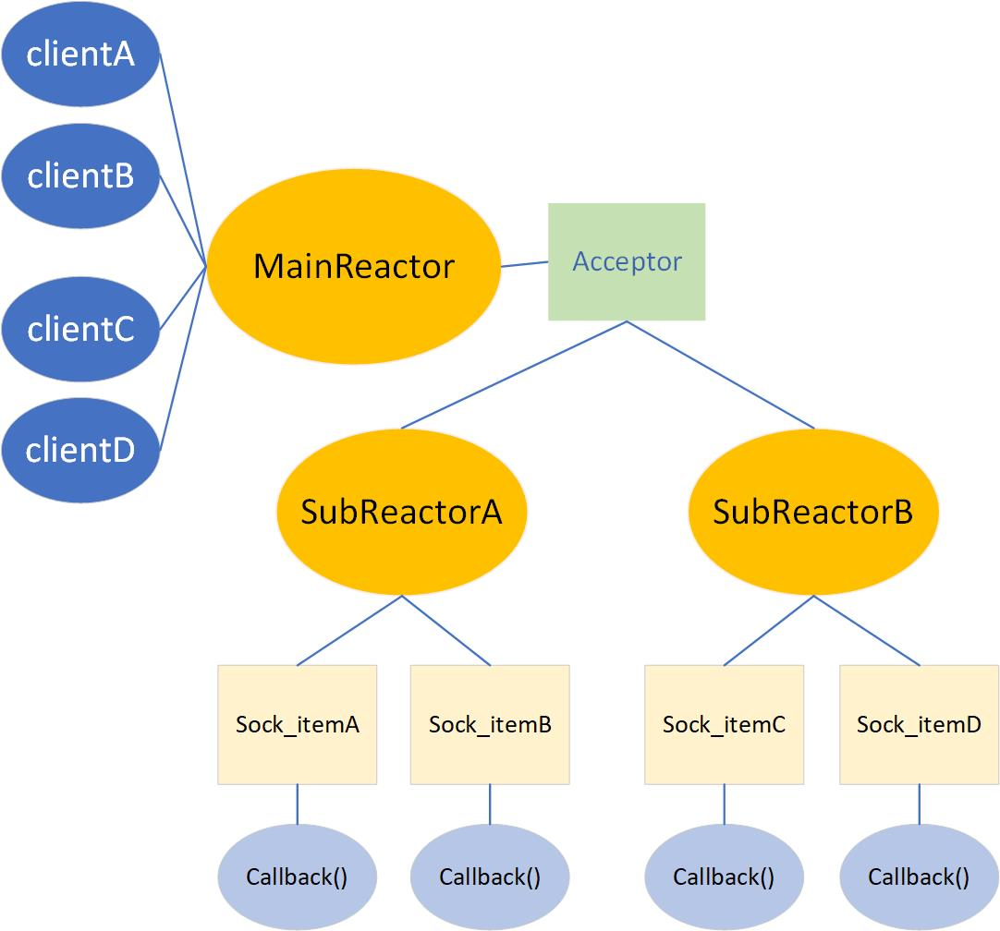
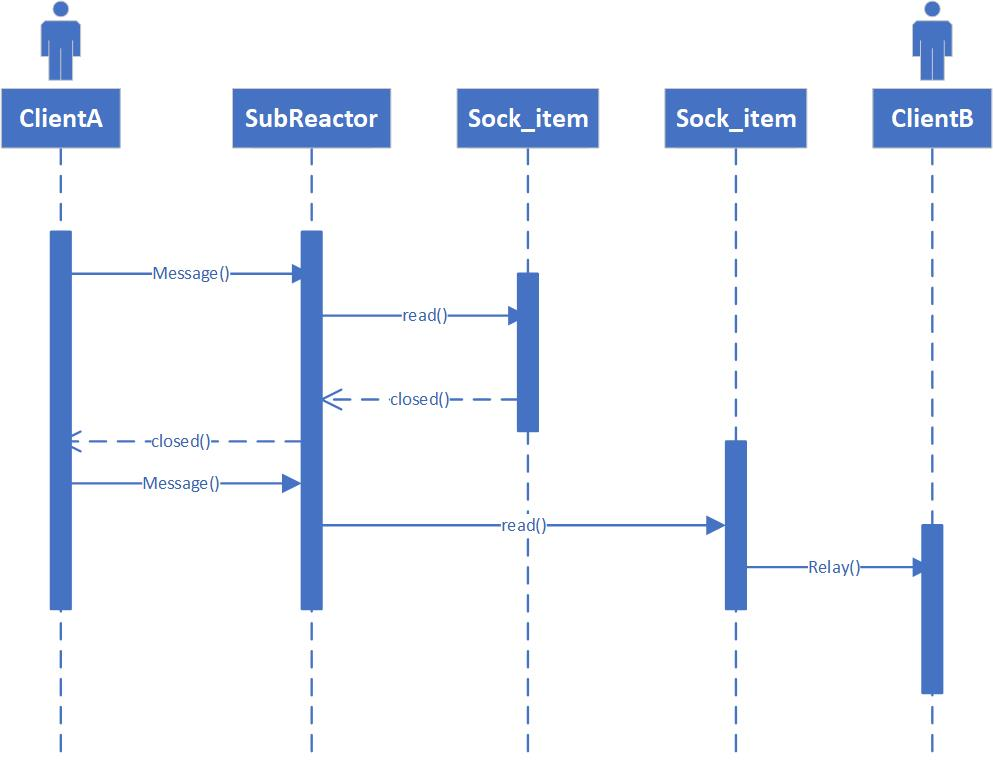
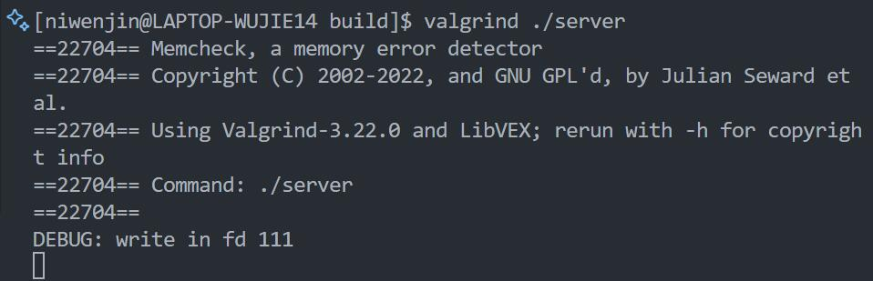
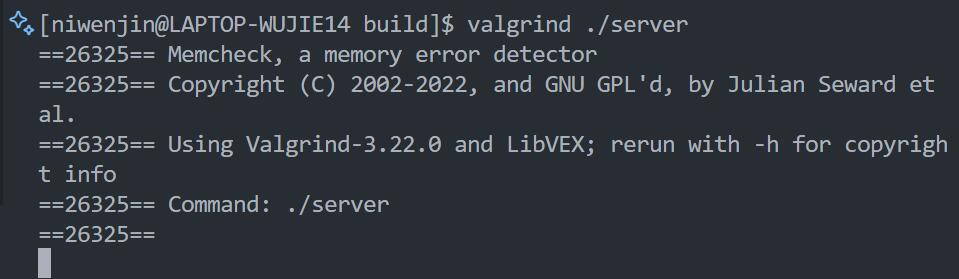
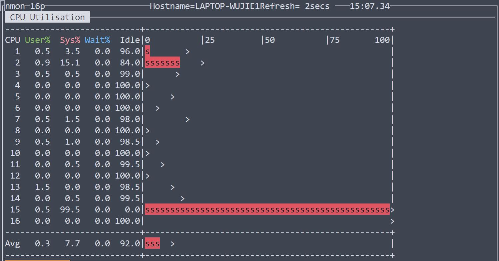

# 网络中继服务器设计与实现

## 设计方案

### 中继服务器

#### 中继服务器框架

采用多 Reactor 模式，mainReactor 负责接受 Tcp 连接（Acceptor），接受连接后，两两配对并分配给 subReactor。可以通过命令行参数启动若干线程，每个线程一个 subReactor。每个 subReactor 启动一个 IO multiplexing（本实验中使用epoll），可监听若干个 Tcp 连接的事件发生情况。每个 Tcp 连接由一个 sock_item 管理，包含读写socket使用的用户态缓冲及处理各个事件的回调函数。



#### 中继时序图

发起连接

mainReactor 启动 epoll 监听 listenfd 上的可读事件。当一组用户向 TcpServer 发起连接，mainReactor 调用 accept 接受 Tcp 连接，选择一个 subReactor 注册这组连接。subReactor 为每个 Tcp 连接创建一个 sock_item 来管理该 fd，并将连接的配对信息注册进 map。


消息转发

subReactor 启动 epoll 监听自己管理的 fd 的事件。当用户发送一条网络消息，subReactor 遍历活跃 fd，根据事件类型调用对应的回调函数。在本实验中，当注意到可读事件，不断读取套接字直到完整地读取一条消息（消息的前8个字节报头表示了消息的长度）。读取完整的消息后，查找配对表，若配对的连接已关闭，丢弃消息并向发送方发送一条“对方已关闭连接”消息；否则，向配对方转发原消息。



#### 服务端核心设计

MainReactor 类主要负责监听和创建连接。其主循环使用 epoll 监听 listenfd 上的可读事件，并 accept 到来的连接。当收到一组成对的连接后，会将其分配给 SubReactor ，由 SubReactor 负责 I/O。

```cpp
class MainReactor {
  public:
    MainReactor(int n);
    ~MainReactor();
    void run();

  private:
    int thread_num;
    int epfd;
    int listenfd;

    vector<thread> threads;
    vector<shared_ptr<SubReactor>> subreactors;

    // 初始化函数
    int epoll_init();
    int listensock_init();
    void thread_init();
    static void thread_func(shared_ptr<SubReactor>);

    void epoll_add_listen();

    // 主循环，负责监听listen fd的可读事件，接受连接
    void accept_loop();

    int fdpair[2];
    int fdflag;

    // 配对连接及分发给SubReactor
    int add_fdpair(int fd);
    void dispatch();
};

// 主循环的实现
void MainReactor::accept_loop() {
    while (1) {
        struct epoll_event events[10];
        // std::cout << "main_epfd: " << epfd << std::endl;
        int nfds = epoll_wait(epfd, events, 10, -1);
        if (nfds == -1) {
            DEBUG_LOG("listen epoll_wait");
            // exit(1);
        }

        for (int i = 0; i < nfds; i++) {
            if (events[i].data.fd == listenfd) {
                struct sockaddr_in client_addr;
                socklen_t client_len = sizeof(client_addr);
                int clientfd = accept4(listenfd, (struct sockaddr *)&client_addr,
                              &client_len, SOCK_NONBLOCK);
                if (clientfd == -1) {
                    DEBUG_LOG("accept");
                    exit(1);
                }

                if (add_fdpair(clientfd)) {
                    dispatch();
                    fdflag = 0;
                }
            }
        }
    }
}
```

SubReactor 类主要负责监听和处理连接上发生的事件，每个 SubReactor 各自使用 epoll 监听自己负责的 fd。当 MainReactor 将一组连接分发给某个 SubReactor 后，会对这两个连接进行注册，将其填入转发表中，并给每个连接绑定一个 Sock_item ，主要负责用用户缓冲区存储各个 socket 读写的数据。之后循环中 epoll 会监听这些 fd 的可读事件，每次非阻塞将 socket 中的数据读入对应的用户缓冲区中。当缓冲区中的数据足够（根据报文头部判断长度），会根据转发表查找转发目标，对数据进行转发。

```cpp
class SubReactor {
  public:
    SubReactor();
    ~SubReactor();
    void add_relay_pair(int fd1, int fd2);
    void run();

  private:
    int epfd;

    // SubReactor循环
    void relay_loop();
    // 转发事件回调函数
    void relay_event(int fd);

    // epoll操作
    int epoll_init();
    void epoll_add(int fd);
    void epoll_del(int fd);

    void del_relay_pair(int fd);

    // SubReactor管理的连接
    std::unordered_map<int, std::shared_ptr<Sock_item>> sock_map;
    // 转发表
    std::unordered_map<int, int> relay_map;
};

// 线程主循环
void SubReactor::relay_loop() {
    while (1) {
        struct epoll_event events[MAX_EVENTS];
        int nfds = epoll_wait(epfd, events, MAX_EVENTS, -1);
        if (nfds == -1) {
            perror("sub_epoll_wait");
            exit(1);
        }

        for (int i = 0; i < nfds; i++) {
            int fd = events[i].data.fd;
            // 转发
            relay_event(fd);
        }
    }
}

// 转发回调函数
void SubReactor::relay_event(int fd) {
    std::shared_ptr<Sock_item> sock = sock_map[fd];
    
    // 该连接已关闭
    if (sock->is_closed()) {
        sock_map.erase(fd);
        epoll_del(fd);
        if (relay_map.find(fd) != relay_map.end()) {
            int tofd = relay_map[fd];
            relay_map.erase(fd);
            relay_map.erase(tofd);
        }
        return;
    }

    // 转发目标已关闭
    if (relay_map.find(fd) == relay_map.end()) {
        char abort[10008];
        read(fd, &abort, sizeof(abort)); // 丢弃数据
        sock->pair_close();
        return;
    }
    
    // 将socket中的数据读取到buf中
    sock->sock_read();

    // 未读完报文头部
    if (sock->get_length() < HEAD_LEN)
        return;

    // 已经读到完整的报文
    while (sock->get_length() > HEAD_LEN + sock->get_head()) {
        int tofd = relay_map[fd];
        sock->sock_send(tofd);
    }
}
```

Sock_item 类主要负责管理每个 fd 拥有的用户缓冲区和 socket 之间的读写操作。其中包含一个可变大小的数组用于存储 socket 读取的数据，当缓冲区中的数据量达到一定数量，缓冲区的大小会翻倍。当从 socket 中读取数据时，每次都非阻塞读入用户缓冲区中；向 socket 中写数据时，也从用户缓冲区中向 socket 中写。如果一个 socket 关闭，不立即清理其 Sock_item，而是将其 close 标志位置为1，这样 SubReactor 可以在确认一组会话全部关闭后再进行清理，防止了串话的发生。

```cpp
class Sock_item {
  public:
    Sock_item() = default;
    Sock_item(int fd)
        : fd_(fd), buf_end_(0), max_buf_size_(2048), close_flag_(false) {
        signal(SIGPIPE, SIG_IGN);
        buf.resize(max_buf_size_);
    }
    ~Sock_item(){};

    int fd() { return fd_; }
    bool is_closed() { return close_flag_; }

    std::vector<char> buf;  // 用户缓冲，用于存储从socket中read的数据

    void sock_read();  // 从fd中read数据
    void sock_send(int tofd);  // 向指定fd发送数据

    void set_head(int head);
    int get_head();  // 获取报头
    int get_length();
    void pair_close();
    void buf_clear();

  private:
    int fd_;
    int buf_end_;  // 缓冲区中实际数据长度
    int max_buf_size_;  // 可变缓冲区长度
    bool close_flag_;  // 设置关闭位，等待SubReactor进行清理
};

// 从fd中read数据
void Sock_item::sock_read() {
    int n = read(fd_, buf.data() + buf_end_, MAX_READ_SIZE);
    if (n == -1) {
        DEBUG_LOG("read in fd " << fd_);
        // exit(1);
    } else if (n == 0) {
        close_flag_ = true;
    } else {
        buf_end_ += n;
        if (buf_end_ * 2 > max_buf_size_) {
            max_buf_size_ *= 2;
            buf.resize(max_buf_size_);
        }
    }
}

// 向指定fd发送数据
void Sock_item::sock_send(int tofd) {
    int len = 8 + get_head();
    int n = write(tofd, buf.data(), len);
    DEBUG_LOG("write bytes " << n);
    if (n == -1) {
        DEBUG_LOG("write in fd " << fd_);
        close_flag_ = true;
        buf_clear();
        return;
    }
    buf_end_ -= len;
    buf.erase(buf.begin(), buf.begin() + len);
    buf.resize(max_buf_size_);
}
```

### 压力发生器

## 测试记录

会话数大概在100到10000的范围内取4到6个值，报文大小可取10B，100B，1KB，10KB四个值。每次测试需要记录的数据：

1. 每秒平均转发报文数（由服务端统计）
2. 每报文平均延迟（由压力发生器统计）
3. CPU平均占用率（单核）（nmon）
4. 网络平均发送和接受速率（nmon）

| 会话数 | 报文大小 | 平均转发报文数/ms | 平均延迟(ms) | cpu占用率 | 接收速率(KB/s) |
| ---- | ---- | ---- | ---- | ---- | ---- |
| 100 | 10B | 1000 | < 0.01 | 12-14 | 6.3 |
| 100 | 100B | 600 | < 0.01 | 8-10 | 18.3 |
| 100 | 1KB | 231 | < 0.01 | 20-21 | 61.7 |
| 100 | 10KB | 66 | < 0.01 | 15-16 | 522 |
| 1000 | 10B | 375 | 0.02 | 8-9 | 89.2 |
| 1000 | 100B | 366 | 0.02 | 18-19 | 199 |
| 1000 | 1KB | 139 | 0.02 | 15-16 | 608 |
| 1000 | 10KB | 42 | 0.08 | 15-16 | 5125 |
| 10000 | 10B | 130 | 0.18 | 14-15 | 704 |
| 10000 | 100B | 149 | 0.17 | 17-18 | 1287 |
| 10000 | 1KB | 102 | 0.24 | 12-13 | 5858 |
| 10000 | 10KB | 27 | 0.66 | 13-14 | 50881 |
| 30000 | 10B | 37 | 0.24 | 99-100 | 1159 |
| 30000 | 100B | 74 | 0.28 | 99-100 | 2136 |
| 30000 | 1KB | 82 | 0.65 | 99-100 | 2216 |
| 30000 | 10KB | 7 | 2.80 | 99-100 | 1444 |
| 50000 | 10B | / | / | 99-100 | 172 |
| 50000 | 100B | / | / | 99-100 | 211 |
| 50000 | 1KB | / | / | 99-100 | 515 |
| 50000 | 10KB | / | / | 99-100 | 390 |

*\* 会话数为100时，转发耗时较少，平均转发数可能误差较大；会话数为50000时，大部分报文丢失，无法统计平均延迟。*

测试截图（部分）：

valgrind测试内存泄漏及错误：



客户端发送中退出；



客户端发送完成后退出；


客户端连接中退出；

nmon监测CPU占用及Network I/O：




## 问题及解决方案

*非阻塞 IO 如何判断读完一条完整的报文？*

每个连接fd绑定一个用户缓冲区 Sock_item，当epoll监听到fd的可读事件时，Sock_item 向用户缓冲区读入数据。通过类方法得到报头和总数据长度，就能判断是否读完一条完整的报文，若读完一条完整的报文则进行转发。

*多线程 Reactor 如何确保用户缓冲区线程安全？*

如果对用户缓冲区加锁，会极大降低效率。最好每个线程一个 event loop，分别管理各自的若干 fd，每个线程不访问其他线程的用户缓冲区，就能消除大多数冲突。

*如何解决用户缓冲区溢出？*

使用 `vector<char>` 代替 char[]，用户缓冲区大小可变，当数据到达高水位，用 resize() 方法将用户缓冲区大小翻倍。注意此处不能使用 reserve() 方法，调用 read 方法传入的缓冲区必须已经初始化。

*压力发射器经常无法接收数据？*

分析发现原因在于 socket 读缓冲溢出。解决方式是用 epoll 监听 fd 的可读事件，立即读出接收到的数据，防止读缓冲溢出。

*写时发现 socket 关闭？*

因为涉及 epoll 管理和 Sock_item，如果立即销毁 fd，新创建的 socket fd 可能误用原先的 Sock_item。因此为 Sock_item 添加关闭标志位，写时若发现 socket 关闭，将标志位置 true，让 SubReactor 销毁该 fd。

*用户缓冲区中数据堆积？*

经分析发现，当用户缓冲区中存储了两条或更多完整的报文时，只会转发一条报文，后面的数据会堆积在用户缓冲区中。应该使用 while 循环而不是 if 语句判断是否需要转发，当转发完一条完整的报文后，就会继续循环判断用户缓冲区中是否还有报文需要转发，直到用户缓冲区的数据不足一条完整的报文。

## 待改进的问题

1. 连接数超过10000后，服务端性能迅速下降，报文开始丢失。
2. 压力发生器占用cpu过多，且稳定性较差。
3. 添加计时器。
