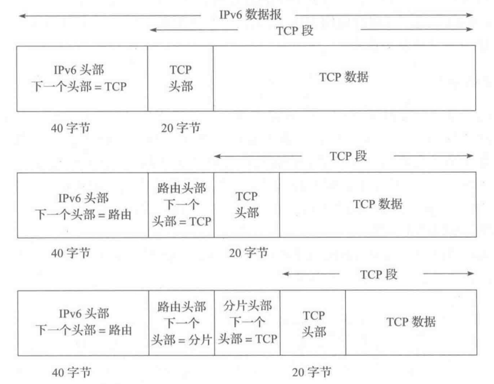
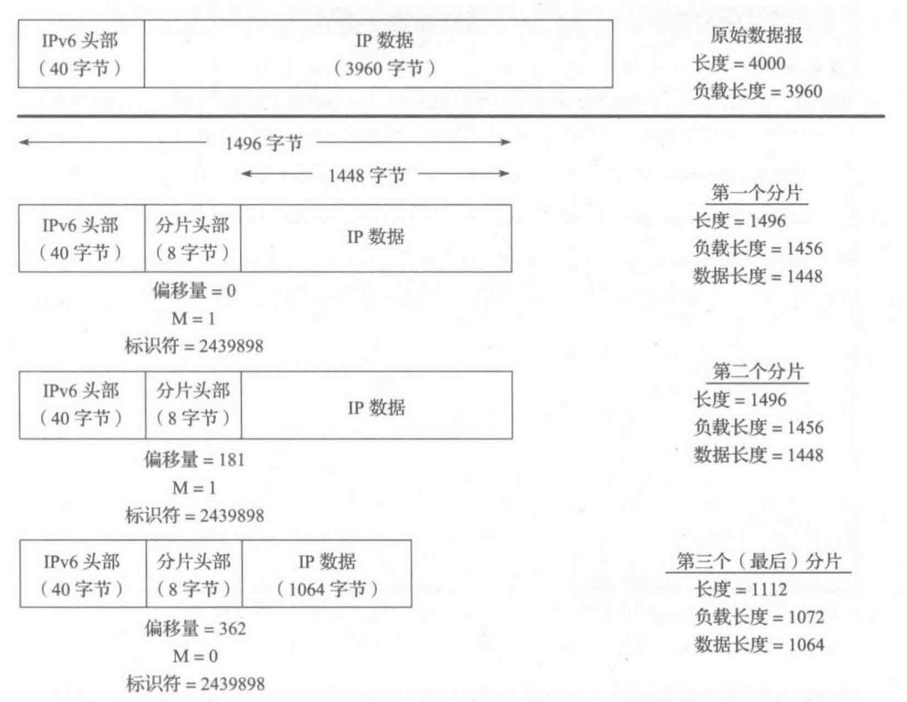
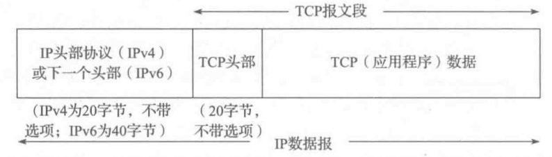
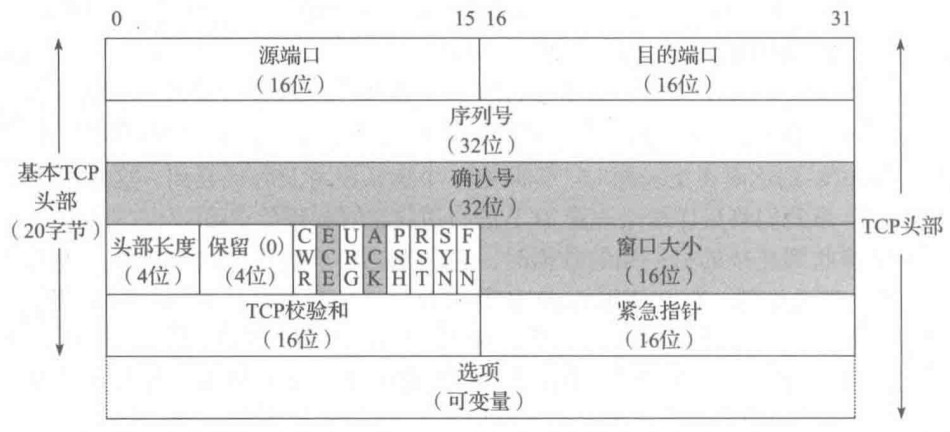
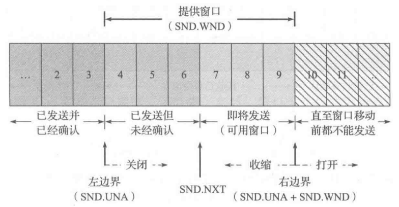
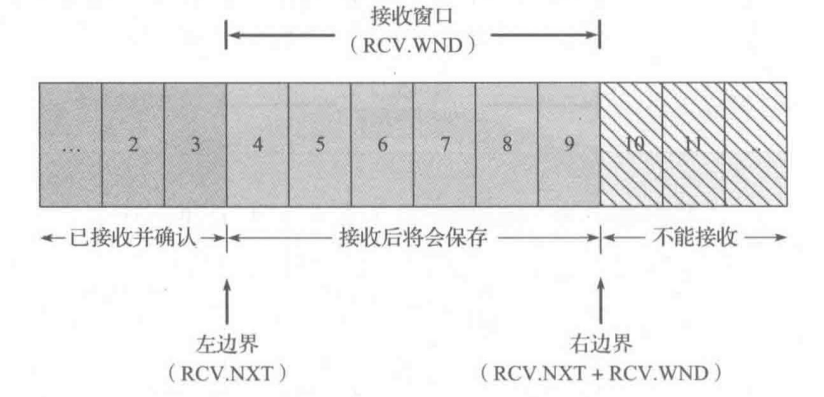

# TCP/IP 详解 卷 1：协议

## 目录

[第 1 章 概述](#第-1-章-概述)  
[第 2 章 Internet 地址结构](#第-2-章-internet-地址结构)  
[第 3 章 链路层](#第-3-章-链路层)  
[第 4 章 地址解析协议](#第-4-章-地址解析协议)  
[第 5 章 Internet 协议](#第-5-章-internet-协议)  
[第 11 章 名称解析和域名系统](#第-11-章-名称解析和域名系统)  
[第 12 章 TCP：传输控制协议](#第-12-章-tcp传输控制协议)  
[第 13 章 TCP 连接管理](#第-13-章-tcp-连接管理)  
[第 14 章 TCP 超时与重传](#第-14-章-tcp-超时与重传)  
[第 15 章 TCP 数据流与窗口管理](#第-15-章-tcp-数据流与窗口管理)  
[第 16 章 TCP 拥塞控制](#第-16-章-tcp-拥塞控制)

## 第 1 章 概述

一系列相关协议的集合称为**协议族**，指定一个协议族中的各种协议之间的相互关系并划分任务的设计，称为协议族的**体系结构**或**参考模型**。TCP/IP 协议族构成了 Internet 的基础。

实现协议族的常用方案是使用一种层次结构的处理方式，这种方案被称为**分层**，通过分层，每层只负责通信的一个方面。国际标准化组织（ISO）定义了称为开放系统互连标准（OSI）的 7 层模型，但是通常认为 TCP/IP 体系结构包含 5 层。分层体系结构的一个主要优点是具有**协议复用**的能力，这种复用形式允许多种协议共存于同一基础设施中。

Internet 工程任务组（IETF）负责各种协议的制定和标准化。 Internet 中的每个标准首先作为临时的 Internet 草案存在，当草案被接收后以一个 RFC（征求意见）的形式发布，*标准跟踪*类别的 RFC 被认为是官方标准。其他类别的 RFC 包括当前最佳实践（BCP）、信息、实验和历史。

## 第 2 章 Internet 地址结构

Internet 中使用的网络层地址又称为 IP 地址。IPv4 地址的长度是 32 位，通常用**点分四组表示法**表示，由四个用点分隔的十进制数组成，如`192.168.130.118`；IPv6 地址的长度是 128 位，将称为块或字段的四个十六进制数用冒号分隔，如`5fU5:2000:80ad:5800:58:800:2023:ld71`。

IPv4 地址空间被划分为 5 大类。A，B，C 类为单播地址（用于唯一标识一个网络接口或设备的地址）分配接口，以及一些特殊状况使用；D 类供组播使用；E 类地址保留。类由地址头决定：0 为 A 类，10 为 B 类，110 为 C 类，1110 为 D 类，1111 为 E 类。在地址头后，每一个单播地址有一部分网络号，剩余位为主机号。

| 类  | 地址范围                  | 高序位 | 用途      | 百分比 | 网络数  | 主机数   |
| --- | ------------------------- | ------ | --------- | ------ | ------- | -------- |
| A   | 0.0.0.0~127.255.255.255   | 0      | 单播/特殊 | 1/2    | 128     | 16777216 |
| B   | 128.0.0.0~191.255.255.255 | 10     | 单播/特殊 | 1/4    | 16384   | 65536    |
| C   | 192.0.0.0~223.255.255.255 | 110    | 单播/特殊 | 1/8    | 2097152 | 256      |
| D   | 224.0.0.0~239.255.255.255 | 1110   | 组播      | 1/16   | N/A     | N/A      |
| E   | 240.0.0.0~255.255.255.255 | 1111   | 保留      | 1/16   | N/A     | N/A      |

为了便于分配，主机字段又被分为了子网号和主机号。例如，在一个 B 类网络中，前 16 位已被固定分配，后 16 位由网络管理员按需分配。如 8 位被分配为子网号，后 8 位为主机号，允许站点支持 256 个子网，每个子网包含 254 台主机（每个子网的第一个和最后一个地址无效）。

为了从 IP 地址中获取网络和子网信息，需要使用**子网掩码**。子网掩码由连续的 1 后跟一些 0 组成，其中的 1 表示网络位，0 表示主机位。为了支持不同子网容纳不同数量的主机，大多数主机、路由器和路由协议支持**可变长度子网掩码**（VLSM），每个路由器和主机除了 IP 地址，还需要配置一个子网掩码。为了减少路由表的条目数，可采用分层路由思想，以**路由聚合**的方式实现。通过将相邻的多个 IP 前缀合并为一个短前缀，可以覆盖更多路由空间。

在每个 IPv4 子网中，主机号全 1 的地址被保留为*广播地址*，如`128.32.1.255/24`，使用这种地址为目的地址的数据报将发送给目标子网的所有主机，称为*定向广播*，由于安全问题，路由器默认禁止定向广播，IPv6 则没有任何广播地址，仅使用组播地址。除了定向广播地址，特殊地址`255.255.255.255`被保留为**本地网络广播**（有限广播），不会被路由器转发。

与 IPv4 不同，IPv6 地址包含范围的概念，不论是单播地址还是组播地址，都要指出地址的有效范围：节点本地/链路本地/全球范围。链路本地地址通常基于 一个标准前缀和一个 IID 创建。IPv6 组播地址的格式变化提供了基于单播前缀分配组的方法，在组中嵌入路由信息（RP 地址），并能基于 IID 创建组播地址。

IPv4 和 IPv6 的地址空间中，都包含一类**特殊用途地址**，不能用于单播地址分配。

IPv4 特殊用途地址[RFC5735]：

| 前缀               | 特殊用途                                             | 参考文献           |
| ------------------ | ---------------------------------------------------- | ------------------ |
| 0.0.0.0/8          | 当前网络（只能作为源地址使用）                       | [RFC1122]          |
| 10.0.0.0/8         | 专用网络（内联网）地址                               | [RFC1918]          |
| 127.0.0.0/8        | 回送地址，用于本地主机通信测试                       | [RFC1122]          |
| 169.254.0.0/16     | 链路本地地址，通常自动分配                           | [RFC3927]          |
| 172.16.0.0/12      | 专用网络（内联网）地址                               | [RFC1918]          |
| 192.0.0.0/24       | IETF 协议分配（IANA 保留）                           | [RFC5736]          |
| 192.0.2.0/24       | TEST-NET-1 地址                                      | [RFC5737]          |
| 192.88.99.0/24     | 用于 6to4 中继（任播地址）                           | [RFC3068]          |
| 192.168.0.0/16     | 专用网络（内联网）地址                               | [RF1918]           |
| 198.18.0.0/15      | 用于基准和性能测试                                   | [RFC2544]          |
| 198.51.100.0/24    | TEST-NET-2 地址。被批准用于文档中                    | [RFC5737]          |
| 203.0.113.0/24     | TEST-NET-3 地址。被批准用于文档中                    | [RFC5737]          |
| 224.0.0.0/4        | IPv4 组播地址（以前的 D 类），仅作为目的 IP 地址使用 | [RFC5771]          |
| 240.0.0.0/4        | 保留空间（以前的 E 类），除了 255.255.255.255        | [RFC1112]          |
| 255.255.255.255/32 | 本地网络（受限的）广播地址                           | [RFC0919][RFC0922] |

IPv6 特殊用途地址[RFC5156]：

| 前缀                | 特殊用途                                                              | 参考文献  |
| ------------------- | --------------------------------------------------------------------- | --------- |
| ::/0                | 默认路由条目。不用于寻址                                              | [RFC5156] |
| ::/128              | 未指定地址，可作为源 IP 地址使用                                      | [RFC4291] |
| ::1/128             | IPv6 主机回送地址，不用于发送出本地主机的数据报中                     | [RFC4291] |
| ::ffff:0:0/96       | IPv4 映射地址。这种地址不会出现在分组头部，仅用于内部主机             | [RFC4291] |
| ::{ipv4-address}/96 | IPv4 兼容地址。已过时，未使用                                         | [RFC4291] |
| 2001::/32           | Teredo 地址                                                           | [RFC4380] |
| 2001:10::/28        | ORCHI（覆盖可路由加密散列标识符）。这种地址不会出现在公共 Internet 中 | [RFC4843] |
| 2001:db8::/32       | 用于文档和实例的地址范围。这种地址不会出现在公共 Internet 中          | [RFC3849] |
| 2002::/16           | 6to4 隧道中继的 6to4 地址                                             | [RFC3056] |
| 3ffe::/16           | 用于 6bone 实验。已过时，未使用                                       | [RFC3701] |
| 5f00::/16           | 用于 6bone 实验。已过时，未使用                                       | [RFC3701] |
| fc00::/7            | 唯一的本地单播地址，不用于全球性的 Internet                           | [RFC4193] |
| fe80::/10           | 链路本地单播地址                                                      | [RFC4291] |
| ff00::/8            | IPv6 组播地址，仅作为目的 IP 地址使用                                 | [RFC4291] |

IP 地址空间的分配由各级权威机构完成，顶层的机构是 IANA，它负责分配 IP 地址和 Internet 协议使用的其他号码。IANA 将分配权限主要委托给几个地区性 Internet 注册机构（RIR），RIR 之间通过号码资源组织（NRO）互相协作。

## 第 3 章 链路层

TCP/IP 协议族中设计链路层的目的是为 IP 模块发送和接收 IP 数据报。它可用于携带一些支持 IP 的辅助性协议，例如 ARP（见第 4 章）。

**以太网**是一种计算机局域网技术，技术标准遵循 IEEE 802.3 标准。基本的共享以太网包含多个连接到共享的介质（电缆段）上的站，链路层的 PDU（帧）可从一个站发送到一个或更多其他站。

### 介质访问控制

由于多个站共享同一网络，需要用**介质访问控制（MAC）协议**协调哪些计算机可访问共享的介质（电缆）。以太网采用**带冲突（或称碰撞）检测的载波侦听多路访问**（CSMA/CD）算法来实现 MAC 协议。在 CSMA/CD 中，一个站（例如计算机）首先检测目前网络上正在发送的信号，并在网络空闲时发送自己的帧。这是协议中的“_载波侦听_”部分。如果其他站碰巧同时发送，发生重叠的电信号被检测为一次碰撞。在这种情况下，每个站等待一个随机时间，然后再次尝试发送。这个时间量的选择依据一个统一的概率分布，随后每个碰撞被检测到的时间长度加倍。最终，每个站会得到机会发送，或者在尝试一定次数（传统以太网为 16）后超时。CSMA/CD 是基于竞争的协议，即在任何给定的时间内，网络中只能有一个帧传输。

随着以太网的发展，基于竞争的 MAC 协议已变得不流行。局域网中每个站之间的线路通常不共享，而是通过以太网*交换机*形成专用的星形拓扑结构。交换机为以太网中的每个站提供同时发送和接收数据的能力（称为“全双工以太网”）。

### 以太网帧

以太网帧格式以一个**前导字段**开始，接收器电路用它确定一个帧的到达时间，并确定编码位（称为时钟恢复）之间的时间量。**帧起始分隔符**（SFD）的固定值为 0xAB，在发现 SFD 时，接收器用它“恢复时钟”。

基本的帧格式包括 48 位（6 字节）的**目的地址**（DST）和**源地址**（SRC）字段。这些地址有时也采用其他名称，例如 “MAC 地址”、“链路层地址”、“802 地址”、“硬件地址”或“物理地址”。以太网帧的目的地址允许寻址到多个站点（称为“广播”或“组播”，见第 9 章）。源地址后面紧跟着一个**类型或长度**字段，它用于确定头部后面的数据类型。TCP/IP 网络中，该字段使用的常见值包括 IPv4（0x0800）、IPv6（0x86DD）和 ARP（0x0806）。在上述字段之后，［802.3 2008］提供了多种**标签**包含由其他 IEEE 标准定义的各种协议字段。之后，是帧的**数据区**或**有效载荷**部分，这里是放高层 PDU（例如 IP 数据报）的地方。传统上，以太网的有效载荷一直是 1500 字节，它代表以太网的 MTU。

有效载荷区域之后的最后字段提供了对帧完整性的检查。**循环冗余校验**（CRC）字段位于尾部，有 32 位。校验码得到的余数取反码放置在帧的**帧校验序列**（FCS）字段中。在接收到数据之后，接收方执行相同的除法计算出余数，并判断该值与 FCS 字段的值是否匹配，若不匹配，则丢弃。

以太网帧有最小和最大尺寸。最小的帧是 64 字节，要求数据区（有效载荷）长度（无标签）最小为 48 字节。当有效载荷较小时，填充字节 0 被添加到有效载荷尾部，以确保达到最小长度。传统以太网的最大帧长度是 1518 字节（包括 4 字节 CRC 和 14 字节头部），但之后扩大到 2000 字节。

如果一个站聚合的流量速率超过该站的链路速率，那么帧就开始存储在中间交换机中。如果这种情况持续一段时间，这些帧可能被丢弃。缓解这种情况的一种方法是在发送方采取**流量控制**。以太网交换机通过在交换机和网卡之间发送特殊信号帧（PAUSE 消息），通知发送方在一定时间内暂停发送。

### 网桥和交换机

网桥或交换机用于连接多个物理的链路层网络（例如一对物理的以太网段）或成组的站，交换机本质上是高性能的网桥。每个交换机（网桥）维护一张表（称为*过滤数据库*），存储每个站的 MAC 地址。当它接收到一个目的地不是自己的帧时，它将帧发送到所有端口，并更新过滤数据库。

## 第 4 章 地址解析协议

网络层地址和链路层地址是由不同部门分配的。对于网络硬件，MAC 地址是由设备制造商定义的，并存储在设备的永久性内存中，所以它不会改变。另一方面，网络接口的 IP 地址通常从维护附近网络连接点的地址池中获得，它在系统启用或配置时分配。**地址解析**是发现两个地址之间的映射关系的过程，对于使用 IPv4 的 TCP/IP 协议族，这是由 **ARP 协议**实现的。

下面的例子是 IPv4*直接交付*的例子，假设使用 Web 浏览器打开以下网址`http://10.0.0.1`：

1. 应用程序调用函数来解析 URL，获取目标 IP 地址；
2. 应用程序要求 TCP 协议建立一条到 10.0.0.1 的连接；
3. 通过向 10.0.0.1 发送一个 IPv4 数据报，TCP 尝试向远程主机发送一个连接请求；
4. 在一个共享的链路层网段上，ARP 向所有主机发送一个称为 ARP 请求的以太网帧，包含目的主机的 IPv4 地址。这被称为链路层广播；
5. 通过 ARP，同一广播域中的所有系统可接收 ARP 请求；
6. 如果某个系统使用请求中指出的 IPv4 地址，它仅需要响应一个 ARP 应答。这个应答包含 IPv4 地址（与请求相匹配）和对应的 MAC 地址；
7. ARP 应答被原始请求的发送方接收;
8. 发送方可将数据报封装在以太网帧中直接发送到目的主机，并使用由 ARP 交换学到的以太网地址作为目的地址。

ARP 高效运行的关键是维护每个主机和路由器上的 **ARP 缓存**（或表）。该缓存使用地址解析为每个接口维护从网络层地址到硬件地址的最新映射。每个映射是一个包含 5 个元素的条目：主机名（对应一个 IP 地址）、硬件地址类型、硬件地址、标志和本地网络接口（它对于这个映射是活跃的）。缓存中每个条目都有一个计时器，用于清除不完整的条目（3 分钟）和完整的条目（20 分钟）。

IPv4 地址映射到 48 位的 MAC（以太网）地址时使用的 **ARP 帧格式**：

在 ARP 帧的以太网头部中，前两个字段包含*目的和源以太网地址*。对于 ARP 请求，目的以太网地址`ff:ff:ff:ff:ff:ff`是广播地址，在同一广播域中的所有以太网接口可接收这些帧。在以太网帧中，对于 ARP（请求或应答），2 字节的*长度或类型*字段必须为 0x0806。*硬件类型*字段指出硬件地址类型，对于以太网，该值为 1。*协议类型*字段指出映射的协议地址类型，对于 IPv4 地址，该值为 0x0800。*硬件大小*和*协议大小*分别指出硬件地址和协议地址的字节数，对于以太网中使用 IPv4 地址的 ARP 请求或应答，它们的值分别为 6 和 4。_Op_ 字段指出该操作是 ARP 请求（值为 1）、 ARP 应答（2）、RARP 请求（3）或 RARP 应答（4）。紧跟在后面的 4 个字段是*发送方硬件地址*（在这个例子中是以太网 MAC 地址）、 _发送方协议地址_（IPv4 地址）、 _目的硬件地址_（MAC/ 以太网地址）和*目的协议地址*（IPv4 地址）。

_注意：以太网头部和 ARP 消息都包含发送方硬件地址。_

## 第 5 章 Internet 协议

IP 是 TCP/IP 协议族中的核心协议，所有 TCP、UDP、ICMP 和 IGMP 数据都通过 IP 数据报传输。IP 提供了一种*尽力而为*、*无连接*的数据报交付服务。任何可靠性必须由上层（例如 TCP）提供。IPv4 和 IPv6 都使用这种尽力而为的基本交付模式。无连接意味着 IP 不维护网络单元（即路由器）中数据报相关的任何链接状态信息，每个数据报独立于其他数据报来处理。

### IP 头部

**IPv4 头部和 IPv6 头部**

正常的 IPv4 头部大小为 20 字节（可变），IPv6 头部长度是 40 字节（不可变）。TCP/IP 头部中所有二进制整数在网络中传输时所需的字节顺序为*大端字节序*，也被称为**网络字节序**。

_提示：对于一个 32 位整数 0x12345678，大端字节序存储顺序为：12 34 56 78；小端字节序存储顺序为：78 56 34 12。_

第一个字段（只有 4 位或半个字节）是**版本**字段。它包含 IP 数据报的版本号：IPv4 为 4，IPv6 为 6。IPv4 头部和 IPv6 头部除版本字段位置相同外再无其他是一样的。因此，这两个协议不能直接互操作，主机或路由器必须分别处理 IPv4 或 IPv6（或两者，称为*双栈*）。

Internet **头部长度**（IHL）字段保存 IPv4 头部中 32 位字的数量，包括任何选项。由于它是一个 4 位的字段，所以 IPv4 头部被限制为最多 15 个 32 位字，即 60 字节。

在头部长度之后，前 6 位被称为**区分服务**字段（DS 字段），后 2 位是**显式拥塞通知**（ECN）字段或指示位。这些字段被用于数据报转发时的特殊处理。

**总长度**字段是 IPv4 数据报的总长度（以字节为单位）。通过这个字段和 IHL 字段，我们知道数据报的数据部分从哪里开始，以及它的长度。由于它是一个 16 位的字段，所以 IPv4 数据报的最大长度（包括头部）为 65 535 字节。但大多数链路层（例如以太网）不能携带这么大的数据，除非将它分（拆）成更小的片。当一个 IPv4 数据报被分为多个更小的分片时，每个分片自身仍是一个独立的 IP 数据报，*总长度*字段反映具体的分片长度。

IPv6 头部不支持分片，其长度可由**负载长度**字段获得。对于 IPv6，负载长度被限制为 64KB。

**标识**字段帮助标识由 IPv4 主机发送的数据报。为了避免将一个数据报分片和其他数据报分片混淆，发送主机通常在每次（从它的一个 IP 地址）发送数据报时都将一个内部计数器加 1，并将该计数器值复制到 IPv4 标识字段。

**生存期**（TTL）字段用于设置一个数据报可经过的路由器数量的上限。发送方将它初始化为某个值，每台路由器在转发数据报时将该值减 1。当这个字段值达到 0 时，该数据报被丢弃，并使用一个 ICMP 消息通知发送方。这可以防止由于出现不希望的路由环路而导致数据报在网络中永远循环。这个字段在 IPv6 中根据实际用途已被重新命名为**跳数限制**。

IPv4 头部中的**协议**字段包含一个数字，表示数据报有效载荷部分的数据类型。最常用的值为 17（UDP）和 6（TCP）。在 IPv6 中，那些由 IPv4 选项提供的特殊功能，通过在 IPv6 头部之后增加扩展头部实现。IPv6 头部中的**下一个头部**字段给出了 IPv4 中的协议字段。它用于指出 IPv6 头部之后的头部类型。

_提示：IPv6 头部使用下一个头部字段形成一个链，链中的头部可以是 IPv6 扩展头部或传输层头部。IPv6 头部出现在数据报的开头，并且长度始终为 40 字节。_

**头部校验和**字段仅计算 IPv4 头部，这意味着 IP 协议不检查 IPv4 数据报有效载荷（例如 TCP 或 UDP 数据）的正确性。IPv6 头部没有任何校验和字段。

**分片头部**用于 IPv6 源节点向目的地发送一个大于路径 MTU 的数据报。在 IPv4 中，如果数据报大小超过下一跳 MTU，任何主机或路由器可将该数据报分片，IPv4 头部中第二个 32 位字段表示分片信息。在 IPv6 中，仅数据报的发送者可以执行分片操作，在这种情况下需要添加一个分片头部。分片头部包括的信息与 IPv4 头部中的相同，只不过标识符字段是 32 位，而不是 IPv4 中采用的 16 位。这个更大的字段提供了在网络中容纳更多分片的能力。

在分片过程中，输入的数据报称为 “原始数据报”，它由两部分组成：“不可分片部分”和“可分片部分”。不可分片部分包括 IPv6 头部和任何在到达目的地之前需由中间节点处理的扩展头部（即包括路由头部之前的所有头部，如果有逐跳选项扩展头部，则是该头部之前的所有头部）。可分片部分包括数据报的其余部分（即目的选项头部、上层头部和有效载荷数据）。

当原始数据报被分片后，将会产生多个分片，其中每个分片都包含一个原始数据报中不可分片部分的副本，但是需要修改每个 IPv6 头部的**负载长度**字段，以反映它所描述的分片的大小。在不可分片部分之后，每个新的分片都包含一个分片头部，其中包含一个分片相应的分片*偏移*字段（例如第一个分片的偏移量为 0），以及一个原始分组的标识符字段的副本。最后一个分片的 M（更多分片）位字段设置为 0。

### IP 转发

IP 层包括一些位于内存中的信息，通常称为**路由表**或**转发表**，每次转发一个数据报时需要从中查找信息。当一个网络接口接收到一个数据报时，IP 模块首先检查目的地址是否为自己的 IP 地址（与自己的某个网络接口相关的 IP 地址），或是它可以接收其流量的一些其他地址，例如 IP 广播或组播地址。如果是的话，数据报交付给由 IPv4 头部的协议字段或 IPv6 头部的下一个头部字段指定的协议模块。如果数据报的目的地不是本地 IP 模块使用的 IP 地址，那么：

1. 如果 IP 层配置为一台路由器，则转发该数据报；
2. 否则，数据报被默默地丢弃。

IP **转发表**通常需要包含几个关键信息：

-   目的地：它是一个 32 位字段（或 128 位字段，用于 IPv6），用于与一个掩码操作结果相匹配。针对涵盖所有目的地的“默认路由”的情况，目的地可简单地设为零；对于仅描述一个目的地的“主机路由”的情况，目的地可设为完整长度的 IP 地址。
-   掩码：它是一个 32 位字段（或 128 位字段，用于 IPv6），用作数据报目的 IP 地址按位与操作的掩码，其中的目的 IP 地址是要在转发表中查找的地址。掩码结果与转发表条目中的多个目的地进行比较。
-   下一跳：它是下一个 IP 实体（路由器或主机）的 32 位 IPv4 地址或 128 位 IPv6 地址，数据报将被转发到该地址。
-   接口：它包含一个由 IP 层使用的标识符，以确定将数据报发送到下一跳的网络接口。

| 目的地   | 掩码            | 网关 (下一跳)  | 接口          | 注意 |
| -------- | --------------- | -------------- | ------------- | ---- |
| 0.0.0.0  | 0.0.0.0         | 70.231.159.254 | 70.231.132.85 | NAT  |
| 10.0.0.0 | 255.255.255.128 | 10.0.0.100     | 10.0.0.1      | NAT  |

IP 转发逐跳进行。当一台主机或路由器中的 IP 层需要向下一跳的路由器或主机发送一个数据报时，它首先检查数据报中的目的 IP 地址（D）。在转发表中使用该值 D 来执行*最长前缀匹配*算法，选择最匹配的条目，并将其下一跳字段作为转发数据报的下一跳 IP 地址。如果在转发表中没有发现匹配的条目，这个数据报无法交付。

第一种情况，所有系统使用相同的网络前缀，这称为**直接交付**；另一种情况为**间接交付**。

*直接交付*不需要路由器，IP 数据报封装在一个链路层帧中，它可以直接识别数据来源或目的地。

*间接交付*涉及路由器，数据转发到这台路由器，并使用该路由器的链路层地址作为目的地址。当路由器 R1 接收到数据报时，它发现数据报的目的 IP 地址不是自己，因此它将转发这个数据报。R1 搜索转发表，并使用默认的条目。当路由器 R2（在 ISP 内部）接收到数据报，它的操作步骤与本地路由器 R1 相同（除了 NAT 操作外）。如果数据报的目的地不是自己的 IP 地址，则转发这个数据报。在这种情况下，路由器通常不仅有一个默认路由，而且有多个其他路由，这取决于它连接的 Internet 的其他部分，以及它的本地策略。

## 第 11 章 名称解析和域名系统

主机名称通过称为**名称解析**（nameresolution）的过程转换成 IP 地址。在互联网中存在不同形式的名称解析，但是最普遍、最重要的一种是**域名系统**（DNS）。DNS 是一个分布式的客户机/服务器网络数据库，TCP/IP 应用程序使用它来完成主机名称和 IP 地址之间的映射。每一个站点维护自己的信息数据库，并运行一个服务器程序供互联网上的其他系统（客户机程序）查询。DNS 提供了允许客户机和服务器相互通信的协议，并且也提供了服务器之间交互信息的协议。

应用程序使用解析器来联系一个或多个 DNS 服务器，执行对区域数据库的查找任务，如转换主机名称到一个 IP 地址，反之亦然。解析器然后联系一个本地域名服务器，该服务器可能递归地联系一个根服务器或满足该请求的其他服务器。大多数 DNS 服务器和一些解析器缓存知道的信息，在一段称为生存时间（TTL）的间隔内，将其提供给随后的客户端。

### DNS 命名空间

DNS 中使用的所有的名称集合构成了 DNS**名称空间**（namespace）。DNS 名称空间是一棵域名树，位于顶部的树根未命名。树的最高层是所谓的**顶级域名**（TLD），包括通用顶级域名（gTLD）、国家代码顶级域名（ccTLD）、国际化国家代码顶级域名（IDNccTLD），以及由于历史原因而存在的一类特殊的称为 ARPA 的基础设施顶级域名（infrastructureTLD）。TLD 管理相关的政策一般由互联网名称和号码分配机构（ICANN）负责。

DNS 名称树中 TLD 下面的名称进一步划分成组，称为**子域名**（subdomain）。一个域名包含一系列的由点分开的**标签**（label）。名称代表名称层级中的一个位置，句点是层次结构分隔符，并且按名称中自右至左的顺序沿树下降。出于匹配的目的，标签是大小写不敏感的。DNS 名称空间的层次结构允许不同的管理机构管理名称空间的不同部分。

### DNS 协议

DNS 协议由两个主要部分组成：用于执行对 DNS 特定名称查询的查询/响应协议和名称服务器用于交换数据库记录的协议（区域传输）。

基本的 DNS 消息格式用于所有的 DNS 操作（查询、响应、区域传输、通知和动态更新）。

基本的 DNS 消息以固定的 12 字节头部开始，其后跟随 4 个可变长度的区段（section）：问题（或查询）、回答、授权记录和额外记录。

在固定长度的头部中，事务 ID（Transaction ID）字段由客户端设置，由服务器返回。客户端使用它来匹配响应和查询。第二个 16 位的字包含一些标志和其他的子域。从最左边的位开始，QR 是 1 位的字段：0 表示查询消息；1 表示响应消息。下一个是操作码（OpCode），4 位的字段。查询和响应中的正常值是 0（标准查询）。其他值为：4（通知）， 5（更新）。其他值（1~3）是弃用的，在运作过程中不会出现。下一个是 AA 位字段，表示“授权回答（authoritative answer）”（与缓存回答相对）。 TC 是 1 位的字段，表示 “可截断的（truncated）”。使用 UDP 时，它表示当应答的总长度超过 512 字节时，只返回前 512 个字节。RD 是 1 位字段，表示 “期望递归（recursion desired）”。该字段可以在一个查询中设置，并在响应中返回。它告诉服务器执行递归查询。RA 是 1 位字段，表示 “递归可用（recursion available）”。如果服务器支持递归查询，则在响应中设置该字段。目前 Z 位字段必须是 0，但是为将来使用而保留。如果包含的信息是已授权的，则 AD 位字段设置为真，如果禁用安全检查（见第 18 章），则 CD 位设置为真。响应码（RCODE）是一个 4 位的返回码字段。

随后的 4 个字段均为 16 位，说明了组成 DNS 消息的问题、回答、授权和额外信息区段中条目的数目。对于查询消息，问题的数目通常为 1，其他三项计数则为 0。对于应答消息，回答的数目至少为 1。

DNS 消息的**问题或查询字段**列出了被引用的问题。**查询名称**（Query Name）是要被查询的域名。每个问题都有**查询类型**（Query Type）和**查询类**（Query Class），类的值是 1 、254 或 255，分别表示互联网类、没有类或所有类。

DNS 信息中的最后三个区段——回答、授权 和额外信息，包含 RR 的集合。**名称**（Name）字段是随后的资源数据对应的域名。**类型**（Type）字段指定为 RR 类型代码中的一个。对于互联网数据来说，**类**（ Class）字段是 1。**TTL** 字段是 RR 可以被缓存的秒数。**资源数据长度**（RDLENGTH）字段指定了资源数据（ RDATA）字段中包含的字节数。

## 第 12 章 TCP：传输控制协议

TCP 提供一种可靠、面向连接、字节流、传输层的服务。

TCP 在 IP 数据报中的封装如图，TCP 头部紧跟着 IP 头部或 IPv6 扩展头部，经常是 20 字节长（不带 TCP 选项）。带选项的话，TCP 头部可达 60 字节。常见选项包括最大段大小、时间戳、窗口缩放和选择性 ACK。

TCP 头部的标准长度是 20 字节，除非出现选项。带阴影的字段（**确认号**（ Acknowledgment Number）、**窗口大小**（ Window Size）以及 ECE 位和 ACK 位）用于与该报文段的发送方关联的相反方向上的数据流。

每个 TCP 头部包含了**源端口**和**目的端口**号，这两个值与 IP 头部中的源和目的 IP 地址一起，唯一地标识了每个连接。

**序列号**（Sequence Number）字段标识了 TCP 发送端到 TCP 接收端的数据流的一个字节，该字节代表着包含该序列号的报文段的数据中的第一个字节。如果我们考虑在两个应用程序之间的一个方向上流动的数据流，TCP 给每个字节赋予一个序列号。这个序列号是一个 32 位的无符号数，到达 $2^{32} - 1$ 后再循环回到 0。**确认号**字段（也简称 ACK 号或 ACK 字段）包含的值是该确认号的发送方期待接收的下一个序列号。即最后被成功接收的数据字节的序列号加 1。

**头部长度**（HeaderLength）字段以 32 位字为单位给出头部的大小（最小值是 5）。当建立一个新连接时，从客户机发送至服务器的第一个报文段的 **SYN** 位字段被启用。这样的报文段称为 SYN 报文段，或简单地称为 SYN。然后序列号字段包含了在本次连接的这个方向上要使用的第一个序列号，后续序列号和返回的 ACK 号也在这个方向上。这个序列号是随机选择的，称为*初始序列号*（Initial Sequence Number，ISN）。

TCP 的流量控制由每个端点使用**窗口大小**字段来通告一个窗口大小来完成。这个窗口大小是字节数，从 ACK 号指定的，也是接收方想要接收的那个字节开始。这是一个 16 位的字段，限制了窗口大小到 65 535 字节，从而限制了 TCP 的吞吐量性能。

**TCP 校验和**字段覆盖了 TCP 的头部和数据以及头部中的一些字段，由发送方进行计算和保存，然后由接收方验证。

**紧急指针**（ Urgent Pointer）字段只有在 URG 位字段被设置时才有效。这个“指针”是一个必须要加到报文段的序列号字段上的正偏移，以产生紧急数据的最后一个字节的序列号。TCP 的紧急机制是一种让发送方给另一端提供特殊标志数据的方法。

最常见的**选项**字段就是“最大段大小”选项，称为 MSS。连接的每个端点一般在它发送的第一个报文段（为了建立该连接，SYN 位字段被设置的那个报文段）上指定这个选项。MSS 指定该选项的发送者在相反方向上希望接收到的报文段的最大值。

## 第 13 章 TCP 连接管理

TCP 是一种面向连接的单播协议。在发送数据之前，通信双方必须在彼此间建立一条连接。

### TCP 连接的建立与终止

一个 TCP 连接是由一对端点或套接字构成，其中通信的每一端都由一对（IP 地址，端口号）所唯一标识。一个 TCP 连接通常分为 3 个阶段：启动、数据传输（也称作 “连接已建立”）和退出（关闭）。建立一个 TCP 连接需要 3 个报文段（三次握手），而关闭一个 TCP 连接需要 4 个报文段（四次挥手）。

为了建立一个 TCP 连接，需要完成以下步骤：

1. 主动开启者（通常称为客户端）发送一个 SYN 报文段（即一个在 TCP 头部的 SYN 位字段置位的 TCP/IP 数据包），并指明自己想要连接的端口号和它的客户端初始序列号（记为 ISN（c））。通常，客户端还会借此发送一个或多个选项。客户端发送的这个 SYN 报文段称作段 1。
2. 服务器也发送自己的 SYN 报文段作为响应，并包含了它的初始序列号（记作 ISN（s））。 该段称作段 2。此外，为了确认客户端的 SYN，服务器将其包含的 ISN（c）数值加 1 后作为返回的 ACK 数值。因此，每发送一个 SYN，序列号就会自动加 1。这样如果出现丢失的情况，该 SYN 段将会重传。
3. 为了确认服务器的 SYN，客户端将 ISN（s）的数值加 1 后作为返回的 ACK 数值。这称作段 3。

TCP 协议规定通过发送一个 FIN 段（即 FIN 位字段置位的 TCP 报文段）来发起关闭操作：

1. 连接的主动关闭者发送一个 FIN 段指明接收者希望看到的自己当前的序列号 K。FIN 段还包含了一个 ACK 段 L 用于确认对方最近一次发来的数据。
2. 连接的被动关闭者将 K 的数值加 1 作为响应的 ACK 值，以表明它已经成功接收到主动关闭者发送的 FIN。此时，上层的应用程序会被告知连接的另一端已经提出了关闭的请其 通常，这将导致应用程序发起自己的关闭操作。接着，被动关闭者将身份转变为主动关闭者，并发送自己的 FIN。该报文段的序列号为 L。
3. 为了完成连接的关闭，最后发送的报文段还包含一个 ACK 用于确认上一个 FIN。值得注意的是，如果出现 FIN 丢失的情况，那么发送方将重新传输直到接收到一个 ACK 确认为止。

### TCP 状态转换

## 第 14 章 TCP 超时与重传

TCP 协议提供可靠数据传输服务。由于下层网络层（IP）可能出现丢失、重复或失序包的情况，为保证数据传输的正确性，TCP 根据接收端返回至发送端的一系列确认信息来判断是否出现丢包。当数据段或确认信息丢失，TCP 启动*重传*操作，重传尚未确认的数据。

TCP 在发送数据时会设置一个计时器，若至计时器超时仍未收到数据确认信息，则会引发相应的超时或基于计时器的重传操作，计时器超时称为重传超时（RTO）。另一种方式的重传称为快速重传，通常发生在没有延时的情况下。若 TCP 累积确认无法返回新的 ACK，或者当 ACK 包含的选择确认信息（SACK）表明出现失序报文段时，快速重传会推断出现丢包。

## 第 15 章 TCP 数据流与窗口管理

当 TCP 通信的接收方的接收速度无法匹配发送速度时，发送方会降低发送速度。TCP 的流量控制机制完成了对发送速率的调节，它是基于 ACK 数据包中的通告窗口大小字段来实现的。

### 流量控制与窗口管理

每个 TCP 头部的窗口大小字段表明接收端可用缓存空间的大小，以字节为单位。TCP 连接的每一端都可收发数据。连接的收发数据量是通过一组窗口结构（window structure）来维护的。每个 TCP 活动连接的两端都维护一个发送窗口结构（send window structure）和接收窗口结构（receive window structure）。

TCP 以字节（而非包）为单位维护其窗口结构。由接收端通告的窗口称为提供窗口（offered window），包含 4~9 字节。随着时间的推移，当接收到返回的数据 ACK，滑动窗口也随之右移。窗口两端的相对运动使得窗口增大或减小。可用三个术语来描述窗口左右边界的运动：

1. 关闭（close），即窗口左边界右移。当已发送数据得到 ACK 确认时，窗口会减小。
2. 打开（open），即窗口右边界右移，使得可发送数据量增大。当已确认数据得到处理，接收端可用缓存变大，窗口也随之变大。
3. 收缩（shrink），即窗口右边界左移。

接收端也维护一个窗口结构，但比发送端窗口简单。该窗口结构记录了已接收并确认的数据，以及它能够接收的最大序列号。

对接收端来说，到达序列号小于左窗口边界（称为 RCV.NXT），被认为是重复数据而丢弃，超过右边界（RCV.WND + RCV.NXT）的则超出处理范围，也被丢弃。对选择确认 TCP 来说，使用 SACK 选项，窗口内的其他报文段也可以被接收确认，但只有在接收到等于左边界的序列号数据时，窗口才能前移。

## 第 16 章 TCP 拥塞控制

当网络中大量的发送方和接收方被要求承担超负荷的通信任务时，可以考虑采取降低发送速率或者最终丢弃部分数据（也可将两者结合使用）的方法。路由器因无法处理高速率到达的流量而被迫丢弃数据信息的现象称为**拥塞**。为避免或者在一定程度上缓解这种状况，TCP 通信的每一方实行**拥塞控制**机制。TCP 实现拥塞控制的核心算法是**慢启动**和**拥塞避免**。TCP 在建立新连接时执行慢启动，直至有丢包时，执行拥塞避免算法。

在传输初始阶段，由于未知网络传输能力，需要缓慢探测可用传输资源，防止短时间内大量数据注入导致拥塞。当一个新的 TCP 连接建立或检测到由重传超时（RTO）导致的丢包时，需要执行慢启动。TCP 发送端长时间处于空闲状态也可能调用慢启动算法。慢启动的目的是，使 TCP 在用拥塞避免探寻更多可用带宽之前得到 cwnd 值，以及帮助 TCP 建立 ACK 时钟。

TCP 以发送一定数目的数据段开始慢启动（在 SYN 交换之后）， 称为初始窗口（Initial Window，IW）。IW 的值初始设为一个 SMSS（发送方的最大段大小），但在［RFC5681］中设为一个稍大的值。假设没有出现丢包情况且每个数据包都有相应的 ACK，第一个数据段的 ACK 到达，说明可发送一个新的数据段。每接收到一个好的 ACK 响应，慢启动算法会以 min（N，SMSS）来增加 cwnd 值。因此，在接收到一个数据段的 ACK 后，通常 cwnd 值会增加到 2，接着会发送两个数据段。如果成功收到相应的新的 ACK，cwnd 会由 2 变 4，由 4 变 8，以此类推。

由于 cwnd 随着 RTT 呈指数增长，大量数据包的发送将导致网络瘫痪。当发生上述情况时，cwnd 将大幅度减小（减至原值一半），接着进入拥塞避免状态。

一旦确立慢启动阈值，TCP 会进入拥塞避免阶段，cwnd 每次的增长值近似于成功传输的数据段大小。这种随时间线性增长方式与慢启动的指数增长相比缓慢许多。每接收一个新的 ACK，cwnd 会做以下更新：

$$
cwnd_{t+1}=cwnd_t + SMSS * SMSS/cwnd_t
$$

随着每个新的 ACK 到达，cwnd 会有相应的小幅增长（取决于上式中的 k 值），整体增长率呈现轻微的次线性。通常认为拥塞避免阶段的窗口时间线性增长，而慢启动阶段呈指数增长。
