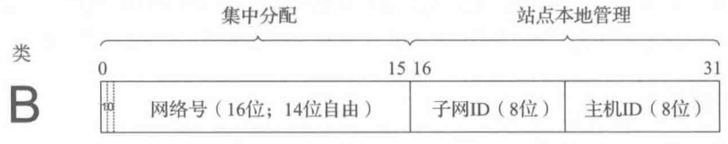

# TCP/IP 详解 卷 1：协议

## 目录

[第 1 章 概述](#第-1-章-概述)  
[第 2 章 Internet 地址结构](#第-2-章-internet-地址结构)

## 第 1 章 概述

一系列相关协议的集合称为**协议族**，指定一个协议族中的各种协议之间的相互关系并划分任务的设计，称为协议族的**体系结构**或**参考模型**。TCP/IP 协议族构成了 Internet 的基础。

实现协议族的常用方案是使用一种层次结构的处理方式，这种方案被称为**分层**，通过分层，每层只负责通信的一个方面。国际标准化组织（ISO）定义了称为开放系统互连标准（OSI）的 7 层模型，但是通常认为 TCP/IP 体系结构包含 5 层。分层体系结构的一个主要优点是具有**协议复用**的能力，这种复用形式允许多种协议共存于同一基础设施中。

Internet 工程任务组（IETF）负责各种协议的制定和标准化。 Internet 中的每个标准首先作为临时的 Internet 草案存在，当草案被接收后以一个 RFC（征求意见）的形式发布，*标准跟踪*类别的 RFC 被认为是官方标准。其他类别的 RFC 包括当前最佳实践（BCP）、信息、实验和历史。

## 第 2 章 Internet 地址结构

Internet 中使用的网络层地址又称为 IP 地址。IPv4 地址的长度是 32 位，通常用**点分四组表示法**表示，由四个用点分隔的十进制数组成，如`192.168.130.118`；IPv6 地址的长度是 128 位，将称为块或字段的四个十六进制数用冒号分隔，如`5fU5:2000:80ad:5800:58:800:2023:ld71`。

IPv4 地址空间被划分为 5 大类。A，B，C 类为单播地址（用于唯一标识一个网络接口或设备的地址）分配接口，以及一些特殊状况使用；D 类供组播使用；E 类地址保留。类由地址头决定：0 为 A 类，10 为 B 类，110 为 C 类，1110 为 D 类，1111 为 E 类。在地址头后，每一个单播地址有一部分网络号，剩余位为主机号。

| 类  | 地址范围                  | 高序位 | 用途      | 百分比 | 网络数  | 主机数   |
| --- | ------------------------- | ------ | --------- | ------ | ------- | -------- |
| A   | 0.0.0.0~127.255.255.255   | 0      | 单播/特殊 | 1/2    | 128     | 16777216 |
| B   | 128.0.0.0~191.255.255.255 | 10     | 单播/特殊 | 1/4    | 16384   | 65536    |
| C   | 192.0.0.0~223.255.255.255 | 110    | 单播/特殊 | 1/8    | 2097152 | 256      |
| D   | 224.0.0.0~239.255.255.255 | 1110   | 组播      | 1/16   | N/A     | N/A      |
| E   | 240.0.0.0~255.255.255.255 | 1111   | 保留      | 1/16   | N/A     | N/A      |

为了便于分配，主机字段又被分为了子网号和主机号。例如，在一个 B 类网络中，前 16 位已被固定分配，后 16 位由网络管理员按需分配。如 8 位被分配为子网号，后 8 位为主机号，允许站点支持 256 个子网，每个子网包含 254 台主机（每个子网的第一个和最后一个地址无效）。

为了从 IP 地址中获取网络和子网信息，需要使用**子网掩码**。子网掩码由连续的 1 后跟一些 0 组成，其中的 1 表示网络位，0 表示主机位。为了支持不同子网容纳不同数量的主机，大多数主机、路由器和路由协议支持**可变长度子网掩码**（VLSM），每个路由器和主机除了 IP 地址，还需要配置一个子网掩码。为了减少路由表的条目数，可采用分层路由思想，以**路由聚合**的方式实现。通过将相邻的多个 IP 前缀合并为一个短前缀，可以覆盖更多路由空间。

在每个 IPv4 子网中，主机号全 1 的地址被保留为*广播地址*，如`128.32.1.255/24`，使用这种地址为目的地址的数据报将发送给目标子网的所有主机，称为*定向广播*，由于安全问题，路由器默认禁止定向广播，IPv6 则没有任何广播地址，仅使用组播地址。除了定向广播地址，特殊地址`255.255.255.255`被保留为**本地网络广播**（有限广播），不会被路由器转发。

与IPv4不同，IPv6地址包含范围的概念，不论是单播地址还是组播地址，都要指出地址的有效范围：节点本地/链路本地/全球范围。链路本地地址通常基于 一个标准前缀和一个IID创建。IPv6组播地址的格式变化提供了基于单播前缀分配组的方法，在组中嵌入路由信息（RP地址），并能基于IID创建组播地址。

IPv4 和 IPv6 的地址空间中，都包含一类**特殊用途地址**，不能用于单播地址分配。

IPv4 特殊用途地址[RFC5735]：

| 前缀               | 特殊用途                                             | 参考文献           |
| ------------------ | ---------------------------------------------------- | ------------------ |
| 0.0.0.0/8          | 当前网络（只能作为源地址使用）                       | [RFC1122]          |
| 10.0.0.0/8         | 专用网络（内联网）地址                               | [RFC1918]          |
| 127.0.0.0/8        | 回送地址，用于本地主机通信测试                       | [RFC1122]          |
| 169.254.0.0/16     | 链路本地地址，通常自动分配                           | [RFC3927]          |
| 172.16.0.0/12      | 专用网络（内联网）地址                               | [RFC1918]          |
| 192.0.0.0/24       | IETF 协议分配（IANA 保留）                           | [RFC5736]          |
| 192.0.2.0/24       | TEST-NET-1 地址                                      | [RFC5737]          |
| 192.88.99.0/24     | 用于 6to4 中继（任播地址）                           | [RFC3068]          |
| 192.168.0.0/16     | 专用网络（内联网）地址                               | [RF1918]           |
| 198.18.0.0/15      | 用于基准和性能测试                                   | [RFC2544]          |
| 198.51.100.0/24    | TEST-NET-2 地址。被批准用于文档中                    | [RFC5737]          |
| 203.0.113.0/24     | TEST-NET-3 地址。被批准用于文档中                    | [RFC5737]          |
| 224.0.0.0/4        | IPv4 组播地址（以前的 D 类），仅作为目的 IP 地址使用 | [RFC5771]          |
| 240.0.0.0/4        | 保留空间（以前的 E 类），除了 255.255.255.255        | [RFC1112]          |
| 255.255.255.255/32 | 本地网络（受限的）广播地址                           | [RFC0919][RFC0922] |

IPv6 特殊用途地址[RFC5156]：

| 前缀                | 特殊用途                                                              | 参考文献  |
| ------------------- | --------------------------------------------------------------------- | --------- |
| ::/0                | 默认路由条目。不用于寻址                                              | [RFC5156] |
| ::/128              | 未指定地址，可作为源 IP 地址使用                                      | [RFC4291] |
| ::1/128             | IPv6 主机回送地址，不用于发送出本地主机的数据报中                     | [RFC4291] |
| ::ffff:0:0/96       | IPv4 映射地址。这种地址不会出现在分组头部，仅用于内部主机             | [RFC4291] |
| ::{ipv4-address}/96 | IPv4 兼容地址。已过时，未使用                                         | [RFC4291] |
| 2001::/32           | Teredo 地址                                                           | [RFC4380] |
| 2001:10::/28        | ORCHI（覆盖可路由加密散列标识符）。这种地址不会出现在公共 Internet 中 | [RFC4843] |
| 2001:db8::/32       | 用于文档和实例的地址范围。这种地址不会出现在公共 Internet 中          | [RFC3849] |
| 2002::/16           | 6to4 隧道中继的 6to4 地址                                             | [RFC3056] |
| 3ffe::/16           | 用于 6bone 实验。已过时，未使用                                       | [RFC3701] |
| 5f00::/16           | 用于 6bone 实验。已过时，未使用                                       | [RFC3701] |
| fc00::/7            | 唯一的本地单播地址，不用于全球性的 Internet                           | [RFC4193] |
| fe80::/10           | 链路本地单播地址                                                      | [RFC4291] |
| ff00::/8            | IPv6 组播地址，仅作为目的 IP 地址使用                                 | [RFC4291] |

IP地址空间的分配由各级权威机构完成，顶层的机构是IANA，它负责分配IP地址和Internet协议使用的其他号码。IANA将分配权限主要委托给几个地区性Internet注册机构（RIR），RIR之间通过号码资源组织（NRO）互相协作。
