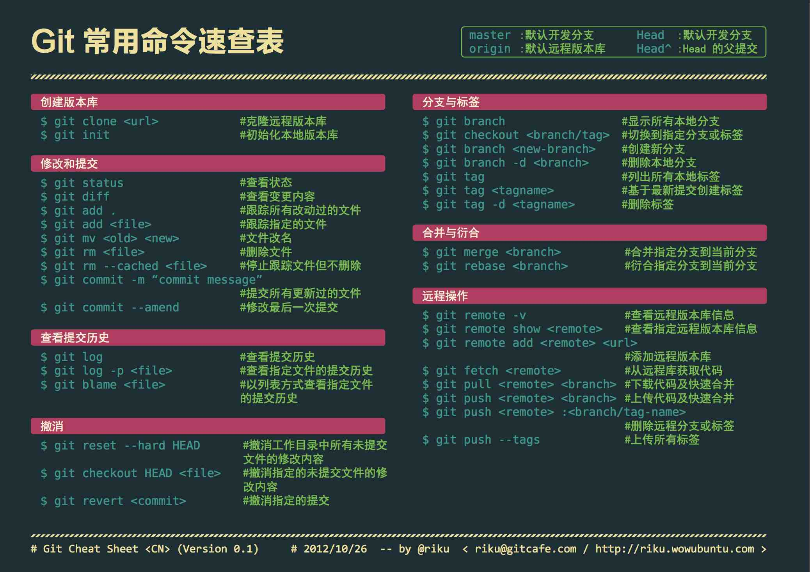

# Git 版本管理

## git 常用命令



## 签名配置

设置姓名邮箱

```shell
# 设置全局
git config --global user.name Niwenjin
git config --global user.email ni_wenjin@qq.com
# 仅设置当前仓库
git config user.name Niwenjin
git config user.email ni_wenjin@qq.com
```

## 最佳实践

### 1. 初始化仓库

在 GitLab 网页端，打开团队公共上游仓库 → 点击右上角 Fork → Fork 到个人账号下。

克隆个人仓库：

```git
git clone git@ssh.git.internal.qifeng.ai:niwenjin/sma.git
```

配置上游远程仓库：

```git
# 添加上游仓库
git remote add upstream git@ssh.git.internal.qifeng.ai:team/sma.git
# 验证远程配置
```

### 2. 同步上游

```git
# 1. 切换到本地主分支
git checkout develop

# 2. 拉取上游仓库最新代码
git fetch upstream

# 3. 将本地主分支变基到上游最新代码（纯线性同步，无merge）
git rebase upstream/develop

# 4. 把同步后的主分支推送到你个人的远程仓库
git push origin develop
```

### 3. 开发流程

1. 同步上游

2. 提交本地更改

    ```git
    git add .
    git commit -m "message"
    ```

    git message 规范

    ```markdown
    <type>(<scope>): <subject>
    <body>
    <footer>

    # type
    feat: 新功能
    refactor: 重构/优化逻辑
    perf: 性能优化
    fix: 修复bug
    chore: 表示对项目配置或工具的修改,不影响功能。
    style: 代码风格
    docs: 文档修改
    test: 增加/修改测试代码

    # scope
    影响范围->模块名、功能名

    # subject
    一句话总结->简短清晰,结尾不要加句号

    # 示例
    feat(audio):增加 keywords 字段并支持模糊查询
    ```

3. 推送代码到个人 Fork 仓库

    ```git
    git push origin develop
    ```

4. 提交 MR 到上游仓库
