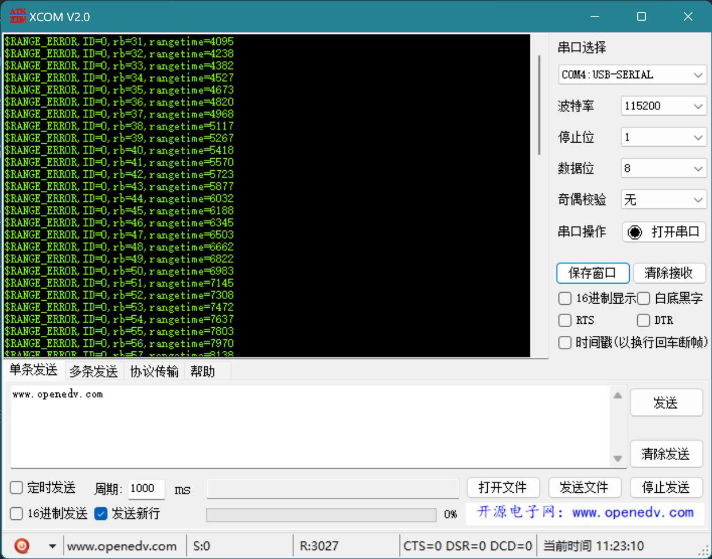
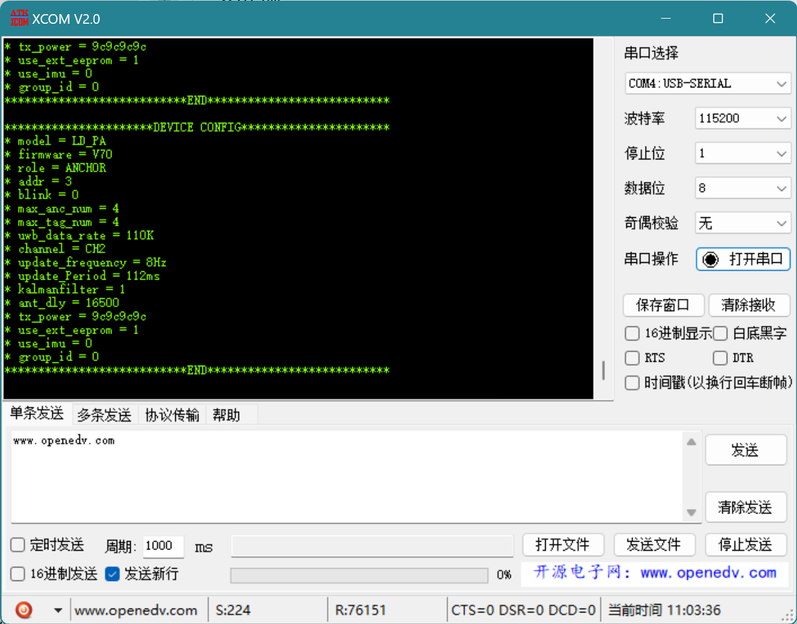
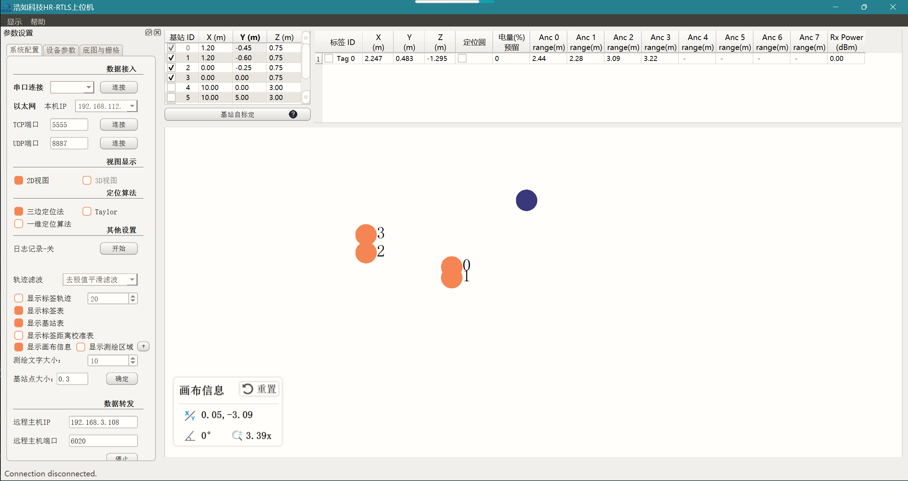

# UWB 开发套件

## 目录

[开箱测试](#开箱测试)

## 开箱测试

基站准备

1. TTL 转 USB 连接 3.3v/5v；
2. 连接到 PC/充电宝供电。

标签测试

1. Windows 安装 CH340 驱动程序；
2. 使用 TTL 转 USB 接口连接到 Windows PC；
3. 使用 XCOM 查看原始消息
   
   

   
4. 使用上位机软件测试

   
