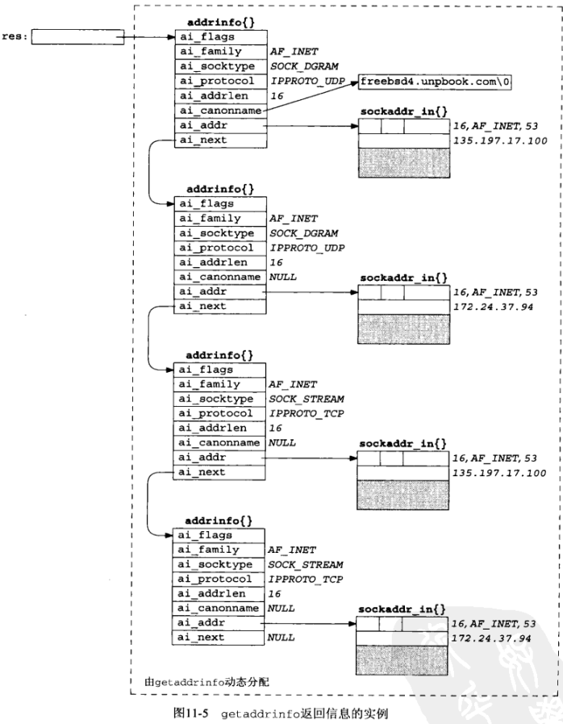

# 第11章 名字与地址转换
## IP地址和域名之间的转换
gethostbyname
```
#include <netdb.h>

struct hostent *gethostbyname(const char *hostname);
// 若成功，返回一个gostent结构指针，结构中含有所查找主机的所有IPv4地址；否则返回NULL

struct hostent {
    char *h_name;         //正式主机名
    char **h_aliases;     //主机别名
    int h_addrtype;       //主机IP地址类型：IPV4-AF_INET
    int h_length;		  //主机IP地址字节长度，对于IPv4是四字节，即32位
    char **h_addr_list;	  //主机的IP地址列表
};
```

gethostbyaddr
```
#include <netdb.h>
 
struct hostent * gethostbyaddr(const char * addr , socklen_t len , int family);
 
//成功时返回hostent结构体变量地址值，失败时返回NULL指针。
 
/* 变量含义 */
// addr：含有IP地址信息的in_addr结构体指针。为了同时传递IPv4地址之外的其他信息，该变量的类型声明为char指针
// len：向第一个参数传递的地址信息的字节数，IPv4时为4，IPv6时为16
// family：传递地址族信息，IPv4时为AF_INET，IPv6时为AF_INET6
```
## 根据名字和端口号查找服务
getservbyname
```
#include <netdb.h>

struct servent *getservbyname(const char *servname, const char *protoname);

// 返回：成功为非空指针，否则为NULL且设置h_errno
```
getservbyport
```
#include <netdb.h>

struct servent *getservbyport(int port, const char *protoname);

// 返回：成功为非空指针，否则为NULL且设置h_errno
// 注意：port参数的值必须为网络字节序
```
servent结构
```
struct servent {
    char  *s_name;
    char  **s_aliases;
    int     s_port;
    char  *s_proto;
};
```
## getaddrinfo函数
函数原型
```
#include<netdb.h>

int getaddrinfo(const char *restrict nodename,
                    const char *restrict servname,
                    const struct addrinfo *restrict hints,
                    struct addrinfo **restrict res);
// 若成功，返回0；否则非0
```

参数
1. nodename：主机名或者是数字化的地址字符串（IPv4的点分十进制串或IPv6的16进制串）。
2. servname：服务名可以是十进制的端口号("8080")字符串，也可以是已定义的服务名称，如"ftp"、"http"等。
3. hints：该参数指向用户设定的`struct addrinfo`
4. 结构体，只能设定该结构体中`ai_family、ai_socktype、ai_protocol 和 ai_flags`四个域，其他域必须设置为0或者NULL, 通常是申请结构体变量后使用memset()初始化再设定指定的四个域。  
该参数可以设置为NULL，等价于`ai_socktype = 0, ai_protocol = 0, ai_family = AF_UNSPEC, ai_flags = 0`
   1. ai_family：指定返回地址的协议簇，取值AF_INET(IPv4)、AF_INET6(IPv6)、AF_UNSPEC(IPv4 and IPv6)
   2. ai_socktype：用于设定返回地址的socket类型，有SOCK_STREAM、SOCK_DGRAM、SOCK_RAW，设置为0表示所有类型。
   3. ai_socktype：协议IPPROTO_TCP、IPPROTO_UDP等，设置为0表示所有协议。
   4. ai_flags：附加选项，多个选项可以使用或操作进行结合。  

### 配套函数
gai_strerror
```
#include <netdb.h>

const char *gai_strerror(int error);
// 返回：指向错误描消息字符串的指针
```
freeaddrinfo
```
#include <netdb.h>

void freeaddrinfo(struct addrinfo *ai);
// 释放结构链表中的所有结构
```
getnameinfo
```
#include <sys/socket.h>
#include <netdb.h>

int getnameinfo(const struct sockaddr *sa, socklen_t salen,
                    char *host, size_t hostlen,
                    char *serv, size_t servlen, int flags);
// 以一个套接字地址为参数，返回描述其中的主机的一个字符串和描述其中服务的另一个字符串。
// 返回：若成功则为0
```