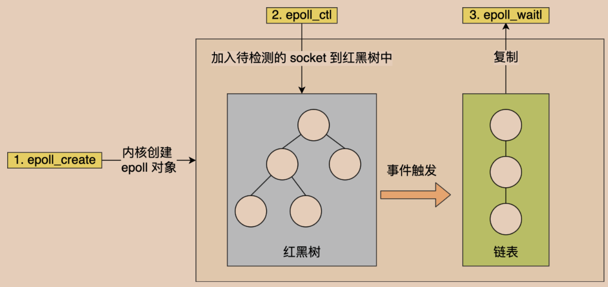
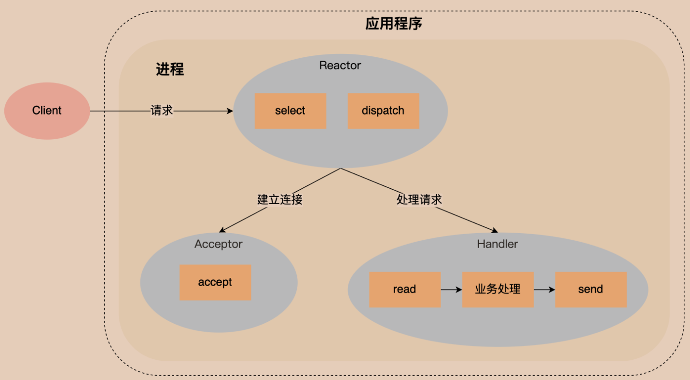
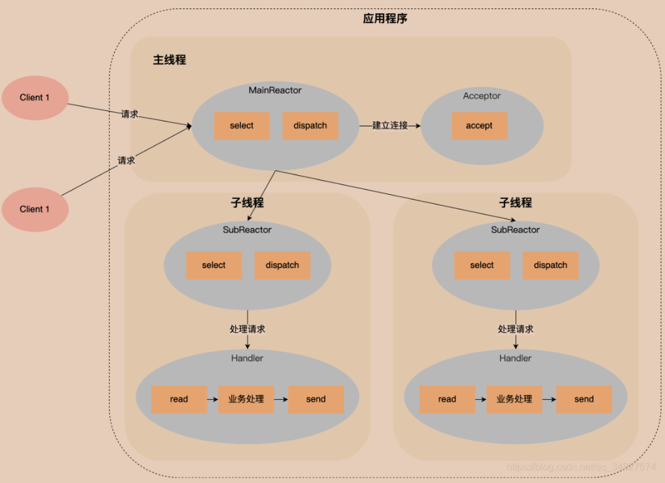
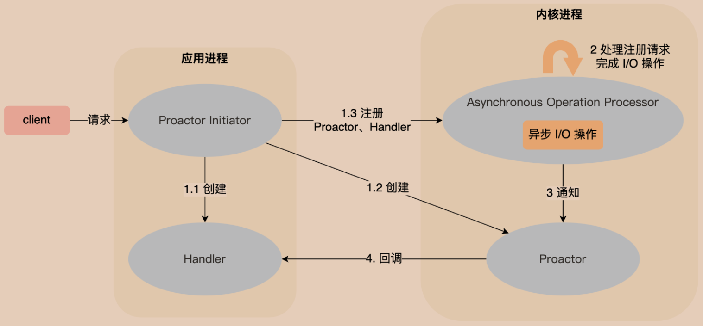

# 第16章 非阻塞式I/O
## 阻塞的套接字调用

可能阻塞的套接字调用可分为以下四类：
1. 输入操作：read、readv、recv、recvfrom和recvmsg
2. 输出操作：write、writev、send、sendto和sendmsg
3. 接受外来连接：accept
4. 发起外出连接：connect
## 非阻塞式I/O

select/poll/epoll等多路复用API返回的事件并不一定可读写的，因此最好搭配非阻塞 I/O，以便应对极少数的特殊情况。例如，当数据已经到达，但经检查后发现有错误的校验和而被丢弃时，就会发生这种情况。
### select
select函数见第6章
```
#include <stdio.h>
#include <sys/socket.h>
#include <sys/types.h>
#include <netinet/in.h>
#include <fcntl.h>

#include <unistd.h>

#include <pthread.h>
#include <sys/select.h>
#include <string.h>

#define PORT 9999
#define START_FD 3
#define BUFFER_LENGTH 128

int main(void)
{
    int listen_fd, conn_fd;
    // 创建监听套接字
	listen_fd = socket(AF_INET, SOCK_STREAM, 0);
	if (listen_fd == -1) return -1;
    
    // 设置监听套接字地址并绑定
	struct sockaddr_in serv_addr, client_addr;
    socklen_t client_len;
	serv_addr.sin_family = AF_INET;
	serv_addr.sin_addr.s_addr = htonl(INADDR_ANY);
	serv_addr.sin_port = htons(PORT);

	if (-1 == bind(listen_fd, (struct sockaddr*)&serv_addr, sizeof(serv_addr))) {
		return -2;
	}

    // 将监听套接字设置为非阻塞，以便select可以非阻塞地监听
	int flag = fcntl(listen_fd, F_GETFL, 0);
	flag |= O_NONBLOCK;
	fcntl(listen_fd, F_SETFL, flag);

	listen(listen_fd, 128);

    // 由于每次有读写事件会调用FD_SET改变r_fds, w_fds，因此需要r_set, w_set作备份
    fd_set r_fds, w_fds;
    fd_set r_set, w_set; 

    FD_ZERO(&r_fds);
    FD_SET(listen_fd, &r_fds); // 监听listen_fd的读事件

    FD_ZERO(&w_fds);
    int max_fd = listen_fd;

    unsigned char buf[BUFFER_LENGTH] = {0};
    int n_ready, ret = 0;


    while (1) {
        r_set = r_fds;
        w_set = w_fds;
        // 使用select阻塞等待读写事件就绪。r_set用于监听读事件，w_set用于监听写事件。
        n_ready = select(max_fd + 1, &r_set, &w_set, NULL, NULL); // 阻塞等待IO读写事件就绪
        
        // 当有新的连接请求时，执行相应的处理。
        if (FD_ISSET(listen_fd, &r_set)) {
            printf("listen_fd --> \n");
            client_len = sizeof(client_addr);
            conn_fd = accept(listen_fd, (struct sockaddr*)&client_addr, &client_len); 

            FD_SET(conn_fd, &r_fds); // 将conn_fd添加到r_fds中监听
            
            if (conn_fd > max_fd) {
                max_fd = conn_fd;
            }
        }

        // 处理已连接的客户端套接字上的读写事件
        for (int i = START_FD; i <= max_fd; i++) {
            if (FD_ISSET(i, &r_set)) {
                ret = recv(i, buf, sizeof(buf), 0);
                // 说明客户端断开了连接
                if (ret == 0) {
                    close(i);
                    FD_CLR(i, &r_fds);
                } else if (ret > 0) {
                    printf("buf : %s, ret : %d\n", buf, ret);
                    FD_SET(i, &w_fds); // 将fd添加到写集合中
                } else {
                    close(i);
                    FD_CLR(i, &r_fds);
                }
            } else if (FD_ISSET(i, &w_set)) {
                ret = send(i, buf, ret, 0);

                FD_CLR(i, &w_fds); // 将fd从写集合中删除
                FD_SET(i, &r_fds);
            }
        }
    }
    return 0;
}
```
## epoll
epoll是Linux下多路复用IO接口select/poll的增强版本，它能显著提高程序在大量并发连接中只有少量活跃的情况下的系统CPU利用率。
### 机制
select的缺点：
1. 每次调用select都需要将进程加入到所有监视socket的等待队列，每次唤醒都需要从每个队列中移除（两次遍历），并且每次都要将整个fds列表传递给内核。
2. 进程被唤醒后，需要遍历寻找哪些socket收到数据。

epoll的方案：
1. epoll 在内核里使用红黑树来跟踪进程所有待检测的文件描述字，把需要监控的socket通过`epoll_ctl()`函数加入内核中的红黑树里，红黑树是个高效的数据结构，增删查一般时间复杂度是 O(logn)，通过对这棵黑红树进行操作，这样就不需要像select/poll每次操作时都传入整个socket集合，只需要传入一个待检测的socket，减少了内核和用户空间大量的数据拷贝和内存分配。
2. epoll使用事件驱动的机制，内核里维护了一个链表来记录就绪事件，当某个socket有事件发生时，通过回调函数内核会将其加入到这个就绪事件列表中，当用户调用`epoll_wait()`函数时，只会返回有事件发生的文件描述符的个数，不需要像select/poll那样轮询扫描整个socket集合，大大提高了检测的效率。


### 两种模式
水平触发（level-triggered，LT）
* socket读触发：socket接收缓冲区有数据，会一直触发epoll_wait EPOLLIN事件，直到数据被用户读取完。
* socket写触发：socket可写，会一直触发epoll_wait EPOLLOUT事件。

边缘触发（edge-triggered，ET）
* socket读触发：socket数据从无到有，只会会触发一次epoll_wait EPOLLIN事件。用户检测到事件后，需一次性把socket接收缓冲区数据全部读取完，读取完的标志为recv返回-1，errno为EAGAIN。
* socket写触发：socket可写，会触发一次epoll_wait EPOLLOUT事件。

两种模式比较：
水平触发epoll_wait的系统调用次数更多，效率较低；边缘触发I/O事件发生时只会通知一次，因此需要尽可能地读写数据，以免错失读写的机会。
### 接口


epoll_create
```
int epoll_create(int size);   // size：监听数量，现已无意义
// 返回文件描述符epfd，该文件描述符指向epoll维护的红黑树的根节点
```
epoll_ctl
```
int epoll_ctl(int epfd, int op, int fd, struct epoll_event *event);
// epfd: 为epoll_creat的句柄
/* op: 表示动作，用3个宏来表示：
  		EPOLL_CTL_ADD (注册新的fd到epfd)，
  		EPOLL_CTL_MOD (修改已经注册的fd的监听事件)，
  		EPOLL_CTL_DEL (从epfd删除一个fd)；*/
// fd：表示要监听的文件描述符
// epoll_event：告诉内核需要监听的事件
struct epoll_event {
    __uint32_t events; /* Epoll events */
    epoll_data_t data; /* User data variable */
};
/* events取值: 
    EPOLLIN ：	表示对应的文件描述符可以读（包括对端SOCKET正常关闭）
  	EPOLLOUT：	表示对应的文件描述符可以写
  	EPOLLPRI：	表示对应的文件描述符有紧急的数据可读（这里应该表示有带外数据到来）
  	EPOLLERR：	表示对应的文件描述符发生错误
  	EPOLLHUP：	表示对应的文件描述符被挂断
  	EPOLLET： 	将EPOLL设为边缘触发(Edge Triggered)模式，这是相对于水平触发(Level Triggered)而言的
  	EPOLLONESHOT：只监听一次事件，当监听完这次事件之后，如果还需要继续监听这个socket的话，需要再次把这个socket加入到EPOLL队列里 */

typedef union epoll_data {
    void *ptr;
    int fd;
    uint32_t u32;
    uint64_t u64;
} epoll_data_t;
```
epoll_wait
```
#include <sys/epoll.h>
int epoll_wait(int epfd, struct epoll_event *events, int maxevents, int timeout);
// events：		用来存内核得到事件的集合；
// maxevents：	告之内核这个events有多大，这个maxevents的值不能大于创建epoll_create()时的size；
/* timeout：超时时间
    -1：	阻塞
    0：	    立即返回，非阻塞
    >0：	指定毫秒 */
// 返回值：成功，返回有多少文件描述符就绪；超时，返回0；出错，返回-1
```
## Reactor和Proactor
### Reactor模式
Reactor指“对事件反应”。I/O多路复用（select/epoll等）监听事件，收到事件后，根据事件类型分配（Dispatch）给某个进程/线程，Reactor模式也叫Dispatcher模式。  
Reactor模式主要由两个核心部分组成：
1. Reactor：负责监听和分发事件
2. 处理资源池：负责处理事件

Reactor模式有三种方案：
1. 单Reactor单进程/线程

Reactor对象监听和分发事件，如果是建立连接的事件，则分发给Acceptor对象；否则分发给Handler对象。  

2. 单Reactor多进程/线程

Handler对象不再负责业务处理，只负责数据的接收和发送，Handler对象读取到数据后，会将数据发给子线程里的 Processor对象进行业务处理。处理完后，将结果发回主线程中的Handler对象，接着由Handler将响应结果发送给client；

3. 多Reactor多进程/线程

主线程中的MainReactor对象监控连接建立事件，收到事件后通过Acceptor对象中的accept获取连接，将新的连接分配给某个子线程。子线程中的SubReactor对象对分配的连接继续进行监听，并创建一个Handler用于处理连接的响应事件。
### Proactor模式
阻塞I/O或非阻塞I/O都是同步调用，因为内核将数据从内核空间拷贝到用户空间的过程都是需要等待的，也就是说这个过程是同步的。如果内核实现的拷贝效率不高，read/send调用就会在这个同步过程中等待比较长的时间。  

异步I/O不需要在“内核数据准备好”和“数据从内核态拷贝到用户态”这两个过程等待。当发起 `aio_read`（异步 I/O）之后，就立即返回，内核自动将数据从内核空间拷贝到用户空间，这个拷贝过程同样是异步的，内核自动完成后发送通知。

Proactor模式的工作流程：
1. Proactor Initiator负责创建Proactor和Handler对象，并将Proactor和Handler都通过异步操作处理器注册到内核。
2. 异步操作处理器负责处理注册请求，并处理I/O操作。
3. 完成I/O操作后通知Proactor。
4. Proactor根据不同的事件类型回调不同的Handler进行业务处理。
### 比较
* Reactor 是非阻塞同步网络模式，感知的是就绪可读写事件。在每次感知到有事件发生（比如可读就绪事件）后，就需要应用进程主动将socket接收缓存中的数据读到缓冲区中。这个过程是同步的，读取完数据后应用进程才能处理数据。
* Proactor是异步网络模式，感知的是已完成的读写事件。在发起异步读写请求时，需要传入数据缓冲区的地址（用来存放结果数据）等信息，系统内核自动把数据的读写工作完成。操作系统完成读写工作后，就会通知应用进程直接处理数据。

*在Linux下的aio系列异步I/O函数，是由POSIX定义的异步操作接口。aio的实现不是真正的操作系统级别支持的，而是在用户空间模拟出来的异步，并且仅仅支持基于本地文件的aio异步操作，不支持网络编程中的socket，这也使得过去基于Linux的高性能网络程序都是使用Reactor方案。  
而Windows里实现了一套完整的支持socket的异步编程接口IOCP，是由操作系统级别实现的、真正意义上异步I/O，因此在Windows里实现高性能网络程序可以使用效率更高的Proactor方案。  
2019年，Linux内核加入了`io_uring`，减少了在用户空间和内核空间之间的数据拷贝，并降低系统调用的开销，从而提高I/O操作的性能。*