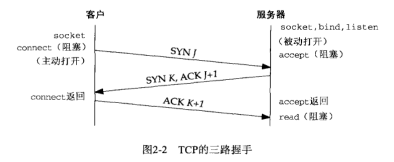

# 第1章 简介和TCP/IP
## 网络拓扑
```
netstat -i(n)            // 提供网络接口的信息,-n输出数值地址
netstat -r               // 展示路由表
ifconfig eth0            // 获取每个接口的详细信息
ping -b 206.168.112.127  // 找到本地网络中众多主机的IP地址
```
## TCP
### 三次握手
建立一个TCP连接时会发生下述情景：

1. 服务器必须准备好接收外来的连接，通常通过调用socket、bind和listen函数来完成，称之为被动打开(passive open)。
2. 客户通过调用connect发起主动打开(active open)，这导致客户发送一个SYN（同步）分节，它告诉服务器将在连接中发送数据的初始序列号。
3. 服务器必须确认（ACK）客户的SYN，同时自己也发送一个SYN分节，它含有服务器将在同一连接中发送的数据的初始序列号。
4. 客户确认服务器的SYN。
### TCP选项
每一个SYN可以含有多个TCP选项：
* MSS选项。最大分节大小，即它在本连接的每个TCP分节中接受的最大数据量。
* 窗口规模选项。
* 时间戳选项。
### 四次挥手
TCP建立一个连接需要3个分节，终止一个连接则需4个分节：

1. 某个应用进程调用close，称该端执行主动关闭(active close)，该端的TCP发送一个FIN分节，表示数据发送完毕。
2. 接收到这个FIN的对端执行被动关闭(passive close)，它发送一个确认(ACK)给发送端应用进程。FIN的接受也作为一个文件结束符传递给接收端应用进程。
3. 一段时间后，接收到这个文件结束符的应用进程将调用close关闭它的套接字，这导致它的TCP也发送一个FIN。
4. 接受这个FIN的原发送端确认这个FIN。
### TCP状态转换图

#### TIME_WAIT状态
该状态的持续时间是最长生命分节期（MSL）的两倍，称之为2MSL。理由：
1. 可靠地实现TCP全双工连接的终止。
2. 允许老的重复分节在网络中消逝。
### 端口号
端口号被划分成3段：
1. 众所周知的端口为0~1023。这些端口号由IANA分配和控制。
2. 已登记的端口为1024~49151。
3. 49152~65535是动态的或私有的端口。它们就是我们所称的临时端口。
### 套接字对
一个TCP连接的套接字对是一个定义该连接的两个端点的四元组：本地IP地址、本地TCP端口号、外地IP地址、外地TCP端口号。标识每个端点的两个值（IP地址和端口号）通常称为一个套接字。
### 缓冲区大小及限制
数据链路的硬件规定了最大传输单元MTU，两个主机间路径中最小的MTU称为路径MTU(path MTU)。  
IPv4数据报的最大大小是65535字节，包括IPv4首部。  
IPv6数据报的最大大小是65575字节，包括40字节的IPv6首部。  
当一个IP数据报的大小超过相应链路的MTU，将执行分片。  
最小重组缓冲区大小是IPv4和IPv6的任何实现都必须保证支持的最小数据报大小。