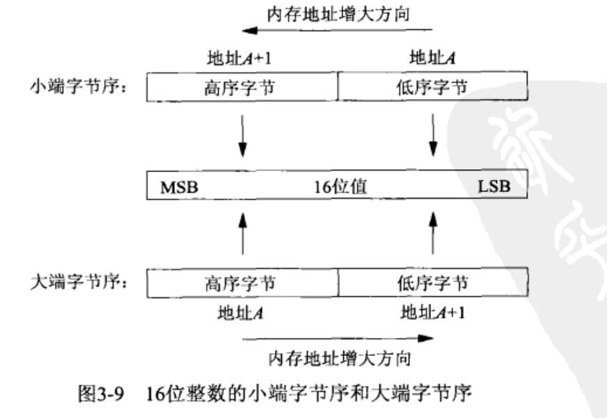
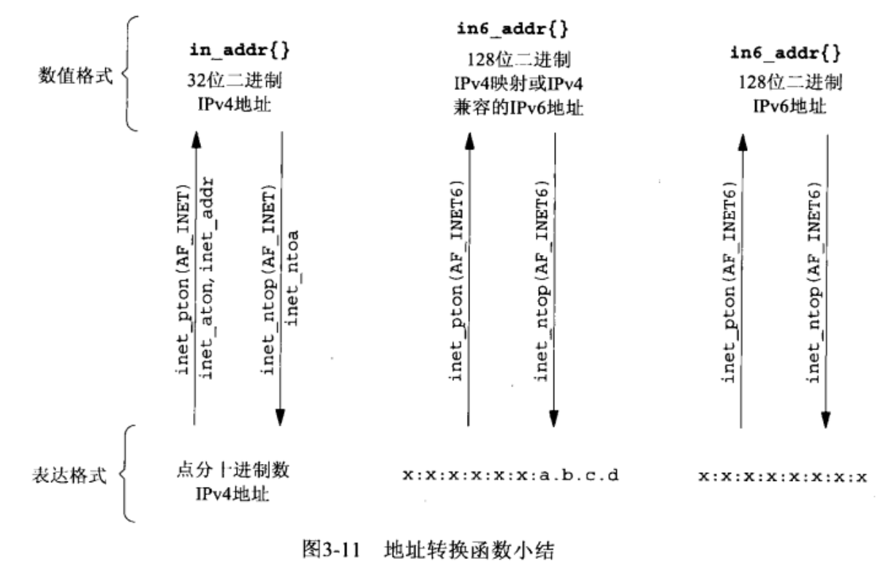

# 第3章 套接字编程简介
## 套接字地址结构

IPv4套接字地址结构
```
struct in_addr 
{
	in_addr_t	s_addr;		/* 32-bit IPv4 address */
};					/* network byet orered */
 
stuct sockaddr_in
{
	uint8_t		sin_len;	    /* length of structure */
	sa_familyt	sin_family;	    /* AF_INET */
	in_port_t 	sin_port;	    /* 16-bit TCP or UDP port number */
					            /* network byet orered */
	struct in_addr	sin_addr;	/* 32-bit IPv4 address */
					            /* network byet orered */
	char		sin_zero[8]	    /* unused */
};

```
通用套接字地址结构
```
struct sockaddr {
    uint8_t        sa_len;
    unsigned short sa_family;    // address family, AF_XXXX
    char           sa_data[14];  // 14 bytes of protocol address
};
// 唯一用途是对指向特定于协议的套接字地址结构的指针执行类型强制转换。
```
IPv6套接字地址结构
```
struct in6_addr{
    unint8_t s6_addr[16]; /*128-bit IPv6 address*/
                        /*network byte ordered*/
};

#define SIN6_LEN

struct sockaddr_in6{
    uint8_t     sin6_len;         /*len of this struct*/
    sa_family_t sin6_family;      /*AF_INET6*/
    in_port_t   sin6_port;        /*transport layer port*/
                                  /*network byte ordered*/
    uint32_t    sin6_flowinfo;    /*flow information,undefine*/
    struct in6_addr sin6_addr;    /*IPv6 address*/
                                  /*network byte ordered*/
    uint32_t    sin6_scope_id;    /*set of interfaces for a scope*/
};
```
新的通用套接字地址结构
```
struct sockaddr_storage
{
	uint8_t		ss_len;		/* length of this structure (implementation dependent)*/
	sa_family_t	ss_family;	/* address family :AF_xxx value */
	/* implementation-dependent elements to provide:
	 * a) alignment sufficient to fulfill the alignment requirements of
	 *    all socket address types that the system supports.
	 * b) enough storage to hold any type of socket address that the
	 *    system supports.
     */
};
```
## 网络字节序

主机字节序与网络字节序转换
```
#include <netinet/in.h>

// 将主机字节序转换为网络字节序
// 返回：网络字节序的值
 unit32_t htonl (unit32_t hostlong);
 unit16_t htons (unit16_t hostshort);

 // 将网络字节序转换为主机字节序
 // 返回：主机字节序的值
 unit32_t ntohl (unit32_t netlong);
 unit16_t ntohs (unit16_t netshort);
```
## 字节操纵函数
BSD函数
```
#include <strings.h>

void bzero(void *dest, size_t nbytes);
void bcopy(const void *src, void *dest, size_t nbytes);
int bcmp(const void *ptr1, const void *ptr2, size_t nbytes);
```
ANSI C函数
```
#include <string.h>

void *memset(void *dest, int c, size_t len);
void *memcpy(void *dest, const void *src, size_t nbytes);
int memcmp(const void *ptrl1, const void *ptrl2, size_t nbytes)
```
## 地址转换函数

数值格式（numeric）和表达格式（presentation）之间转换
```
#include <arpa/inet.h>

int inet_pton(int family, const char *strptr, void *addrptr);
const char *inet_ntop(int family, const void *addrptr, char *strptr, size_t len);
```
## 读写套接字函数
readn
```
#include	"unp.h"

ssize_t						/* Read "n" bytes from a descriptor. */
readn(int fd, void *vptr, size_t n)
{
	size_t	nleft;
	ssize_t	nread;
	char	*ptr;

	ptr = vptr;
	nleft = n;
	while (nleft > 0) {
		if ( (nread = read(fd, ptr, nleft)) < 0) {
			if (errno == EINTR)
				nread = 0;		/* and call read() again */
			else
				return(-1);
		} else if (nread == 0)
			break;				/* EOF */

		nleft -= nread;
		ptr   += nread;
	}
	return(n - nleft);		/* return >= 0 */
}
/* end readn */

ssize_t
Readn(int fd, void *ptr, size_t nbytes)
{
	ssize_t		n;

	if ( (n = readn(fd, ptr, nbytes)) < 0)
		err_sys("readn error");
	return(n);
}
```
writen
```
#include	"unp.h"

ssize_t						/* Write "n" bytes to a descriptor. */
writen(int fd, const void *vptr, size_t n)
{
	size_t		nleft;
	ssize_t		nwritten;
	const char	*ptr;

	ptr = vptr;
	nleft = n;
	while (nleft > 0) {
		if ( (nwritten = write(fd, ptr, nleft)) <= 0) {
			if (nwritten < 0 && errno == EINTR)
				nwritten = 0;		/* and call write() again */
			else
				return(-1);			/* error */
		}

		nleft -= nwritten;
		ptr   += nwritten;
	}
	return(n);
}
/* end writen */

void
Writen(int fd, void *ptr, size_t nbytes)
{
	if (writen(fd, ptr, nbytes) != nbytes)
		err_sys("writen error");
}
```
readline
```
#include	"unp.h"

static int	read_cnt;
static char	*read_ptr;
static char	read_buf[MAXLINE];

static ssize_t
my_read(int fd, char *ptr)
{

	if (read_cnt <= 0) {
again:
		if ( (read_cnt = read(fd, read_buf, sizeof(read_buf))) < 0) {
			if (errno == EINTR)
				goto again;
			return(-1);
		} else if (read_cnt == 0)
			return(0);
		read_ptr = read_buf;
	}

	read_cnt--;
	*ptr = *read_ptr++;
	return(1);
}

ssize_t
readline(int fd, void *vptr, size_t maxlen)
{
	ssize_t	n, rc;
	char	c, *ptr;

	ptr = vptr;
	for (n = 1; n < maxlen; n++) {
		if ( (rc = my_read(fd, &c)) == 1) {
			*ptr++ = c;
			if (c == '\n')
				break;	/* newline is stored, like fgets() */
		} else if (rc == 0) {
			*ptr = 0;
			return(n - 1);	/* EOF, n - 1 bytes were read */
		} else
			return(-1);		/* error, errno set by read() */
	}

	*ptr = 0;	/* null terminate like fgets() */
	return(n);
}

ssize_t
readlinebuf(void **vptrptr)
{
	if (read_cnt)
		*vptrptr = read_ptr;
	return(read_cnt);
}
/* end readline */

ssize_t
Readline(int fd, void *ptr, size_t maxlen)
{
	ssize_t		n;

	if ( (n = readline(fd, ptr, maxlen)) < 0)
		err_sys("readline error");
	return(n);
}
```