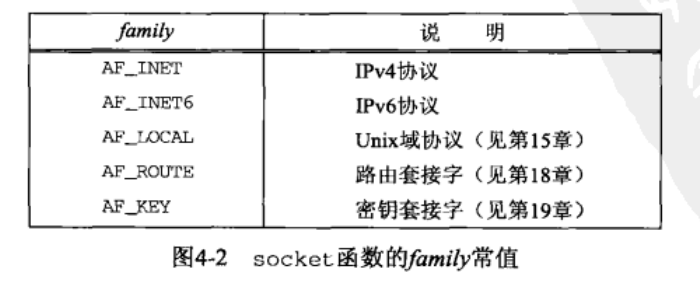
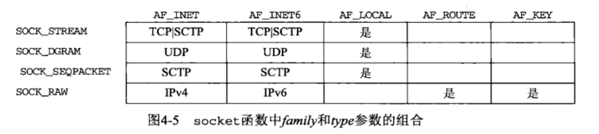
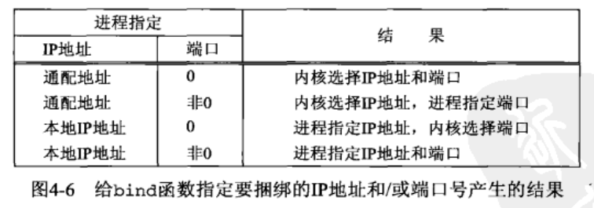
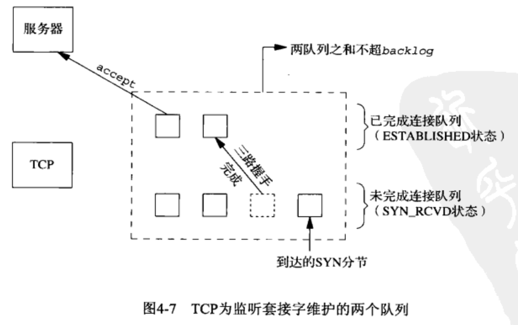
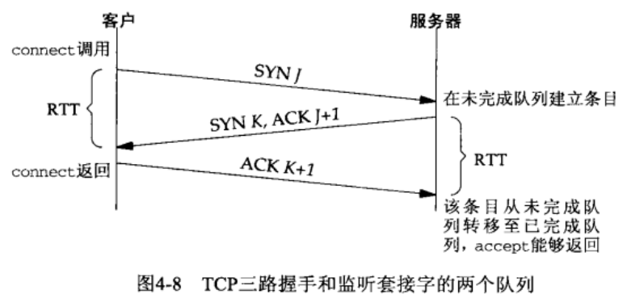
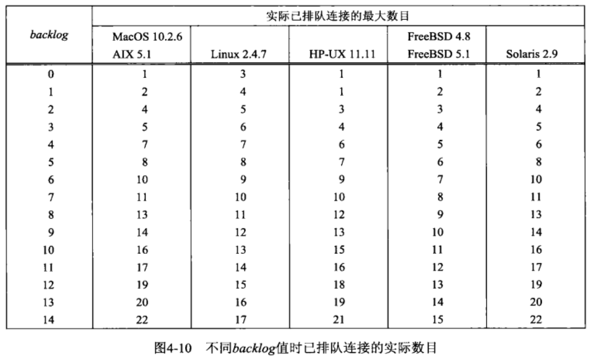

# 第4章 基本TCP套接字编程
## 基本套接字函数

### socket函数
socket函数指定通信协议类型
```
#include <sys/socket.h>

int socket(int family, int type, int protocol);
// 若成功返回非负描述符，否则返回-1
```



### connect函数
TCP客户用connect函数建立与服务器的连接
```
#include <sys/socket.h>

int connect(int sockfd, const struct sockaddr *servaddr, socklen_t addrlen);
// 若成功返回0，否则返回-1
```
### bind函数
bind函数把一个本地协议地址赋予一个套接字
```
#include <sys/socket.h>

int bind(int sockfd, const struct sockaddr *myaddr, socklen_t addrlen);
// 若成功返回0，否则返回-1
```

### listen函数
listen函数仅由TCP服务器调用
```
#include <sys/socket.h>

int listen(int sockfd, int backlog);
// 若成功返回0，否则返回-1
```
内核为任何一个给定的监听套接字维护两个队列


不同backlog值时已排队的实际数目

### accept函数
accept函数由TCP服务器调用，从已完成连接队列队头返回下一个已完成连接
```
#include <sys/socket.h>

int accept(int sockfd, struct sockaddr *cliaddr, socklen_t *addrlen);
// 若成功返回非负描述符，否则返回-1
```
### getsockname和getpeername函数
```
#include <sys/socket.h>

int getsockname(int sockfd, struct sockaddr *localaddr, socklen_t *addrlen);
int getpeername(int sockfd, struct sockaddr *peeraddr, socklen_t *addrlen);
// 均返回：若成功则为0，若出错则为-1
```
使用场景：
1. 在一个没有调用bind的TCP客户上，connect成功返回后，getsockname用于返回内核赋予该连接的本地IP地址和本地端口号。
2. 在以端口号0（告知内核选择本地端口号）调用bind后，getsockname用于返回内核赋予的本地端口号。
3. getsockname可用于获取某个套接字的地址族。
4. 在一个以通配地址调用bind的TCP服务器上，与某个客户的连接一旦建立，就可以调用getsockname返回由内核赋予该连接的本地IP地址。
5. 当一个服务器是由调用过accept的某个进程调用exec执行程序时，getpeername用于获取客户身份。
## 并发服务器
### fork和exec函数
fork有两个典型用法：  
1. 一个进程创建一个自身的副本。
2. 一个进程想要执行另一个程序。首先调用fork创建一个自身的副本，然后其中一个副本调用exec将自身替换为新的程序。
```
#include <unistd.h>

pid_t fork(void);
// 返回:在子进程中为0，在父进程中为子进程ID，若出错则为-1

int execl(const char *pathname, const char *arg0, ... /* (char *) 0*/ );
int execv (const char *pathname, char *const *argv[]);
int execle (const char *pathname, const char *arg0, ...
            /*( char * ) 0, char *const envp [ ] */);
int execve(const char *pathname, char *const argv[], char *const envp []);
int execlp(const char *filename, const char *arg0, ... /* (char *) 0*/ );
int execvp(const char *filename, char *const argv[]);
//均返回：若成功则不返回，若出错则为-1
```
exec函数族

### close函数
close函数也用来关闭套接字，并终止TCP连接
```
#include <unistd.h>

int close(int sockfd);
// 若成功返回0，否则返回-1
```
调用close函数使描述符引用计数减1，当引用计数为0，才会引发TCP的连接终止。