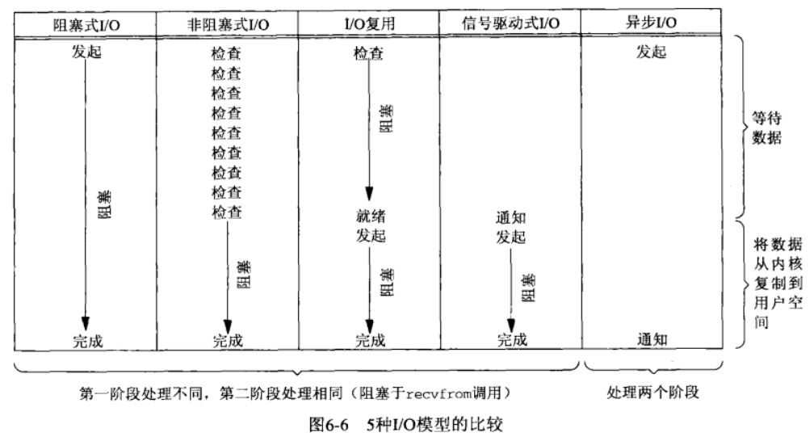
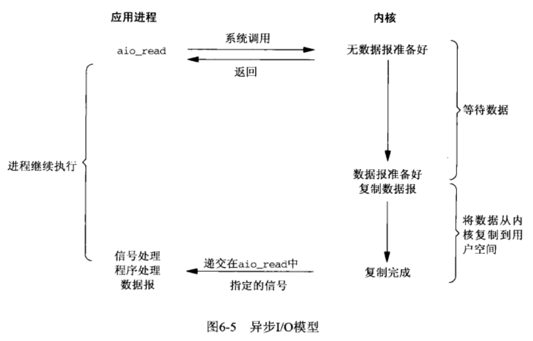
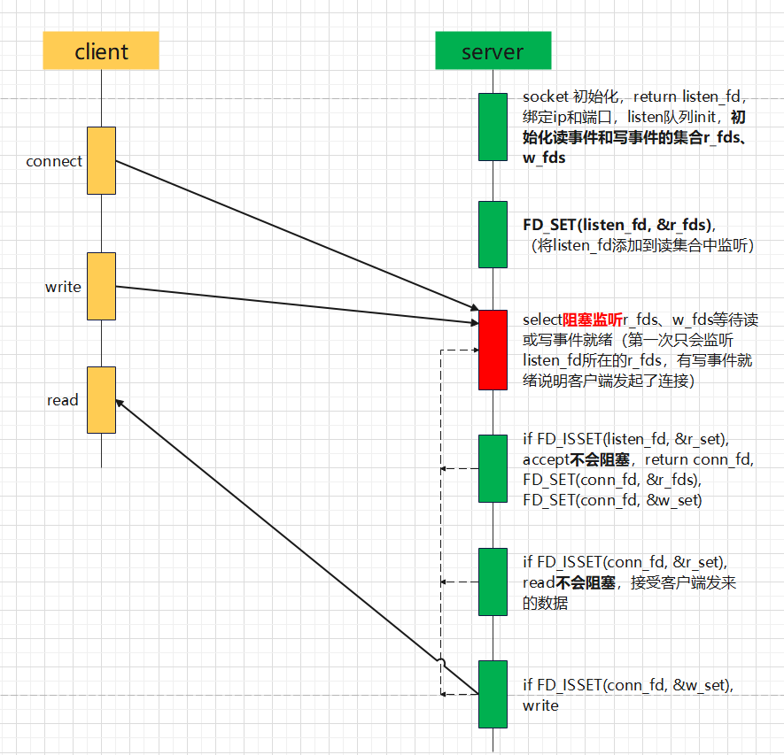

# 第6章 I/O复用：select和poll函数
## I/O模型

### 阻塞式I/O

### 非阻塞式I/O

当所请求的I/O操作非得把本进程投入睡眠才能完成时，不要把本进程投入睡眠，而是返回一个错误。
### I/O复用

调用select或poll，阻塞在这两个系统调用中，而不是阻塞在真正的I/O系统调用上。
### 信号驱动式I/O

让内核在描述符就绪时发送SIGIO信号通知程序。
### 异步I/O

告知内核启动某个操作，并让内核在整个操作完成后通知程序。
## select函数

函数原型
```
#include <sys/select.h>
#include <sys/time.h>

int select(int nfds, fd_set *readfds, fd_set *writefds, fd_set *exceptfds, struct timeval *timeout);
```
### 参数
nfds：监控的文件描述符集里最大文件描述符加1，因为此参数会告诉内核检测前多少个文件描述符的状态
readfds：监控有读数据到达文件描述符集合，传入传出参数
writefds：监控写数据到达文件描述符集合，传入传出参数
exceptfds：监控异常发生达文件描述符集合,如带外数据到达异常，传入传出参数
fd_set类型：位图
timeout：定时阻塞监控时间，3种情况
1. NULL，永远等下去
2. 设置timeval，等待固定时间
3. 设置timeval里时间均为0，检查描述字后立即返回，轮询
```
struct timeval {
    long tv_sec; /* seconds */
    long tv_usec; /* microseconds */
};
```
### 返回值
成功：所监听的所有监听集合（readfds + writefds + exceptfds）中，满足条件的总数。  
失败：-1
### 配套使用的接口
```
void FD_CLR(int fd, fd_set *set); 	// 把文件描述符集合里fd清0
int FD_ISSET(int fd, fd_set *set); 	// 测试文件描述符集合里fd是否置1
void FD_SET(int fd, fd_set *set); 	// 把文件描述符集合里fd位置1
void FD_ZERO(fd_set *set); 		    // 把文件描述符集合里所有位清0
```
## poll函数
```
#include <poll.h>

int poll(struct pollfd *fdarray, unsigned long nfds, int timeout);
// 返回就绪描述符的个数，若出错，返回-1

struct pollfd {
    int fd;
    short events;
    short revents;
}
```