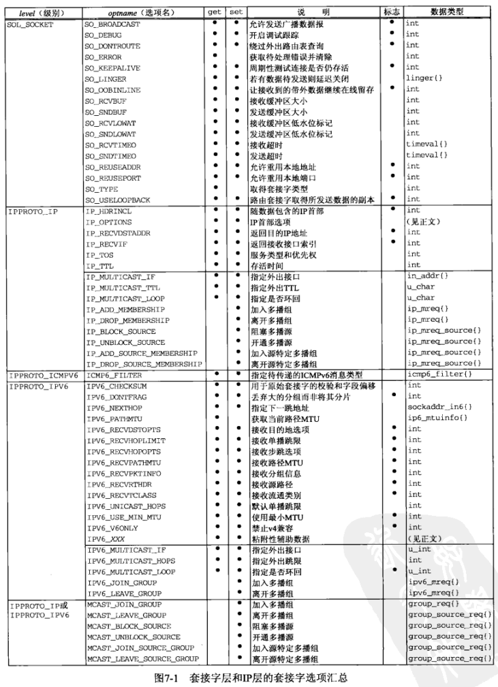

# 第7章 套接字选项
## getsockopt和setsockopt函数
函数原型
```
#include <sys/socket.h>

int getsockopt(int sock, int level, int optname, void *optval, socklen_t *optlen);
int setsockopt(int sock, int level, int optname, const void *optval, socklen_t optlen);
// if success return 0, else return -1
```
参数
1. sock：指向一个的打开的套接字描述符，也就是将要被设置或者获取选项的套接字。
2. level：所在协议，或为通用套接字，或为某个特定协议（例如IPv4、IPv6、TCP或SCTP）
```
SOL_SOCKET     // 通用套接字
IPPROTO_IP     // IPv4套接字
IPPROTO_IPV6   // IPv6套接字
IPPROTO_TCP    // TCP套接字
```
3. optname：需要访问的选项名。
4. optval：分为两大类型
   1. 标识选项：为0表示相应的选项被禁止，不为零表示该选项被启用。标有“标识”的列表示这是标识选项。
   2. 值选项：设置或检查特定值。
5. optlen：对于getsockopt()，作为入口参数，为选项值的最大长度。对于setsockopt()，作为出口参数，为选项值的实际长度。

选项


## 通用套接字选项
### SO_REUSEADDR
一般来说，一个端口释放后会等待两分钟之后才能再被使用，SO_REUSEADDR是让端口释放后立即就可以被再次使用。  
SO_REUSEADDR用于对TCP套接字处于TIME_WAIT状态下的socket，才可以重复绑定使用。  
server程序总是应该在调用bind()之前设置SO_REUSEADDR套接字选项
TCP，先调用close()的一方会进入TIME_WAIT状态。
SO_REUSEADDR提供如下四个功能：
1. 允许启动一个监听服务器并捆绑其众所周知端口，即使以前建立的将此端口用做他们的本地端口的连接仍存在。这通常是重启监听服务器时出现，若不设置此选项，则bind时将出错
2. 允许在同一端口上启动同一服务器的多个实例，只要每个实例捆绑一个不同的本地IP地址即可。对于TCP，我们根本不可能启动捆绑相同IP地址和相同端口号的多个服务器。
3. 允许单个进程捆绑同一端口到多个套接口上，只要每个捆绑指定不同的本地IP地址即可。这一般不用于TCP服务器。
4. SO_REUSEADDR允许完全重复的捆绑：当一个IP地址和端口绑定到某个套接口上时，还允许此IP地址和端口捆绑到另一个套接口上。一般来说，这个特性仅在支持多播的系统上才有，而且只对UDP套接口而言（TCP不支持多播）。