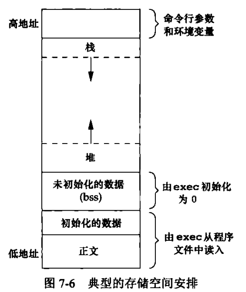

# 第7章 进程环境
## 进程终止
正常中止  
1. 从main返回
2. 调用exit
3. 调用_exit或_Exit
4. 最后一个线程从其启动例程返回
5. 从最后一个线程调用pthread_exit  

异常终止
1. 调用abort
2. 接到一个信号
3. 最后一个线程对取消请求做出响应

### 退出函数
3个函数用于正常终止一个程序：_exit和_Exit立刻进入内核，exit则先执行一些清理处理，然后返回内核。
```
#include <stdlib.h>
void exit(int status);
void _Exit(int status);
#include <unistd.h>
void _exit(int status);
```
一个进程可以至多登记32个函数，这些函数将有exit自动调用，称为“终止处理程序”。调用atexit函数来登记这些函数。
```
#include <stdlib.h>
int atexit(void (*func)(void));
```
## 命令行参数
argv[argc]是一个空指针，在循环遍历参数时可以：
```
for(int i = 0; argv[i] != NULL; i++){ ... }
```
## 环境表
每个程序接收一张环境表，是一个字符指针数组。全局变量environ包含了该指针数组的地址。  
`extern char **environ;`

### 环境变量
环境字符串的形式是：`name=value`  
应当使用getenv获取value值，而不是访问environ
```
#include <stdilb.h>
char *getenv(const char *name);
```
设置环境变量
```
#include <stdlib.h>
// 取name=value形式的字符串放入环境表中，若name已存在，删除其定义
int putenv(char *str);
// 将name设置成value，若rewrite非0，删除现有定义
int setenv(const char *name, const char *value, int rewrite);
// 删除name的定义
int unsetenv(const char *name);
```
## 存储空间
C程序的存储空间由下列几部分组成：
* 正文段
* 初始化程序段
* 未初始化程序段
* 栈
* 堆


### 存储空间分配
```
#include <stdlib.h>
// 分配指定字节数的存储区，该存储区的初始值不确定
void *malloc(size_t size);
// 为指定数量指定长度的对象分配空间，初始化为全0
void *calloc(size_t nobj, size_t size);
// 改变以前分配区的长度
void *realloc(void *ptr, size_t newsize);

void free(void *ptr);
```
## 跳转
goto语句不能跨越函数，执行这种类型他跳转功能的是setjmp和longjmp
```
#include <setjmp.h>
int setjmp(jmp_buf env);
void longjmp(jmp_buf env, int val)
```
## 资源限制
查询和更改资源限制
```
#include <sys/resource.h>
int getrlimit(int resource, struct rlimit *rlptr);
int setrlimit(int resource, const struct rlimit *rlptr);
```
资源限制结构
```
struct rlimit{
    rlim_t rlim_cur;      // 软限制
    rlim_t rlim_max;      // 硬限制
}
```
在更改资源限制时，必须遵守下列规则：
* 任何一个进程都可以将软限制值更改为小于等于其硬限制值
* 任何一个进程都可以降低其硬限制值
* 只有超级用户进程可以提高其硬限制值