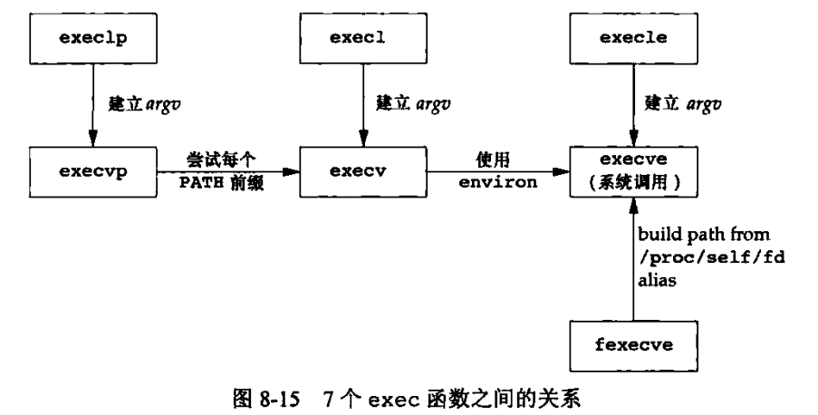

# 第8章 进程控制
## 进程标识
每个进程有一个非负整型表示的唯一进程ID，下列函数返回进程ID和其他标识符
```
#include <unistd.h>
pid_t getpid(void);       // 调用进程ID
pid_t getppid(void);      // 调用进程的父进程ID
uid_t getuid(void);       // 调用进程的实际用户ID
uid_t geteuid(void);      // 调用进程的有效用户ID
gid_t getgid(void);       // 调用进程的实际组ID
gid_t getegid(void);      // 调用进程的有效组ID
```
## 子进程
进程可以调用fork函数创建一个子进程
```
#include <unistd.h>
pid_t fork(void);
// 子进程返回0，父进程返回子进程ID
```
### 数据空间
> 子进程是父进程的一个副本，共享正文段，但不共享数据空间、堆和栈  
> 子进程中变量的改变不影响父进程的变量的值
### 文件共享
> 父进程所有的文件描述符都被复制到子进程中  
> 相同的文件描述符指向同一个文件表项  
> 父子进程共享同一个文件偏移量
>

### 父子进程差异
* fork()的返回值不同
* 进程ID不同
* 父进程ID不同
* 子进程的tms_utime、tms_stime、tms_cutime和tms_ustime设置为0
* 子进程不继承父进程的文件锁
* 子进程的未处理闹钟被清除
* 子进程的未处理信号机设置为空集
### 退出状态
父进程通过wait获取子进程状态  
* 如果所有子进程还在运行，则阻塞
* 如果一个子进程已经终止，则取得终止状态立即返回
* 如果没有任何子进程，则立即出错返回
```
#include <sys/wait.h>
// 函数返回终止进程的pid，并将终止状态存放在statloc中
// 终止状态用4个宏来查看
pid_t wait(int *statloc);
pid_t waitpid(pid_t pid, int *statloc, int options);

// waitid用两个单独的参数表示要等待的子进程所属的类型
int waitid(idtype_t idtype, id_t id, siginfo_t *infop, int options);
// 另外还有wait3, wait4，提供的功能更多
```
## 进程替换
exec函数将磁盘上的新程序替换当前进程的正文段、数据段、堆段和栈段，不改变进程ID
```
#include <unistd.h>
int execl(const char *pathname, const char *arg0, ...);
int execv(const char *pathname, char *const argv[]);
int execle(const char *pathname, const char *arg0, ...);
int execve(const char *pathname, char *const argv[], char *const envp[]);
int execlp(const char *filename, const char *arg0, ...);
int execvp(const char *filename, char *const argv[]);
int fexecve(int fd, char *const argv[], char *const envp[]);
// 只有execve是系统调用
// 字母p表示该函数取filename作为参数，并用PATH环境变量寻找可执行文件；字母l表示取一个参数表；字母v表示取一个argv矢量；字母e表示取一个envp数组，不使用当前环境
```

### 解释器文件
exec函数可以执行解释器文件，其起始行的形式为：  
`! pathname [optional-argument]`  
内核使exec函数执行pathname指定的文件
## 访问控制
> 特权及访问控制，是基于用户ID和组ID的
>
可用setuid设置有效/实际用户ID和组ID
```
#include <unistd.h>
int setuid(uid_t uid);
int setgid(gid_t gid);
```
* 如进程有超级用户特权，则将实际用户ID、有效用户ID及保存的设置用户ID设置成uid
* 若用户没有超级用户特权，但uid等于实际用户ID或保存的设置用户ID，则只能更改有效用户ID
* 若上面两个条件都不满足，则errno设置为EPERM，返回-1


seteuid和setupid只更改有效用户ID和有效组ID
```
#include <unistd.h>
int seteuid(uid_t uid);
int setepid(pid_t pid);
```
* 非特权用户可将其有效用户ID设置为实际用户ID和保存的设置用户ID
* 特权用户可将有效用户ID设置为uid

getlogin函数获取登录名
```
#include <nnistd.h>
char *getlogin(void);
```
## shell命令
system函数执行一个命令字符串
```
#include <stdlib.h>
int system(const char *cmdstring);
```
system函数的实现调用了fork, exec和waitpid，有3个返回值：
* 当fork失败或waitpid返回EINTR之外的出错，返回-1
* 当exec失败（表示不能执行shell），返回值如shell执行exit(127)
* 当3个函数都返回成功，返回shell的终止状态
## 进程会计
超级用户启动一个带路径名参数的accton命令启用和禁用进程会计。启用进程会计选项后，每当进程结束时会计就写一个会计记录，会计记录的结构如下：
```
struct acct
{
  char ac_flag;          /* Flags. */
  u_int16_t ac_uid;      /* Real user ID. */
  u_int16_t ac_gid;      /* Real group ID. */
  u_int16_t ac_tty;      /* Controlling terminal. */
  u_int32_t ac_btime;    /* Beginning time. */
  comp_t ac_utime;       /* User time. */
  comp_t ac_stime;       /* System time. */
  comp_t ac_etime;       /* Elapsed time. */
  comp_t ac_mem;         /* Average memory usage. */
  comp_t ac_io;          /* Chars transferred. */
  comp_t ac_rw;          /* Blocks read or written.*/
  char ac_comm[8];       /* command name */
};
```
## 进程调度
> 进程可以通过nice值选择以更低优先级运行，ncie值越小，优先级越高，只有特权进程允许提高调度权限
>
进程可以通过nice函数获取和更改nice值
```
#include <unistd.h>
int nice(int incr);
// 返回新的nice值
```
getpriority可以获取一组相关进程的nice值
```
#include <unistd.h>
int getpriority(int which, id_t who);
```
setpriority可为进程、进程组和所有属于特定用户ID的进程设置优先级
```
#include <unistd.h>
int setpriority(int which, id_t who, int value);
```
## 进程时间
可用times函数获取3个时间：墙钟时间、用户cpu时间和系统cpu时间
```
#include <sys/times.h>
clock_t times(struct tms *buf);
// 函数返回墙钟时间
```
tms结构如下：
```
struct tms{
  clock_t tms_utime;     // 用户CPU时间
  clock_t tms_stime;     // 系统CPU时间
  clock_t tms_cutime;    // 终止的子进程，用户CPU时间
  clock_t tms_cstime;    // 终止的子进程，系统CPU时间
}；
```