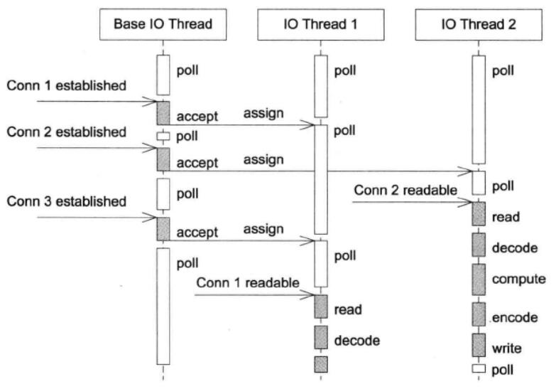
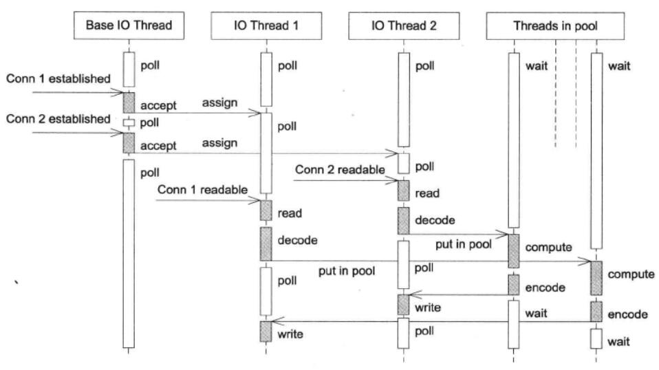
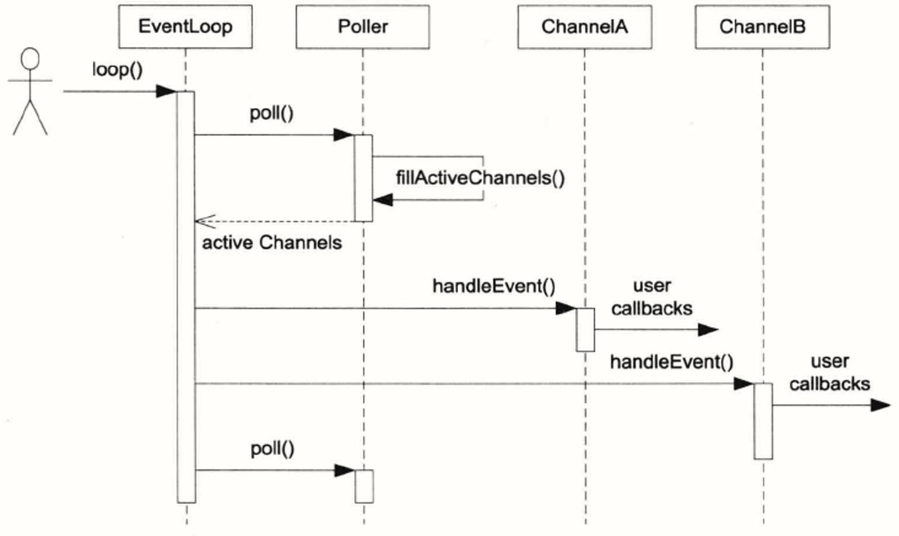
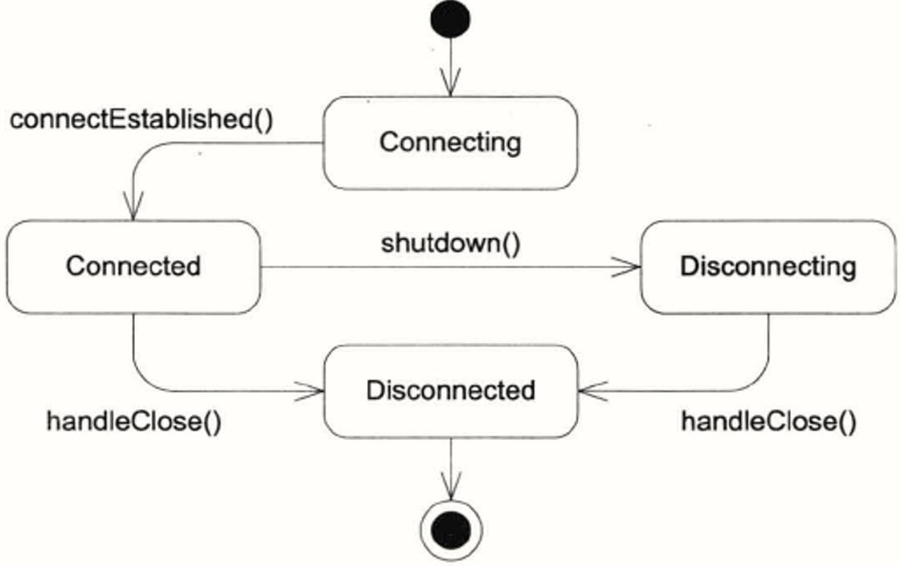

# Linux多线程服务端编程：使用muduo网络库

## 目录

**第1部分 C++多线程系统编程**  
[第1章 线程安全的对象生命期管理](#第1章-线程安全的对象生命期管理)  
[第2章 线程同步精要](#第2章-线程同步精要)  
[第3章 多线程服务器的使适用场合与常用编程模型](#第3章-多线程服务器的适用场合与常用编程模型)  
[第4章 C++多线程系统编程精要](#第4章-c多线程系统编程精要)  
[第5章 高效的多线程日志](#第5章-高效的多线程日志)  
**第2部分 muduo网络库**  
[第6章 muduo网络库简介](#第6章-muduo网络库简介)  
[第7章 muoduo编程示例](#第7章-muoduo编程示例)  
[第8章 muduo网络库设计与实现](#第8章-muduo网络库设计与实现)  
**第3部分 工程实践经验谈**  
**第4部分 附录**

## 第一部分 C++多线程系统编程

### 第1章 线程安全的对象生命期管理

尽量减少或不使用跨线程的对象，而是用流水线、生产者消费者、任务队列这些有规律的机制，最低限度地共享数据。如果不得不使用跨线程对象，需要解决各种线程安全问题。

#### 对象构造的线程安全

对象构造要做到线程安全，唯一的要求是在构造期间不要泄漏this指针，以防止别的线程访问这个半成品对象（在构造函数执行期间对象还没有完成初始化）。

#### 对象析构的线程安全

在销毁对象时，不能使用互斥锁来保护临界区，因为析构函数会把mutex成员变量销毁，导致死锁或其他未知的情况。  
没有高效的办法能判断一个指针是不是合法指针（指针指向的对象如果已经销毁就无法访问，不能访问就不能知道对象的状态；或者，原址又创建了一个新的对象，等等），这是C/C++指针问题的根源。  
要想安全地销毁对象，最好在别的线程都看不到的情况下进行（垃圾回收原理：所有人都用不到的东西一定是垃圾）。

万能的解决方案是使用智能指针：

* `shared_ptr`是引用计数型智能指针，当引用计数降为0时，对象（资源）即被销毁。
* `weak_ptr`不控制对象的生命期，但是它知道对象是否还活着。如果对象还活着，那么它可以promote为有效的shared_ptr；如果对象已经死了，promote会失败，并返回一个空的shared_ptr。
* `shared_ptr`控制对象的生命周期，是强引用，只要有一个指向x对象的shared_ptr存在，该x对象就不会被析构。当指向x对象的最后一个shared_ptr析构或是`reset()`的时候，x保证会被销毁。
* `shared_ptr`的“计数”通常是原子操作，没有加锁，性能优异。

C++可能出现的内存问题大致有几个方面：

1. 缓冲区溢出
2. 空悬指针
3. 重复释放
4. 内存泄漏
5. 不配对的new[]/delete
6. 内存碎片

正确使用智能指针vector/string/shared_ptr能轻易解决前面5个问题。现代的C++程序中一般不会出现delete语句，资源都是通过对象（智能指针或容器）来管理的。解决第6个问题需要别的思路（见第9章）。

虽然shared_ptr的引用计数本身是安全且无锁的，但对象的读写则不是。要在多个线程中同时访问一个shared_ptr正确的做法是用mutex保护。

使用shared_ptr需要避免循环引用，如owner持有指向child的shared_ptr，child持有owner的weak_ptr而不是shared_ptr。weak_ptr是shared_ptr的好搭档，可以用作弱回调、对象池等。

### 第2章 线程同步精要

线程同步的四项原则：

1. 尽量低限度地共享对象，减少需要同步的场合。
2. 使用高级的并发构件，如TaskQueue、Prodecer-Consumer Queue、CountDownLatch等等。
3. 不得不使用底层同步原语时，只用非递归的互斥器和条件变量，慎用读写锁，不要用信号量。
4. 不自己编写lock-free代码，也不要用内核级同步原语。

### 第3章 多线程服务器的适用场合与常用编程模型

多线程适用于多核处理器的场合，常用编程模型有如下：

1. 每个请求创建一个线程，使用阻塞式IO操作。
2. 使用线程池，同样使用阻塞式IO操作，性能比1更高。
3. 使用non-blocking IO + IO multiplexing。
4. Leader/Follower等高级模式。

#### 多线程服务端编程模式

在C++多线程服务端编程模式推荐为：one loop per thread + thread pool。

* event loop用作IO multiplexing，配合non-blocking IO和定时器。
* thread pool用作计算，具体可以是任务队列或生产者消费者队列。

程序或许还有个别执行特殊任务的线程，比如logging，这对程序来说是基本不可见的，但是在分配资源的事件要算进去。

##### one loop per thread

这种模型下，程序里的每个IO线程有一个event loop（或者叫Reactor），用于处理读写和定时事件（无论周期性的还是单次的）。这种方式的好处是：

1. 线程数目基本固定，不会频繁创建与销毁。
2. 可以很方便地在线程间调配负载。
3. IO事件发生的线程是固定的，同一个TCP连接不必考虑事件并发。

##### 线程池

对于没有IO而光有计算任务的线程，使用event loop会有点浪费，可以使用线程池和任务队列（TaskQueue）。

#### TCP通信的优点

使用TCP进行进程间通信有如下好处：

1. TCP port由一个进程独占，且操作系统会自动回收（即使程序意外退出，也不会给系统留下垃圾）。
2. 两个进行TCP通信的进程中，如果一个崩溃了，操作系统会立即关闭连接，另一个进程几乎立即就能感知。
3. 可记录，可重现。tcpdump和Wireshark是解决进程间协议和状态争端的好帮手，也是性能分析的利器。
4. 跨语言。服务端和客户端不必使用同一种语言。
5. 可再生。连接的任何一方都可以退出再启动，重新连接后就能继续工作。

#### 多线程服务器的适用场合

有两种场合必须使用单线程：

1. 程序可能会fork()。
2. 限制程序的CPU占用率。

适合单线程的场合：

1. 对于CPU负载较轻的服务器，主要瓶颈在磁盘IO和网络IO方面，这时候往往一个单线程程序就能使IO饱和，用多线程并不能提高吞吐量。
2. CPU运算时间长，此时启动多个单线程的进程更加合适。

简单的单线程event loop有一个明显的缺点：它是非抢占的。早来的事件会阻塞晚来的事件，不论优先级如何。这个缺点可以用多线程来克服，这也是多线程的主要优势。

##### 提高响应速度

多线程的适用场景是：需要提高响应速度，让IO和“计算”相互重叠，降低延迟。虽然多线程不能提高绝对性能，但是能提高平均相应性能。一个程序要做成多线程，大概要满足：

1. 有多个CPU可用。
2. 线程间有共享数据，即内存中的全局状态。
3. 共享的数据是可修改的。
4. 事件的相应有优先级差异。
5. 程序有相当的CPU计算量。
6. 利用异步操作。
7. 能扩大规模。
8. 具有可预测的性能。随着负载增加，性能缓慢下降，超过某个临界点后急速下降。
9. 多线程能有效划分责任和功能。

##### 线程的分类

一个多线程服务程序中的线程大致可分为3类：

1. IO线程，这类线程的主循环是IO multiplexing，阻塞在select/poll/epoll_wait系统调用上。
2. 计算线程，这类线程的主循环是blocking queue，阻塞在信号量上。
3. 第三方库所用的线程，比如logging/database connection。

### 第4章 C++多线程系统编程精要

#### 线程安全性原则

基本原则：凡是非共享的对象都是彼此独立的。  
*如果一个对象从始至终只被一个线程用到，那么它就是安全的。*

#### 线程的创建与销毁

线程的创建只需要遵循几条简单的原则：

1. 程序库不应该在未提前告知的情况下创建自己的“背景线程”。
2. 尽量用相同的方法创建线程。
3. 在进入main()函数之前不应该启动线程。
4. 程序中线程的创建最好在初始化阶段全部完成。

线程的销毁有几种方式：

1. 自然死亡。从线程主函数中返回，线程自然退出。
2. 非自然死亡。从线程主函数中抛出异常或线程触发segfault信号等非法操作。
3. 自杀。在线程中调用pthread_exit()来立即退出线程。
4. 他杀。其他线程调用pthread_cancel()来强制终止某个线程。

线程正确的退出方式只有一种，即自然死亡。任何从外部强行终止线程的做法都是错的，无论是自杀还是他杀，它都没有机会清理资源，也没有机会释放已经持有的锁。如果能做到RAII，则线程是不必销毁的，伴随进程一直运行，彻底避开了线程安全退出可能面临的各种困难。

#### 多线程与IO

操作文件描述符的系统调用本身是线程安全的，但是会造成逻辑上的混乱。通常，每个文件描述符只由一个线程操作。epoll也遵循相同的原则，对同一个epfd的操作应在同一个线程内执行。

这条规则只有两个例外：

1. 对于磁盘文件，在必要的时候可以同时调用pread/pwrite来读写同一个文件。
2. 对于UDP，由于协议本身保证消息的原子性，在适当的条件下可以多个线程读写同一个UDP文件描述符。

在管理文件描述符时，稍不注意就会造成串话，*例如，线程A正准备read某个socket，线程B关闭了该socket，线程C恰好open了另一个socket，其文件描述符恰好与刚关闭的socket相同。*  
在多线程程序中，需要用RAII的思想解决这个问题：用Socket对象封装文件描述符，所有对此文件描述符的读写操作都通过此对象进行，在对象的析构函数里关闭文件描述符。这样，只要Socket对象存活，就不可能有其他Socket对象跟它有一样的文件描述符。

另外，网络服端程序不应该关闭stdout和stderr，因为有些第三方库在特殊情况下会往stdout和stderr打印出错信息，如果我们关闭了stdout(fd=1)和stderr(fd=2)，这两个文件描述符有可能被网络连接占用，结果造成对方收到意料之外的数据。正确的做法是将stdout和stderr重定向到磁盘文件。

### 第5章 高效的多线程日志

在服务端编程中，日志是必不可少的。对于关键进程，日志通常要记录：

1. 收到的每条内部消息的id（还可以包括关键字段、长度、hash等）；
2. 收到每条外部消息的全文；
3. 发出的每条消息的全文，每条消息都有全局唯一的id；
4. 关键内部状态的变更，等等。

每条日志都有时间戳，便于完整追踪分布式系统中一个事件的来龙去脉。

日志库可分为前端和后端两部分。前端是供应用程序使用的接口（API），并生成日志消息；后端则负责把日志消息写到目的地（对于分布式系统中的服务进程而言，日志的目的地只有一个：本地文件）。

日志的消息格式有几个要点：

1. 尽量每条日志占一行。
2. 时间戳精确到微秒。每条消息都通过`gettimeofday`获得当前事件（不是系统调用）。
3. 始终使用GMT时区。
4. 打印线程id。
5. 打印日志级别。
6. 打印源文件名和行号。

在多线程服务端程序中，**异步日志**是必须的。方案是用一个背景线程负责收集日志消息，并写入日志文件。其他线程只管往这个“日志线程”发送日志消息。

## 第二部分 muduo网络库

### 第6章 muduo网络库简介

muduo的简化类图如下，Buffer是TcpConnection的成员。


* Channel 是 selectable IO channel，负责注册与响应 IO 事件，注意它不拥有 file descriptor。它是 Acceptor、Connector、EventLoop、TimerQueue、TcpConnection 的成员，生命期由后者控制。
* Socket 是一个 RAII handle，封装一个 file descriptor，并在析构时关闭fd。它是 Acceptor、TcpConnection的成员，生命期由后者控制。 EventLoop，TimerQueue 也拥有 fd，但是不封装为 Socket class。
* SocketsOps 封装各种 Sockets 系统调用。
* Poller 是 PollPoller 和 EpollPoller 的基类，采用 “水平触发” 的语义。它是 EventLoop 的成员，生命期由后者控制。
* PollPoller 和 EpollPoller 封装 poll(2) 和 epoll(4) 两种 IO multiplexing 后端。
* Connector 用于发起 TCP 连接，它是 TcpClient 的成员，生命期由后者控制。
* Acceptor 用于接受 TCP 连接，它是 TcpServer 的成员，生命期由后者控制。
* TimerQueue 用 timerfd 实现定时，这有别于传统的设置 poll/epoll_wait 的等待时长的办法。TimerQueue 使用 std::map 来管理 Timer，常用操作的复杂度是 O(log N)，N 为定时器数目。它是 EventLoop 的成员，生命期由后者控制。
* EventLoopThreadPool 用于创建 IO 线程池，用于把 TcpConnection 分派到某个 EventLoop 线程上。它是 TcpServer 的成员，生命期由后者控制。

#### muduo网络库多线程模型

##### one loop per thread模型

有一个 main Reactor 负责 accept 连接，然后把连接挂在某个 sub Reactor 中，这样该连接的所有操作都在那个 sub Reactor 中完成。与线程池相比，减少了进出 thread pool 的两次上下文切换，小规模计算可以在当前 IO 线程完成并发会结果，从而降低相应的延迟。



##### thread pool模型

如果程序的IO带宽较小，计算量较大，而且对延迟不敏感，那么可以把计算放到 thread pool 中。



### 第7章 muoduo编程示例

TCP网络编程最本质的是处理三个半事件：

1. 连接的建立，包括服务端accept和客户端成功发起connect连接。TCP连接一旦建立，客户端和服务端是平等的，可以各自收发数据。
2. 连接的断开，包括主动断开（close、shutdown）和被动断开（read返回0）。
3. 消息到达，文件描述符可读。这是最为重要的一个事件，对它的处理方式决定了网络编程的风格（阻塞还是非阻塞，如何处理分包，应用层的缓冲如何设计，等等）。
4. 消息发送完毕，这算半个。对于低流量的事件，可以不必关心这个事件。

使用muduo只需要注册几个回调函数去处理三个半事件就行了:

“连接已建立”事件

```cpp
void onConnection(const TcpConnectionPtr& conn){
    // 业务逻辑
}
```

“连接已断开”事件

```cpp
void onClose(const TcpConnectionPtr& conn){
    // 业务逻辑
}
```

“消息/数据到达”事件

```cpp
void onMessage(const TcpConnectionPtr& conn, Buffer* buf, Timestamp time){
    // 业务逻辑
}
```

“消息/数据发送完毕”事件

```cpp
void onWriteComplete(const TcpConnectionPtr& conn){
    // 业务逻辑
}
```

### 第8章 muduo网络库设计与实现

#### Reactor模式的现代C++实现

事件分发机制是Reactor的核心机制，即将IO复用拿到的IO事件分发给各个fd的事件处理函数。



##### EventLoop类

EventLoop类负责循环去持续监听、持续获取监听结果、持续处理监听结果对应的事件。

##### Poller类

Poller类是 IO multiplexing 的封装，负责监听文件描述符事件是否触发以及返回发生事件的文件描述符以及具体事件。

##### Channel类

在TCP网络编程中，想要IO多路复用监听某个文件描述符，就要把这个fd和该fd感兴趣的事件注册到IO多路复用模块（poll/epoll）上。当事件监听器监听到该fd发生了某个事件。事件监听器返回“发生事件的fd集合”以及“每个fd都发生了什么事件”。

Channel类则封装了一个 fd 和这个 fd “感兴趣事件”以及事件监听器监听到“该 fd 实际发生的事件”。同时Channel类还提供了设置该 fd 的感兴趣事件，以及将该 fd 及其感兴趣事件注册到事件监听器或从事件监听器上移除，以及保存了该 fd 的每种事件对应的处理函数。


##### TimerQueue类

timerQueue 定时器选择线性表组织目前尚未到期的 Timer ，能快速根据当前时间找到已经到期的 Timer ，也能高效地添加和删除 Timer。

#### 基于Reactor的的单线程非阻塞并发的TCP网络编程


##### Acceptor类

Acceptor类用于 accept 新 TCP 连接，并通过回调通知使用者。

##### TcpServer类

TcpServer会为新连接创建对应的 TcpConnection 对象，把它加入 ConnectionMap，设置好callback。

##### TcpConnection类

TcpConnection类是 muduo 里唯一默认使用 shared_ptr 管理的 class，原因在于其模糊的生命期（见第4章）。TcpConnection 表示的是“一次TCP连接”，它是不可再生的。




##### Buffer类

TcpConnection 使用 Buffer 作为输入和输出缓冲（见第7章）。

#### one loop per thread的实现

用 one loop per thread 实现多线程 TcpServer的关键步骤是在新建 TcpConnection 时从 event loop pool 中挑选一个 loop 给 TcpConnection 用。也就是说多线程 TcpServer 自己的 EventLoop 只用来接受新连接，而新连接会用其他的 EventLoop 来执行 IO。

TcpServer 每次新建一个 TcpConnection 都会调用 getNextLoop() 来取得 EventLoop（如果是单线程服务，每次返回的都是 baseloop_，即 TcpServer 自己的 loop）。
