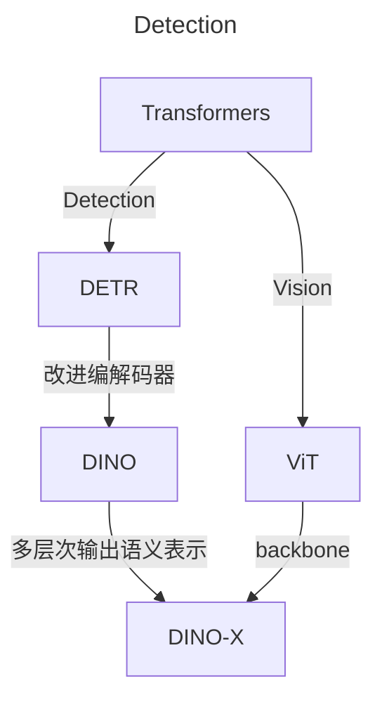

# 目标检测

关系图

[End-to-End Object Detection with Transformers](https://arxiv.org/pdf/2005.12872.pdf)

DETR 是 Detection Transformers 的简称，没有非极大值抑制 NMS 后处理步骤、没有 anchor 等先验知识和约束，整个由网络实现端到端的目标检测实现。

- 用 CNN 提取特征
- 输入Transformers Encoder，提取全局特征
- 输入Transformers Decoder，选择固定的 N 个 token 作为输入
- 用分类头和检测头预测类别和目标框
- 训练过程中通过匈牙利算法来进行预测结果和 ground-truth 之间的一一匹配用于计算损失

[DINO: DETR with Improved DeNoising Anchor Boxes for End-to-End Object Detection](https://arxiv.org/abs/2203.03605)

基于 DETR 的端到端的目标检测器，在性能和效率上改进了 DETR 模型。

- 训练引入噪声，让模型得以学习的正负样本的区分问题
- 优化了query的初始化

[DINO-X: A Unified Vision Model for Open-World Object Detection and Understanding](https://arxiv.org/abs/2411.14347)

用于开放世界物体检测和理解的统一视觉模型。

- 利用预训练的 ViT 作为视觉骨干
- 集成多个感知头，从而同时支持多个物体感知和理解任务，包括检测、分割、姿势估计、物体字幕、基于物体的 QA 等
