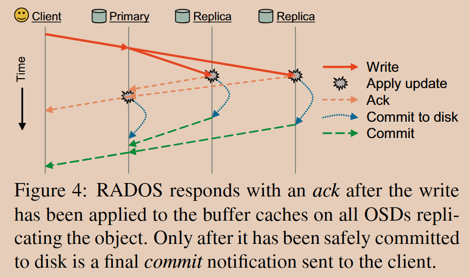

# Ceph: A Scalable, High-Performance Distributed File System

## 1 简介

类似 NFS 式的集中式层次结构，服务器导出文件存储层次结构，客户端将其映射到本地。  
基于对象存储，客户机与 OSD（对象存储设备）通信执行 I/O，与 MDS（元数据服务器）通信执行元数据操作。元数据操作没有分发出去。  
通过生成函数代替文件分配表，Ceph 解耦了元数据操作和数据操作，由此利用了 OSD 中的性能来分散压力。

## 2 系统概述

组件：

1. 客户机：提供接近 POSIX 的文件接口
2. OSD 集群：共同存储数据和元数据
3. MDS 集群：管理命名空间，同时协调安全性、一致性和连续性

三个基本设计：

1. 数据和元数据解耦
   > 元数据操作（打开、重命名等）由 MDS 集群管理；客户端与 OSD 直接交互执行文件 I/O。
2. 动态分布式元数据管理
   > 利用基于动态子树分区的数据集群架构在 MDS 集群之间分配文件系统目录层次结构的责任。
3. 可靠的自主分布式对象存储 RADOS
   > Ceph 将数据迁移、复制、故障检测和故障恢复的责任委托给 OSD 集群，能有效利用 OSD 的性能。

## 3 客户端操作

描述了 Ceph 客户端如何运行，提供文件系统接口给应用程序，并且如何与 OSDs 和元数据服务器进行交互。

### 3.1 文件 I/O 和功能

当进程打开一个文件时，客户端会向 MDS 集群发送请求。MDS 遍历文件系统层次结构，将文件名转换为 inode 和条带号（stripe number），MDS 会下发相应的操作权限 capability（客户端读取、缓存读取、写入和缓冲写入）。  
客户端通过 CRUSH 可以找到每个条带对象对应的 OSD，并直接从 OSD 中读取或写入对象。完成后，客户端需要交还 capability，并将新的文件大小告知 MDS。

### 3.2 客户端同步

当 MDS 发现文件被多个客户端并发读写的时候，它就会收回所有客户端的缓冲读写权限（buffer capability），强制 client 执行同步的读写操作。单个 OSD 的并发操作的顺序完全由 OSD 自己决定。  
在科学计算中，并发读写同一个文件是常见的场景，此时就需要放松一致性以获得更好的性能。Ceph 提供了 POSIX 的扩展，比如 O_LAZY 表示宽松的一致性。另外应用可以自己管理一致性，如保证不同 client 写文件的不同区域。

### 3.3 命名空间操作

客户端与文件系统的命名空间 namespace 交互都是同步的。为了降低这些同步 namespace 操作的延时，Ceph 针对常见场景做了优化：比如 readdir 随后对每个文件调用 stat（ls -l），在 Ceph 中 readdir 就会加载整个目录的 inode，这样随后的 stat 就会直接返回刚刚加载的内容，牺牲了一致性（假设之间有更新），但保证了性能。

## 4 动态分布式元数据

Ceph 中文件和目录的元数据都很小，几乎只包含目录项（文件名）和 inode（80B）。与传统文件系统不同的是，Ceph 中不需要记录 block 分配表，而是使用 CRUSH 定位。这些设计都能缓解 MDS 的压力，允许它管理海量的文件和目录（大部分缓存在内存中）。

### 4.1 元数据存储

每个 MDS 维护自己的日志 journal，以流式传输 streaming 的方式存储到 OSD 的磁盘上，这些日志后续会合并到 MDS 的长期存储中。  
优势：

1. 以顺序方式将更新流式传输到磁盘，大大减少了重写工作负载。
2. MDS 发生故障时，另一个节点可以扫描日志以恢复节点内存中缓存的关键内容。

### 4.2 动态子树分区

MDS 集群通过动态子树划分策略来分配缓存元数据。  
每个 MDS 都使用计数器来衡量目录树中元数据的热度 popularity，任何 inode 操作都会使整个链路上的计数器递增直到根节点，计数器随指数时间衰减。MDS 根据该计数器定期比较负载大小，并迁移适当大小的目录子树，使负载均衡。

### 4.3 流量控制

针对许多客户端访问同一目录的情况，Ceph 有特殊处理：

1. 读特别热的目录可以复制到多个节点上，以分散负载。
2. 写特别热的目录可以按文件名 hash 后分散到多个节点上，以在牺牲目录局部性的情况下实现平衡的分布。

## 5 分布式对象存储

解释了 Ceph 如何通过 CRUSH 算法将数据分布在 OSDs 上，以及 RADOS 如何管理对象复制、集群扩展、故障检测和恢复。

### 5.1 基于 CRUSH 的数据分发

  
步骤：

1. 根据数据对象(object)的对象名，使用哈希函数计算得到 PG_ID，将对象映射到放置组（PGs）。
2. 根据 PG_ID，使用 CRUSH 函数计算得到一组 OSD，将放置组分配给 OSDs。
   > CRUSH 全称 Controlled Replication Under Scalable Hashing，主要目的是为了定位所存储数据的位置。

### 5.2 复制

数据按放置组进行复制，每个放置组映射到一个有序列表的 n 个 OSD（n 路复制）。客户端将所有写操作发送到对象的 PG 中的第一个非故障 OSD（主 OSD），该主 OSD 为对象和 PG 分配一个新版本号，并将写操作转发给任何其他副本 OSD。读操作定向到主 OSD。

### 5.3 数据安全

主 OSD 将更新转发到副本，并在应用于所有 OSD 的内存缓存之后回复 ack，允许客户端上的同步 POSIX 调用返回。当数据安全地提交到磁盘时，可能会在最终提交时发送 ack（也许在许多秒钟后）。默认情况下，客户端还会缓冲写入，直到提交，以避免在放置组中的所有 OSD 同时断电时发生数据丢失。在这种情况下恢复时，RADOS 允许在接受新更新之前回放先前已确认（因此有序）更新的固定时间间隔。

### 5.4 故障检测

OSD 会定期发送显式的 ping 给同 PG 的其他 OSD。不响应的 OSD 最初被标记为下线，其在每个放置组中的主要责任（更新序列化、复制）临时传递给其放置组中的下一个 OSD。如果 OSD 没有快速恢复，它将被标记为数据分布之外，另一个 OSD 将加入每个 PG 以重新复制其内容。与故障的 OSD 有待处理操作的客户端简单地重新提交到新的主 OSD。

### 5.5 恢复和集群更新

OSD 维护每个对象的版本号和每个 PG 的最近更改日志。

### 5.6 基于 EBOFS 的对象存储

EBOFS（Extent and B-tree based Object File System）是一个专为 Ceph 设计的本地对象文件系统，用于管理低级存储。每个 Ceph OSD 都使用 EBOFS 管理其本地对象存储。在用户空间完全实现 EBOFS 并直接与原始块设备交互，使我们能够定义自己的低级对象存储接口和更新语义，将更新序列化（用于同步）与磁盘提交（用于安全性）分离。EBOFS 支持原子事务（例如，对多个对象进行写入和属性更新），并在内存缓存更新时返回，同时提供提交的异步通知。
