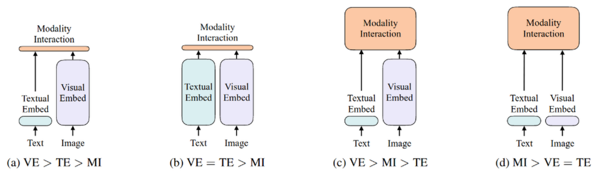
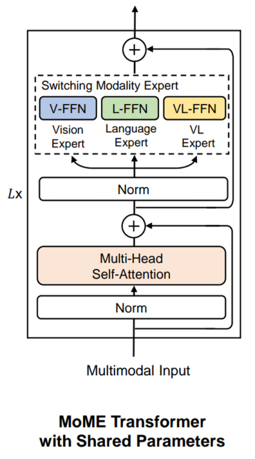

# 多模态大模型

## 图文多模态

**VSE**

[Polysemous Visual-Semantic Embedding for Cross-Modal Retrieval](https://arxiv.org/abs/1906.04402)

- 对图像和文本独立使用encoder，图像的更重，文本的更轻
- 使用简单的点积或者浅层 attention 层来表示两种模态特征的相似性

**CLIP**

[CLIP: Learning Transferable Visual Models From Natural Language Supervision](https://arxiv.org/abs/2103.00020)

- 图像编码器使用 ResNet50 或 ViT
- 文本编码器使用 Transformer 架构
- 用简单的点积对比模态之间的 Embed

**ViLBERT**

[ViLBERT: Pretraining Task-Agnostic Visiolinguistic Representations for Vision-and-Language Tasks](https://arxiv.org/abs/1908.02265)

- 图像编码器使用深层卷积网络
- 使用 Transformer 架构进行模态融合

**ViLT**

[ViLT: Vision-and-Language Transformer Without Convolution or Region Supervision](https://arxiv.org/abs/2102.03334)

- 用线性层提取图像和文本特征
- 计算量集中在模态融合上
- 推理速度快，训练慢

**ALBEF**

[Align before Fuse: Vision and Language Representation Learning with Momentum Distillation](https://arxiv.org/abs/2107.07651)

- 特征提取和模态融合都使用 Transformer
- 图像编码器比文本编码器大

**VLMO**

[VLMO: Unified Vision-Language Pre-Training with Mixture-of-Modality-Experts](https://arxiv.org/pdf/2111.02358.pdf)

- 提出了图文单编码器 MoME transformer ，不同的 Expert 在各自的模态上预训练

  

**BLIP**

[BLIP: Bootstrapping Language-Image Pre-training for  Unified Vision-Language Understanding and Generation](https://arxiv.org/abs/2201.12086)

- 吸取 VLMO 的经验，图文 Self-Attention 层共享参数
- 添加了 Image-grounded Text Large-scale Video Classification with Convolutional Neural NetworksDecoder 用于生成文本输出

**CoCa**

[CoCa: Contrastive Captioners are Image-Text Foundation Models](https://arxiv.org/abs/2205.01917)

**BeiTv3**

[Image as a Foreign Language: BEiT Pretraining for All Vision and Vision-Language Tasks](https://arxiv.org/abs/2208.10442)

- 统一了多模态编码的损失函数
