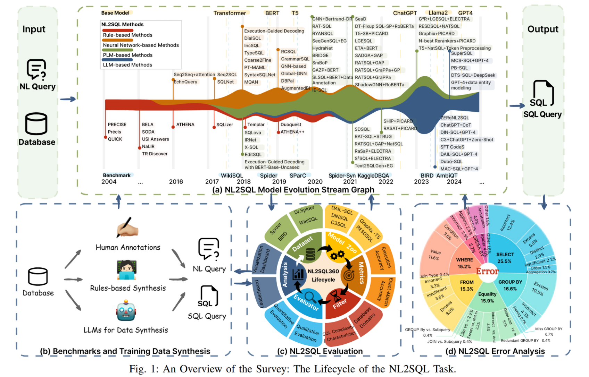

# NL2SQL

[A Survey of NL2SQL with Large Language Models: Where are we, and where are we going?](https://arxiv.org/abs/2408.05109)

人类工作流：

-   理解自然语言查询
    1. 实体或属性
    2. 时间情景
    3. 特定条件
-   找到相关的表、列和关键词
-   编写 SQL

NL2SQL 解决方案：

-   基于规则：语义解析器 + 预定义规则
-   基于神经网络：序列到序列架构、图神经网络
-   基于 PLM：利用在大型语料库上预训练的模型迁移到 NL2SQL 任务
-   基于 LLM：在大型的 NL2SQL 相关语料库上预训练，构建一个专门针对 NL2SQL 任务的 LLM

## 语言模型驱动的 NL2SQL

### 预处理方法

预处理是对 NL2SQL 解析过程中模型输入的增强。虽然预处理不是严格必要的，但预处理对 NL2SQL 解析的优化有重要贡献。

-   架构链接（Schema Linking）：确定与给定自然语言查询相关的表格和列
-   数据库内容检索：通过文本搜索算法和数据库索引高效检索单元格值
-   额外信息获取

### NL2SQL 翻译方法

NL2SQL 解决方案的核心，负责将输入的 NL 查询转换为 SQL。

-   编码策略：顺序编码、基于图的编码、独立编码
-   解码策略：贪婪搜索解码、束搜索解码、约束感知增量解码
-   基于特定任务的提示策略：提示词工程

### 后处理方法

后处理是对生成的 SQL 查询进行精化以提高查询准确率的关键步骤。

-   SQL 校正策略
-   输出一致性
-   执行引导策略：使用 SQL 查询的执行结果来指导后续处理
-   N-best 重排策略：对原始模型生成的前 n 个结果进行重排序
