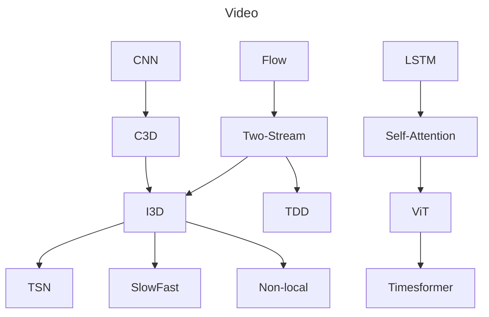
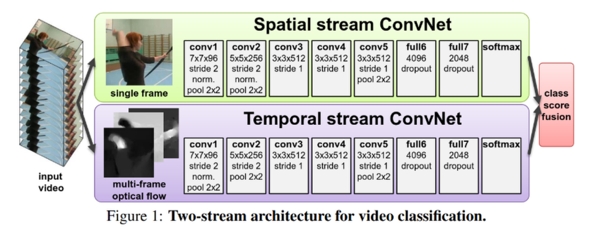
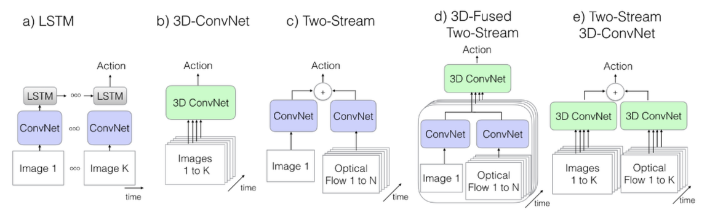

# 视频理解

**DeepVideo**

[Large-scale Video Classification with Convolutional Neural Networks](https://static.googleusercontent.com/media/research.google.com/zh-CN//pubs/archive/42455.pdf)

- 将卷积神经网络迁移到视频理解领域

**C3D**

[Learning Spatiotemporal Features with 3D Convolutional Networks](https://arxiv.org/pdf/1412.0767)

- 用 3D 卷积核替换了 VGG 网络的 2D 卷积核进行视频特征提取

**双流网络**

[Two-Stream Convolutional Networks for Action Recognition in Videos](https://arxiv.org/abs/1406.2199)

- 将动作识别和视频分类绑定

- 使用了两个卷积网络处理空间流和时间流，一个提取帧特征，一个提取光流特征

  
  
- 用 JPEG 压缩算法减少光流图的存储空间 

**TSN**

[Temporal Segment Networks: Towards Good Practices for Deep Action Recognition](https://arxiv.org/abs/1608.00859)

- 将视频分割为段，经过双流网络再进行融合，从而理解长视频

**I3D**

[Quo Vadis, Action Recognition? A New Model and the Kinetics Dataset](https://arxiv.org/abs/1705.07750)

- 建立了 Kinetics 数据集

- 提出了将 2D 网络 inflate 到 3D 的方法

- 提出了 Two-Stream Inflated 3D-ConvNet

  

**Non-local**

[Non-local Neural Networks](https://arxiv.org/abs/1711.07971)

- 提出了视频自注意力模块 Non-local block

**SlowFast**

[SlowFast Networks for Video Recognition](https://arxiv.org/abs/1812.03982)

- 使用两支网络：Slow 分支描述静态特征，低帧率大网络；Fast 分支描述运动信息，高帧率小网络

**Timesformer**

[Is Space-Time Attention All You Need for Video Understanding?](https://arxiv.org/abs/2102.05095)

- 将 ViT 迁移到视频领域
- 拆分时空自注意力 