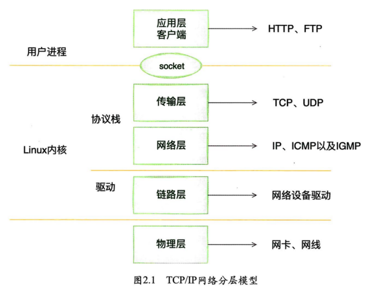
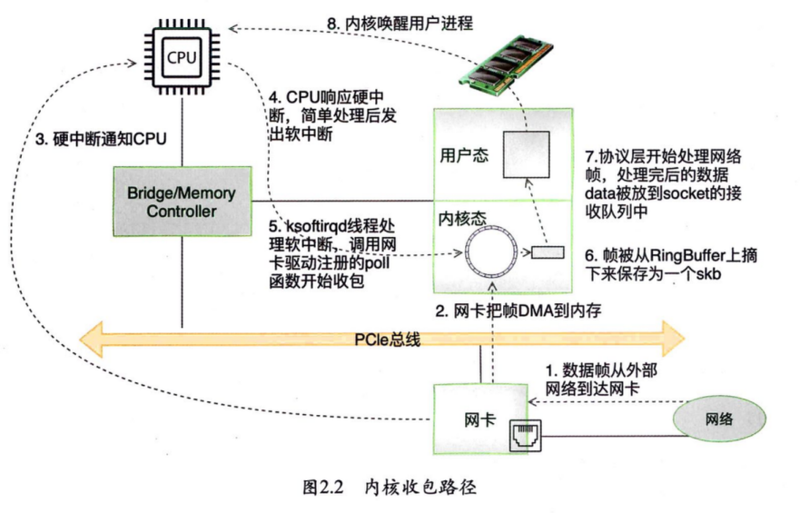

# 深入理解 Linux 网络：修炼底层内功，掌握高性能原理

## 第 2 章 内核是如何接收网络包的

### 数据是如何从网卡到协议栈的

内核和⽹络设备驱动是通过**中断**的⽅式来处理的。当设备上有数据到达时，会给 CPU 的相关引脚触发⼀个电压变化，以通知 CPU 来处理数据。对于⽹络模块来说，由于处理过程⽐较复杂和耗时，如果在中断函数中完成所有的处理，将会导致中断处理函数（优先级过⾼）过度占⽤ CPU，使得 CPU ⽆法响应其他设备，例如⿏标和键盘的消息。因此 Linux 中断处理函数是分上半部和下半部的。上半部只进⾏最简单的⼯作，快速处理然后释放 CPU，接着 CPU 就可以允许其他中断进来。将剩下的绝⼤部分的⼯作都放到下半部，可以慢慢、从容处理。下半部的实现方式是软中断，由 ksoftirqd 内核线程全权处理。

_硬中断是通过给 CPU 物理引脚施加电压变化实现的，⽽软中断是通过给内存中的⼀个变量赋予⼆进制值以标记有软中断发⽣。_

当⽹卡收到数据以后，以 DMA 的⽅式把⽹卡收到的帧写到内存⾥，再向 CPU 发起⼀个中断，以通知 CPU 有数据到达。当 CPU 收到中断请求后，会去调⽤⽹络设备驱动注册的中断处理函数。⽹卡的中断处理函数并不做过多⼯作，发出软中断请求，然后尽快释放 CPU 资源。ksoftirqd 内核线程检测到有软中断请求到达，调⽤ poll 开始轮询收包，收到后交由各级协议栈处理。对于 TCP 包来说，会被放到⽤户 socket 的接收队列中。
