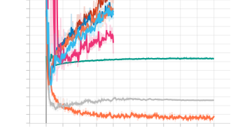

# CIFAR-10

完成在 CIFAR-10 上的分类模型训练，并且在测试集上的正确率不低于 95%。

## 网络选择

采用了 resnet 网络，初步验证了 resnet18，resnet34，resnet50，resnet101，resnet152 在 CIFAR-10 上的性能。

经过训练，发现 resnet34 以及更深的网络能够较好的拟合训练集，但是网络层数加深对性能的影响较大，打印模型参数量，发现训练耗时与模型参数量呈正相关。

相比 resnet18，resnet34 参数量接近翻倍，测试精度也有较大的提升；resnet50 以及更深的网络提升较小或者没有提升。

| 模型      | 参数量 | 训练耗时 | 训练精度 | 测试精度 |
| --------- | ------ | -------- | -------- | -------- |
| resnet18  | 11.17M | 3h 8m    | 99.61%   | 84.27%   |
| resnet34  | 21.28M | 8h 53m   | 100.00%  | 85.16%   |
| resnet50  | 23.52M | 18h 42m  | 99.88%   | 83.95%   |
| resnet101 | 42.51M | 28h 5m   | 99.96%   | 85.23%   |
| resnet152 | 58.15M | 38h 55m  | 99.25%   | 84.33%   |

_在 GTX1080ti 上使用基础模型, optimizer=Adam, batch_size=128, epochs=200, lr=5e-3 初步验证模型性能。_

综合模型精度和训练性能，本实验选择 resnet34 在 CIFAR-10 上训练分类模型。

## 调优思路

在训练过程中，发现学习速度较慢，因此提高学习率 lr=2e-3, lr=5e-3, epochs=500，尝试后发现由于使用 Adam 优化器，训练过程变化不大。尝试使用 SGD 优化器，发现损失函数波动较大，选择增加 scheduler 来动态调整学习率。使用 lr=5e-3, scheduler = CosineAnnealingLR，拟合速度明显加快，测试精度变化不大。{train1}

此时，观察在测试集上的损失值，发现已经很接近 0。可以得知，模型对于训练集的拟合能力已经比较优秀，已经难以再进行训练，需要提高模型的泛化能力。考虑对训练集进行数据增强。

基本的数据变换如下，仅进行了归一化：

```py
transform = transforms.Compose(
    [
        transforms.ToTensor(),
        transforms.Normalize(mean, std),
    ]
)
```

考虑对训练集进行随机变换：

-   RandomCrop：随机地对原始图像进行边缘填充和裁剪；
-   RandomHorizontalFlip： 以一定概率水平翻转图像；
-   ColorJitter：随机调整图像的亮度、对比度、饱和度和色调。

```py
transform_train = transforms.Compose(
    [
        transforms.RandomCrop(32, padding=4),
        transforms.RandomHorizontalFlip(),
        transforms.ColorJitter(
            brightness=0.4, contrast=0.4, saturation=0.4, hue=0
        ),
        transforms.ToTensor(),
        transforms.Normalize(mean, std),
    ]
)
```

增加随机变换后，图像标签不变，只需在 trainset 初始化时应用变换。经过训练，模型的泛化能力得到极大提升，测试精度提升到 93.65%。{train2}

发现大约 440 轮之后，训练集上损失就已经极低（0.0001），难以优化。需要继续对训练集进行数据增强，增加训练难度。考虑增加 cutmix 和 mixup。这些变换与加载数据集时的 transforms 有所不同，需要成批的样本进行输入，使用的时机是在 DataLoader 之后。

```py
dataloader = DataLoader(dataset, batch_size=4, shuffle=True)

cutmix = v2.CutMix(num_classes=NUM_CLASSES)
mixup = v2.MixUp(num_classes=NUM_CLASSES)
cutmix_or_mixup = v2.RandomChoice([cutmix, mixup])

for images, labels in dataloader:
    print(f"Before CutMix/MixUp: {images.shape = }, {labels.shape = }")
    images, labels = cutmix_or_mixup(images, labels)
    print(f"After CutMix/MixUp: {images.shape = }, {labels.shape = }")

    # <rest of the training loop here>
    break
```

Mixup 是一种数据增强方法，它通过线性插值的方式将两幅图像混合在一起，计算加权后的图像和标签。CutMix 是 Mixup 的一种变体，它通过在图像上进行裁剪和交换区域来混合图像，同样需要计算加权因子和混合后的标签。

引入 cutmix 和 mixup 之后，拟合难度大大提高了，减少了模型过拟合的风险。此时，在测试集上的精度达到 96.47%。{train3}

<table>
  <tr>
    <td></td>
    <td></td>
  </tr>
  <tr>
    <td></td>
    <td></td>
  </tr>
</table>

## 详细代码

[代码仓库](https://github.com/Niwenjin/CIFAR-10)

resnet 网络的 torch 实现：

```py
import torch
import torch.nn as nn


class BasicBlock(nn.Module):
    """Basic Block for resnet 18 and resnet 34"""

    # BasicBlock and BottleNeck block
    # have different output size
    # we use class attribute expansion
    # to distinct
    expansion = 1

    def __init__(self, in_channels, out_channels, stride=1):
        super().__init__()

        # residual function
        self.residual_function = nn.Sequential(
            nn.Conv2d(
                in_channels,
                out_channels,
                kernel_size=3,
                stride=stride,
                padding=1,
                bias=False,
            ),
            nn.BatchNorm2d(out_channels),
            nn.ReLU(inplace=True),
            nn.Conv2d(
                out_channels,
                out_channels * BasicBlock.expansion,
                kernel_size=3,
                padding=1,
                bias=False,
            ),
            nn.BatchNorm2d(out_channels * BasicBlock.expansion),
        )

        # shortcut
        self.shortcut = nn.Sequential()

        # the shortcut output dimension is not the same with residual function
        # use 1*1 convolution to match the dimension
        if stride != 1 or in_channels != BasicBlock.expansion * out_channels:
            self.shortcut = nn.Sequential(
                nn.Conv2d(
                    in_channels,
                    out_channels * BasicBlock.expansion,
                    kernel_size=1,
                    stride=stride,
                    bias=False,
                ),
                nn.BatchNorm2d(out_channels * BasicBlock.expansion),
            )

    def forward(self, x):
        return nn.ReLU(inplace=True)(self.residual_function(x) + self.shortcut(x))


class BottleNeck(nn.Module):
    """Residual block for resnet over 50 layers"""

    expansion = 4

    def __init__(self, in_channels, out_channels, stride=1):
        super().__init__()
        self.residual_function = nn.Sequential(
            nn.Conv2d(in_channels, out_channels, kernel_size=1, bias=False),
            nn.BatchNorm2d(out_channels),
            nn.ReLU(inplace=True),
            nn.Conv2d(
                out_channels,
                out_channels,
                stride=stride,
                kernel_size=3,
                padding=1,
                bias=False,
            ),
            nn.BatchNorm2d(out_channels),
            nn.ReLU(inplace=True),
            nn.Conv2d(
                out_channels,
                out_channels * BottleNeck.expansion,
                kernel_size=1,
                bias=False,
            ),
            nn.BatchNorm2d(out_channels * BottleNeck.expansion),
        )

        self.shortcut = nn.Sequential()

        if stride != 1 or in_channels != out_channels * BottleNeck.expansion:
            self.shortcut = nn.Sequential(
                nn.Conv2d(
                    in_channels,
                    out_channels * BottleNeck.expansion,
                    stride=stride,
                    kernel_size=1,
                    bias=False,
                ),
                nn.BatchNorm2d(out_channels * BottleNeck.expansion),
            )

    def forward(self, x):
        return nn.ReLU(inplace=True)(self.residual_function(x) + self.shortcut(x))


class ResNet(nn.Module):

    def __init__(self, block, num_block, num_classes=10):
        super().__init__()

        self.in_channels = 64

        self.conv1 = nn.Sequential(
            nn.Conv2d(3, 64, kernel_size=3, padding=1, bias=False),
            nn.BatchNorm2d(64),
            nn.ReLU(inplace=True),
        )
        # we use a different inputsize than the original paper
        # so conv2_x's stride is 1
        self.conv2_x = self._make_layer(block, 64, num_block[0], 1)
        self.conv3_x = self._make_layer(block, 128, num_block[1], 2)
        self.conv4_x = self._make_layer(block, 256, num_block[2], 2)
        self.conv5_x = self._make_layer(block, 512, num_block[3], 2)
        self.avg_pool = nn.AdaptiveAvgPool2d((1, 1))
        self.fc = nn.Linear(512 * block.expansion, num_classes)

    def _make_layer(self, block, out_channels, num_blocks, stride):
        """make resnet layers(by layer i didnt mean this 'layer' was the
        same as a neuron netowork layer, ex. conv layer), one layer may
        contain more than one residual block

        Args:
            block: block type, basic block or bottle neck block
            out_channels: output depth channel number of this layer
            num_blocks: how many blocks per layer
            stride: the stride of the first block of this layer

        Return:
            return a resnet layer
        """

        # we have num_block blocks per layer, the first block
        # could be 1 or 2, other blocks would always be 1
        strides = [stride] + [1] * (num_blocks - 1)
        layers = []
        for stride in strides:
            layers.append(block(self.in_channels, out_channels, stride))
            self.in_channels = out_channels * block.expansion

        return nn.Sequential(*layers)

    def forward(self, x):
        output = self.conv1(x)
        output = self.conv2_x(output)
        output = self.conv3_x(output)
        output = self.conv4_x(output)
        output = self.conv5_x(output)
        output = self.avg_pool(output)
        output = output.view(output.size(0), -1)
        output = self.fc(output)

        return output


def resnet18(num_classes=10):
    """return a ResNet 18 object"""
    return ResNet(BasicBlock, [2, 2, 2, 2], num_classes)


def resnet34(num_classes=10):
    """return a ResNet 34 object"""
    return ResNet(BasicBlock, [3, 4, 6, 3], num_classes)


def resnet50(num_classes=10):
    """return a ResNet 50 object"""
    return ResNet(BottleNeck, [3, 4, 6, 3], num_classes)


def resnet101(num_classes=10):
    """return a ResNet 101 object"""
    return ResNet(BottleNeck, [3, 4, 23, 3], num_classes)


def resnet152(num_classes=10):
    """return a ResNet 152 object"""
    return ResNet(BottleNeck, [3, 8, 36, 3], num_classes)
```

CIFAR-10 数据集的加载和变换：

```py
import torchvision
from torch.utils.data import DataLoader, random_split
from torchvision import transforms


cifar_trainset = torchvision.datasets.CIFAR10(
    root="./data", train=False, download=False
)
data = cifar_trainset.data / 255

mean = data.mean(axis=(0, 1, 2))
std = data.std(axis=(0, 1, 2))


# 定义数据转换
transform_train = transforms.Compose(
    [
        transforms.RandomCrop(32, padding=4),
        transforms.RandomHorizontalFlip(),
        transforms.ColorJitter(
            brightness=0.4, contrast=0.4, saturation=0.4, hue=0
        ),  # 随机调整亮度、对比度、饱和度和色调
        transforms.ToTensor(),
        transforms.Normalize(mean, std),
    ]
)

transform_test = transforms.Compose(
    [
        transforms.ToTensor(),
        transforms.Normalize(mean, std),
    ]
)


# 加载训练集和测试集
DATASET_PATH = "data"

trainset = torchvision.datasets.CIFAR10(
    root=DATASET_PATH, train=True, download=False, transform=transform_train
)
testset = torchvision.datasets.CIFAR10(
    root=DATASET_PATH, train=False, download=False, transform=transform_test
)
# CIFAR-10 类别
classes = (
    "plane",
    "car",
    "bird",
    "cat",
    "deer",
    "dog",
    "frog",
    "horse",
    "ship",
    "truck",
)
```

训练过程：

```py
from model.net import resnet18, resnet34, resnet50, resnet101, resnet152
from utils.dataset import trainset, testset
from torch.utils.data import DataLoader, random_split
from torch import nn, optim
from torchvision.transforms import v2
import torch
import os
from tqdm import tqdm
from torch.utils.tensorboard import SummaryWriter

# 定义device
device = torch.device(f"cuda:{0}" if torch.cuda.is_available() else "cpu")

def train_evaluate(mymodel, train_loader):
    mymodel.eval()
    correct = 0
    total = 0

    with torch.no_grad():
        for images, labels in tqdm(
            train_loader, desc="Evaluating Training Set", leave=False
        ):
            images, labels = images.to(device), labels.to(device)
            outputs = mymodel(images)

            _, predicted = torch.max(outputs.data, 1)
            total += labels.size(0)
            correct += (predicted == labels).sum().item()

    train_accuracy = correct / total
    return train_accuracy


def test(mymodel, data_loader, criterion):
    mymodel.eval()
    correct = 0
    total = 0
    total_loss = 0  # 添加总损失变量

    with torch.no_grad():
        for images, labels in tqdm(data_loader, desc="Testing", leave=False):
            images, labels = images.to(device), labels.to(device)
            outputs = mymodel(images)
            loss = criterion(outputs, labels)  # 计算损失
            total_loss += loss.item()  # 累加损失

            _, predicted = torch.max(outputs.data, 1)
            total += labels.size(0)
            correct += (predicted == labels).sum().item()

    accuracy = correct / total
    average_loss = total_loss / len(data_loader)  # 计算平均损失
    return accuracy, average_loss


def train(
    model,
    train_loader,
    test_loader,
    criterion,
    optimizer,
    scheduler=None,
    save_dir="runs/",
    epochs_num=100,
):
    writer = SummaryWriter(save_dir)

    if torch.cuda.is_available():
        print("CUDA is available. Training on GPU.")
    else:
        print("CUDA is not available. Training on CPU.")

    best_accuracy = 0.0
    best_model = None

    cutmix = v2.CutMix(num_classes=10)
    mixup = v2.MixUp(num_classes=10)
    cutmix_or_mixup = v2.RandomChoice([cutmix, mixup])

    for epoch in range(epochs_num):
        model.train()
        running_loss = 0.0
        for images, labels in tqdm(train_loader, desc="Training", leave=False):
            images, labels = cutmix_or_mixup(images, labels)
            images, labels = images.to(device), labels.to(device)
            outputs = model(images)
            loss = criterion(outputs, labels)

            optimizer.zero_grad()
            loss.backward()
            optimizer.step()

            running_loss += loss.item()

        avg_training_loss = running_loss / len(train_loader)
        writer.add_scalar("Loss/Training", avg_training_loss, epoch + 1)

        print(
            f"Epoch [{epoch + 1}/{epochs_num}], Training Loss: {avg_training_loss:.4f}"
        )

        train_accuracy = train_evaluate(model, train_loader)
        test_accuracy, test_loss = test(model, test_loader, criterion)
        writer.add_scalar("Loss/Test", test_loss, epoch + 1)
        writer.add_scalar("Accuracy/Train", train_accuracy, epoch + 1)
        writer.add_scalar("Accuracy/Test", test_accuracy, epoch + 1)

        print(
            f"Train Accuracy: {train_accuracy:.4f}, Test Accuracy: {test_accuracy:.4f}, Test Loss: {test_loss:.4f}\n"
        )

        if test_accuracy > best_accuracy:
            best_accuracy = test_accuracy
            best_model = model

        if scheduler is not None:
            scheduler.step()

    writer.close()

    return model, best_model


if __name__ == "__main__":
    model = resnet34().to(device)

    # 统计模型参数量
    trainable_num = sum(p.numel() for p in model.parameters() if p.requires_grad)
    print(f"trainable parameters: {trainable_num}")

    # 加载数据
    batch_size = 128  # batch size
    train_loader = DataLoader(
        trainset, batch_size=batch_size, shuffle=True, num_workers=2
    )
    test_loader = DataLoader(
        testset, batch_size=batch_size, shuffle=False, num_workers=2
    )

    # 超参数
    criterion = nn.CrossEntropyLoss()
    num_epochs = 500  # epochs_num
    learning_rate = 5e-3  # lr
    # optimizer = optim.Adam(model.parameters(), lr=learning_rate)
    optimizer = optim.SGD(model.parameters(), lr=learning_rate, momentum=0.9)
    scheduler = optim.lr_scheduler.CosineAnnealingLR(optimizer, T_max=num_epochs)
    save_dir = "runs/"

    # 训练模型
    model, best_model = train(
        model,
        train_loader,
        test_loader,
        criterion,
        optimizer,
        scheduler=scheduler,
        save_dir=save_dir,
        epochs_num=num_epochs,
    )

    # 保存最佳模型
    best_model_path = os.path.join(save_dir, "best.pth")
    torch.save(best_model.state_dict(), best_model_path)

    last_model_path = os.path.join(save_dir, "last.pth")
    torch.save(model.state_dict(), last_model_path)

```
