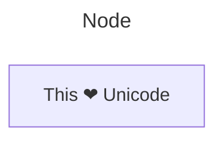
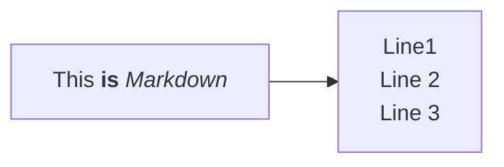
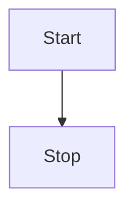
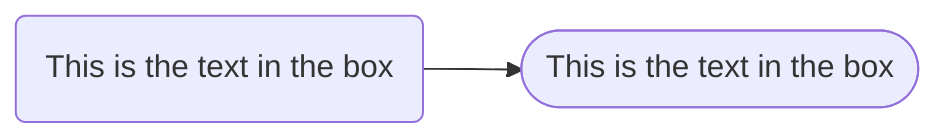
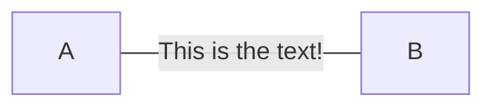
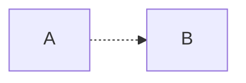
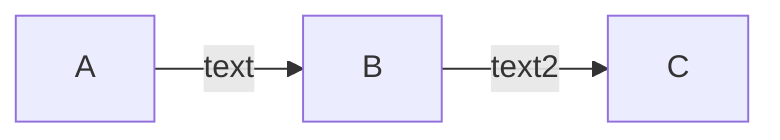
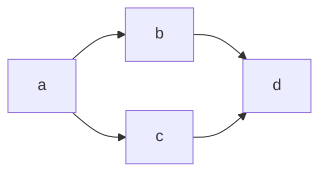
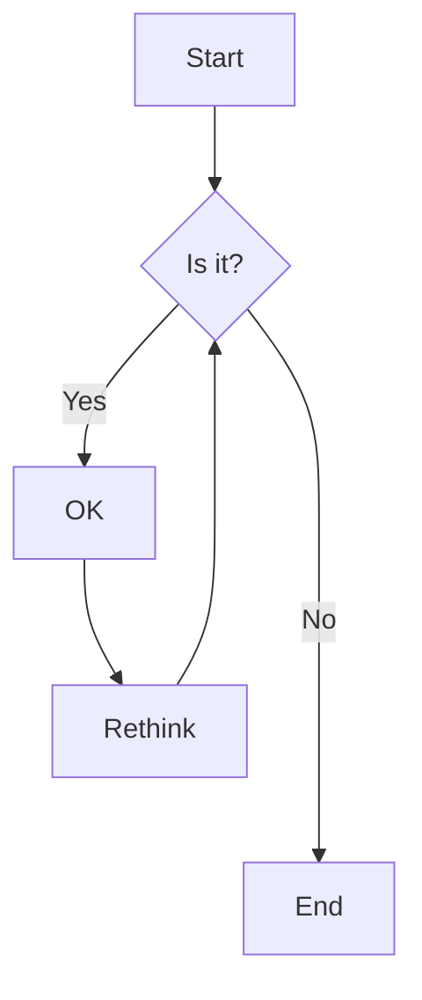

# Mermaid

Mermaid 是基于 JavaScript 的图表工具，可渲染 Markdown 启发的文本定义以动态创建和修改图表。[官方文档](https://mermaid.nodejs.cn/)

## 图语法

所有图表定义都以图表类型的声明开始，后面是图表及其内容的定义。该声明通知解析器代码应该生成哪种图表。

```javascript
erDiagram
          CUSTOMER }|..|{ DELIVERY-ADDRESS : has
          CUSTOMER ||--o{ ORDER : places
          CUSTOMER ||--o{ INVOICE : "liable for"
          DELIVERY-ADDRESS ||--o{ ORDER : receives
          INVOICE ||--|{ ORDER : covers
          ORDER ||--|{ ORDER-ITEM : includes
          PRODUCT-CATEGORY ||--|{ PRODUCT : contains
          PRODUCT ||--o{ ORDER-ITEM : "ordered in"

```

### 流程图

流程图由节点（几何形状）和边（箭头或线条）组成。

#### 节点文本和形状



使用 `"` 将 unicode 文本括起来。



使用双引号和反引号 "`text`" 将 Markdown 文本括起来。



TD 或 TB 表示流程图是从上到下的；LR 表示从左到右；另外还有 BT 和 LR。



不同的括号组合代表不同的节点形状。

#### 节点之间的连接

`-->`带箭头的链接。


`-- Text -->带文本的链接。



`-.->`虚线链接。



`A-->B-->C`连续链接。



`a --> b & c--> d`同一行中声明多个节点的链接。



当链接较多时，每一行声明一个箭头。



## 集成

Typora 原生支持 Mermaid 语法，只需要插入代码块并指定语言为 mermaid 即可渲染图表。
