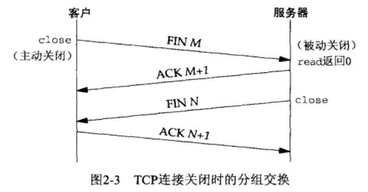
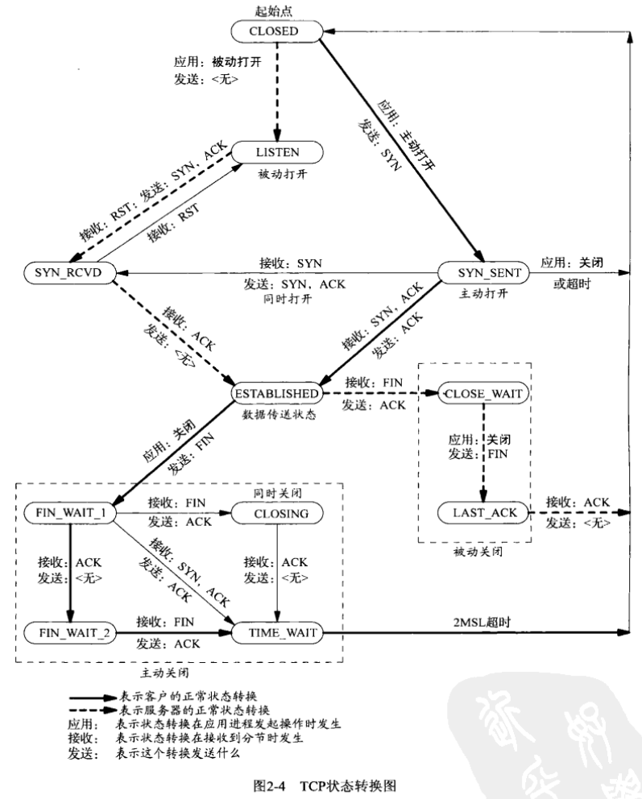
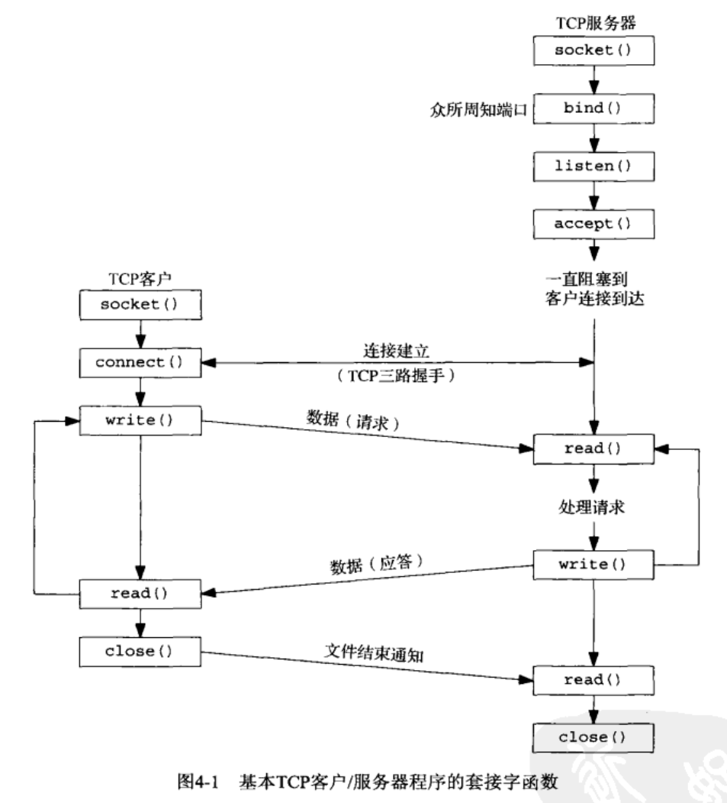
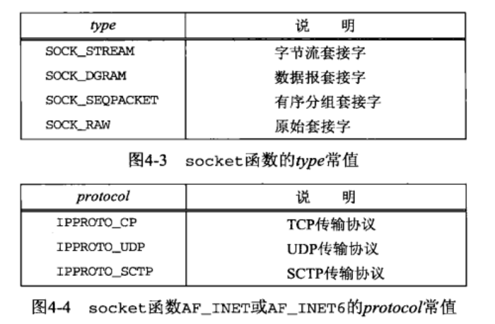
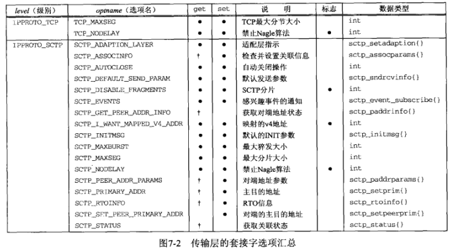
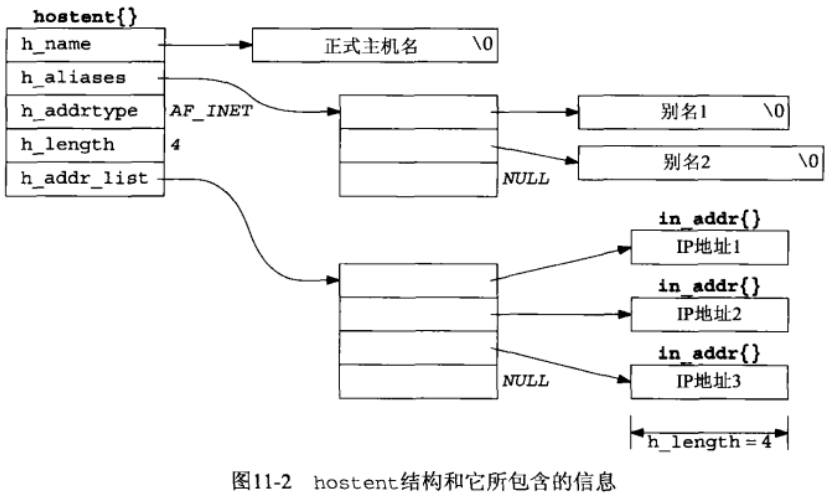

# Unix网络编程

## 目录

[第1章 简介和TCP/IP](#第1章-简介和tcpip)  
[第3章 套接字编程简介](#第3章-套接字编程简介)  
[第4章 基本TCP套接字编程](#第4章-基本tcp套接字编程)  
[第5章 TCP客户/服务器程序示例](#第5章-tcp客户服务器程序示例)  
[第6章 I/O复用：select和poll函数](#第6章-io复用select和poll函数)  
[第7章 套接字选项](#第7章-套接字选项)  
[第11章 名字与地址转换](#第11章-名字与地址转换)  
[第16章 非阻塞式I/O](#第16章-非阻塞式io)

## 第1章 简介和TCP/IP

### 网络拓扑

```cpp
netstat -i(n)            // 提供网络接口的信息,-n输出数值地址
netstat -r               // 展示路由表
ifconfig eth0            // 获取每个接口的详细信息
ping -b 206.168.112.127  // 找到本地网络中众多主机的IP地址
```

### TCP

#### 三次握手

建立一个TCP连接时会发生下述情景：


1. 服务器必须准备好接收外来的连接，通常通过调用socket、bind和listen函数来完成，称之为被动打开(passive open)。
2. 客户通过调用connect发起主动打开(active open)，这导致客户发送一个SYN（同步）分节，它告诉服务器将在连接中发送数据的初始序列号。
3. 服务器必须确认（ACK）客户的SYN，同时自己也发送一个SYN分节，它含有服务器将在同一连接中发送的数据的初始序列号。
4. 客户确认服务器的SYN。

#### TCP选项

每一个SYN可以含有多个TCP选项：

* MSS选项。最大分节大小，即它在本连接的每个TCP分节中接受的最大数据量。
* 窗口规模选项。
* 时间戳选项。

#### 四次挥手

TCP建立一个连接需要3个分节，终止一个连接则需4个分节：


1. 某个应用进程调用close，称该端执行主动关闭(active close)，该端的TCP发送一个FIN分节，表示数据发送完毕。
2. 接收到这个FIN的对端执行被动关闭(passive close)，它发送一个确认(ACK)给发送端应用进程。FIN的接受也作为一个文件结束符传递给接收端应用进程。
3. 一段时间后，接收到这个文件结束符的应用进程将调用close关闭它的套接字，这导致它的TCP也发送一个FIN。
4. 接受这个FIN的原发送端确认这个FIN。

#### TCP状态转换图



##### TIME_WAIT状态

该状态的持续时间是最长生命分节期（MSL）的两倍，称之为2MSL。理由：

1. 可靠地实现TCP全双工连接的终止。
2. 允许老的重复分节在网络中消逝。

#### 端口号

端口号被划分成3段：

1. 众所周知的端口为0~1023。这些端口号由IANA分配和控制。
2. 已登记的端口为1024~49151。
3. 49152~65535是动态的或私有的端口。它们就是我们所称的临时端口。

#### 套接字对

一个TCP连接的套接字对是一个定义该连接的两个端点的四元组：本地IP地址、本地TCP端口号、外地IP地址、外地TCP端口号。标识每个端点的两个值（IP地址和端口号）通常称为一个套接字。

#### 缓冲区大小及限制

数据链路的硬件规定了最大传输单元MTU，两个主机间路径中最小的MTU称为路径MTU(path MTU)。  
IPv4数据报的最大大小是65535字节，包括IPv4首部。  
IPv6数据报的最大大小是65575字节，包括40字节的IPv6首部。  
当一个IP数据报的大小超过相应链路的MTU，将执行分片。  
最小重组缓冲区大小是IPv4和IPv6的任何实现都必须保证支持的最小数据报大小。

## 第3章 套接字编程简介

### 套接字地址结构


IPv4套接字地址结构

```cpp
struct in_addr 
{
    in_addr_t s_addr;   /* 32-bit IPv4 address */
};  /* network byet orered */
 
stuct sockaddr_in
{
    uint8_t  sin_len;     /* length of structure */
    sa_familyt sin_family;     /* AF_INET */
    in_port_t  sin_port;     /* 16-bit TCP or UDP port number */
                 /* network byet orered */
    struct in_addr sin_addr; /* 32-bit IPv4 address */
                 /* network byet orered */
    char  sin_zero[8]     /* unused */
};

```

通用套接字地址结构

```cpp
struct sockaddr {
    uint8_t        sa_len;
    unsigned short sa_family;    // address family, AF_XXXX
    char           sa_data[14];  // 14 bytes of protocol address
};
// 唯一用途是对指向特定于协议的套接字地址结构的指针执行类型强制转换。
```

IPv6套接字地址结构

```cpp
struct in6_addr{
    unint8_t s6_addr[16]; /*128-bit IPv6 address*/
                        /*network byte ordered*/
};

#define SIN6_LEN

struct sockaddr_in6{
    uint8_t     sin6_len;         /*len of this struct*/
    sa_family_t sin6_family;      /*AF_INET6*/
    in_port_t   sin6_port;        /*transport layer port*/
                                  /*network byte ordered*/
    uint32_t    sin6_flowinfo;    /*flow information,undefine*/
    struct in6_addr sin6_addr;    /*IPv6 address*/
                                  /*network byte ordered*/
    uint32_t    sin6_scope_id;    /*set of interfaces for a scope*/
};
```

新的通用套接字地址结构

```cpp
struct sockaddr_storage
{
 uint8_t  ss_len;  /* length of this structure (implementation dependent)*/
 sa_family_t ss_family; /* address family :AF_xxx value */
 /* implementation-dependent elements to provide:
  * a) alignment sufficient to fulfill the alignment requirements of
  *    all socket address types that the system supports.
  * b) enough storage to hold any type of socket address that the
  *    system supports.
     */
};
```

### 网络字节序


主机字节序与网络字节序转换

```cpp
#include <netinet/in.h>

// 将主机字节序转换为网络字节序
// 返回：网络字节序的值
 unit32_t htonl (unit32_t hostlong);
 unit16_t htons (unit16_t hostshort);

 // 将网络字节序转换为主机字节序
 // 返回：主机字节序的值
 unit32_t ntohl (unit32_t netlong);
 unit16_t ntohs (unit16_t netshort);
```

### 字节操纵函数

BSD函数

```cpp
#include <strings.h>

void bzero(void *dest, size_t nbytes);
void bcopy(const void *src, void *dest, size_t nbytes);
int bcmp(const void *ptr1, const void *ptr2, size_t nbytes);
```

ANSI C函数

```cpp
#include <string.h>

void *memset(void *dest, int c, size_t len);
void *memcpy(void *dest, const void *src, size_t nbytes);
int memcmp(const void *ptrl1, const void *ptrl2, size_t nbytes)
```

### 地址转换函数


数值格式（numeric）和表达格式（presentation）之间转换

```cpp
#include <arpa/inet.h>

int inet_pton(int family, const char *strptr, void *addrptr);
const char *inet_ntop(int family, const void *addrptr, char *strptr, size_t len);
```

### 读写套接字函数

readn

```cpp
#include "unp.h"

ssize_t      /* Read "n" bytes from a descriptor. */
readn(int fd, void *vptr, size_t n)
{
    size_t nleft;
    ssize_t nread;
    char *ptr;

    ptr = vptr;
    nleft = n;
    while (nleft > 0) {
        if ( (nread = read(fd, ptr, nleft)) < 0) {
            if (errno == EINTR)
                nread = 0;  /* and call read() again */
            else
                return(-1);
        } else if (nread == 0)
            break;    /* EOF */

        nleft -= nread;
        ptr   += nread;
    }
    return(n - nleft);  /* return >= 0 */
}
/* end readn */

ssize_t
Readn(int fd, void *ptr, size_t nbytes)
{
 ssize_t  n;

 if ( (n = readn(fd, ptr, nbytes)) < 0)
  err_sys("readn error");
 return(n);
}
```

writen

```cpp
#include "unp.h"

ssize_t      /* Write "n" bytes to a descriptor. */
writen(int fd, const void *vptr, size_t n)
{
 size_t  nleft;
 ssize_t  nwritten;
 const char *ptr;

 ptr = vptr;
 nleft = n;
 while (nleft > 0) {
  if ( (nwritten = write(fd, ptr, nleft)) <= 0) {
   if (nwritten < 0 && errno == EINTR)
    nwritten = 0;  /* and call write() again */
   else
    return(-1);   /* error */
  }

  nleft -= nwritten;
  ptr   += nwritten;
 }
 return(n);
}
/* end writen */

void
Writen(int fd, void *ptr, size_t nbytes)
{
 if (writen(fd, ptr, nbytes) != nbytes)
  err_sys("writen error");
}
```

readline

```cpp
#include "unp.h"

static int read_cnt;
static char *read_ptr;
static char read_buf[MAXLINE];

static ssize_t
my_read(int fd, char *ptr)
{

 if (read_cnt <= 0) {
again:
  if ( (read_cnt = read(fd, read_buf, sizeof(read_buf))) < 0) {
   if (errno == EINTR)
    goto again;
   return(-1);
  } else if (read_cnt == 0)
   return(0);
  read_ptr = read_buf;
 }

 read_cnt--;
 *ptr = *read_ptr++;
 return(1);
}

ssize_t
readline(int fd, void *vptr, size_t maxlen)
{
 ssize_t n, rc;
 char c, *ptr;

 ptr = vptr;
 for (n = 1; n < maxlen; n++) {
  if ( (rc = my_read(fd, &c)) == 1) {
   *ptr++ = c;
   if (c == '\n')
    break; /* newline is stored, like fgets() */
  } else if (rc == 0) {
   *ptr = 0;
   return(n - 1); /* EOF, n - 1 bytes were read */
  } else
   return(-1);  /* error, errno set by read() */
 }

 *ptr = 0; /* null terminate like fgets() */
 return(n);
}

ssize_t
readlinebuf(void **vptrptr)
{
 if (read_cnt)
  *vptrptr = read_ptr;
 return(read_cnt);
}
/* end readline */

ssize_t
Readline(int fd, void *ptr, size_t maxlen)
{
 ssize_t  n;

 if ( (n = readline(fd, ptr, maxlen)) < 0)
  err_sys("readline error");
 return(n);
}
```

## 第4章 基本TCP套接字编程

### 基本套接字函数



#### socket函数

socket函数指定通信协议类型

```cpp
#include <sys/socket.h>

int socket(int family, int type, int protocol);
// 若成功返回非负描述符，否则返回-1
```





#### connect函数

TCP客户用connect函数建立与服务器的连接

```cpp
#include <sys/socket.h>

int connect(int sockfd, const struct sockaddr *servaddr, socklen_t addrlen);
// 若成功返回0，否则返回-1
```

#### bind函数

bind函数把一个本地协议地址赋予一个套接字

```cpp
#include <sys/socket.h>

int bind(int sockfd, const struct sockaddr *myaddr, socklen_t addrlen);
// 若成功返回0，否则返回-1
```


#### listen函数

listen函数仅由TCP服务器调用

```cpp
#include <sys/socket.h>

int listen(int sockfd, int backlog);
// 若成功返回0，否则返回-1
```

内核为任何一个给定的监听套接字维护两个队列


不同backlog值时已排队的实际数目


#### accept函数

accept函数由TCP服务器调用，从已完成连接队列队头返回下一个已完成连接

```cpp
#include <sys/socket.h>

int accept(int sockfd, struct sockaddr *cliaddr, socklen_t *addrlen);
// 若成功返回非负描述符，否则返回-1
```

#### getsockname和getpeername函数

```cpp
#include <sys/socket.h>

int getsockname(int sockfd, struct sockaddr *localaddr, socklen_t *addrlen);
int getpeername(int sockfd, struct sockaddr *peeraddr, socklen_t *addrlen);
// 均返回：若成功则为0，若出错则为-1
```

使用场景：

1. 在一个没有调用bind的TCP客户上，connect成功返回后，getsockname用于返回内核赋予该连接的本地IP地址和本地端口号。
2. 在以端口号0（告知内核选择本地端口号）调用bind后，getsockname用于返回内核赋予的本地端口号。
3. getsockname可用于获取某个套接字的地址族。
4. 在一个以通配地址调用bind的TCP服务器上，与某个客户的连接一旦建立，就可以调用getsockname返回由内核赋予该连接的本地IP地址。
5. 当一个服务器是由调用过accept的某个进程调用exec执行程序时，getpeername用于获取客户身份。

### 并发服务器

#### fork和exec函数

fork有两个典型用法：  

1. 一个进程创建一个自身的副本。
2. 一个进程想要执行另一个程序。首先调用fork创建一个自身的副本，然后其中一个副本调用exec将自身替换为新的程序。

```cpp
#include <unistd.h>

pid_t fork(void);
// 返回:在子进程中为0，在父进程中为子进程ID，若出错则为-1

int execl(const char *pathname, const char *arg0, ... /* (char *) 0*/ );
int execv (const char *pathname, char *const *argv[]);
int execle (const char *pathname, const char *arg0, ...
            /*( char * ) 0, char *const envp [ ] */);
int execve(const char *pathname, char *const argv[], char *const envp []);
int execlp(const char *filename, const char *arg0, ... /* (char *) 0*/ );
int execvp(const char *filename, char *const argv[]);
//均返回：若成功则不返回，若出错则为-1
```

exec函数族


#### close函数

close函数也用来关闭套接字，并终止TCP连接

```cpp
#include <unistd.h>

int close(int sockfd);
// 若成功返回0，否则返回-1
```

调用close函数使描述符引用计数减1，当引用计数为0，才会引发TCP的连接终止。

## 第5章 TCP客户&服务器程序示例

### TCP回射服务器程序

```cpp
#include "unp.h"

int
main(int argc, char **argv)
{
 int     listenfd, connfd;
 pid_t    childpid;
 socklen_t   clilen;
 struct sockaddr_in cliaddr, servaddr;

 // 创建一个TCP套接字，绑定服务器的端口
    listenfd = Socket(AF_INET, SOCK_STREAM, 0);

 bzero(&servaddr, sizeof(servaddr));
 servaddr.sin_family      = AF_INET;
 servaddr.sin_addr.s_addr = htonl(INADDR_ANY);
 servaddr.sin_port        = htons(SERV_PORT);

 Bind(listenfd, (SA *) &servaddr, sizeof(servaddr));

 Listen(listenfd, LISTENQ);

 for ( ; ; ) {
  // 服务阻塞于accept调用，等待客户完成连接
        clilen = sizeof(cliaddr);
  connfd = Accept(listenfd, (SA *) &cliaddr, &clilen);

  // 并发服务器，为每个客户派生一个子进程
        if ( (childpid = Fork()) == 0) { /* child process */
   Close(listenfd); /* close listening socket */
   // 回射函数
            str_echo(connfd); /* process the request */
   exit(0);
  }
  Close(connfd);   /* parent closes connected socket */
 }
}

// 读入缓冲区并回射其中内容
void
str_echo(int sockfd)
{
 ssize_t  n;
 char  buf[MAXLINE];

again:
 // read函数从套接字读入数据，writen函数把内容回射给客户
    while ( (n = read(sockfd, buf, MAXLINE)) > 0)
  Writen(sockfd, buf, n);

 // 如果客户关闭连接，返回0，函数退出；否则循环
    if (n < 0 && errno == EINTR)
  goto again;
 else if (n < 0)
  err_sys("str_echo: read error");
}
```

### TCP回射客户程序

```cpp
#include "unp.h"

int
main(int argc, char **argv)
{
 int     sockfd;
 struct sockaddr_in servaddr;

 if (argc != 2)
  err_quit("usage: tcpcli <IPaddress>");

 // 创建TCP套接字，用服务器IP地址和端口号装填网际网套接字地址结构
    sockfd = Socket(AF_INET, SOCK_STREAM, 0);

 bzero(&servaddr, sizeof(servaddr));
 servaddr.sin_family = AF_INET;
 servaddr.sin_port = htons(SERV_PORT);
 Inet_pton(AF_INET, argv[1], &servaddr.sin_addr);

 // 连接到服务器
    Connect(sockfd, (SA *) &servaddr, sizeof(servaddr));

 // 处理回射工作
    str_cli(stdin, sockfd);  /* do it all */

 exit(0);
}

// TCP回射函数
void
str_cli(FILE *fp, int sockfd)
{
 char sendline[MAXLINE], recvline[MAXLINE];

 // 每次读入一行，直到遇到文件结束符
    while (Fgets(sendline, MAXLINE, fp) != NULL) {

  // 发送给服务器
        Writen(sockfd, sendline, strlen(sendline));

  // 从服务器读到回射行，并写到标准输出
        if (Readline(sockfd, recvline, MAXLINE) == 0)
   err_quit("str_cli: server terminated prematurely");

  Fputs(recvline, stdout);
 }
}
```

### 处理僵死进程

注意事项

1. 当fork子进程时，必须捕获SIGCHLD信号
2. 当捕获信号时，必须处理被中断的系统调用
3. SIGCHLD的信号处理函数必须正确编写，应使用waitpid函数以免留下僵死进程

## 第6章 I/O复用：select和poll函数

### I/O模型


#### 阻塞式I/O


#### 非阻塞式I/O


当所请求的I/O操作非得把本进程投入睡眠才能完成时，不要把本进程投入睡眠，而是返回一个错误。

#### I/O复用


调用select或poll，阻塞在这两个系统调用中，而不是阻塞在真正的I/O系统调用上。

#### 信号驱动式I/O


让内核在描述符就绪时发送SIGIO信号通知程序。

#### 异步I/O


告知内核启动某个操作，并让内核在整个操作完成后通知程序。

### select函数


函数原型

```cpp
#include <sys/select.h>
#include <sys/time.h>

int select(int nfds, fd_set *readfds, fd_set *writefds, fd_set *exceptfds, struct timeval *timeout);
```

#### 参数

nfds：监控的文件描述符集里最大文件描述符加1，因为此参数会告诉内核检测前多少个文件描述符的状态
readfds：监控有读数据到达文件描述符集合，传入传出参数
writefds：监控写数据到达文件描述符集合，传入传出参数
exceptfds：监控异常发生达文件描述符集合,如带外数据到达异常，传入传出参数
fd_set类型：位图
timeout：定时阻塞监控时间，3种情况

1. NULL，永远等下去
2. 设置timeval，等待固定时间
3. 设置timeval里时间均为0，检查描述字后立即返回，轮询

```cpp
struct timeval {
    long tv_sec; /* seconds */
    long tv_usec; /* microseconds */
};
```

#### 返回值

成功：所监听的所有监听集合（readfds + writefds + exceptfds）中，满足条件的总数。  
失败：-1

#### 配套使用的接口

```cpp
void FD_CLR(int fd, fd_set *set);  // 把文件描述符集合里fd清0
int FD_ISSET(int fd, fd_set *set);  // 测试文件描述符集合里fd是否置1
void FD_SET(int fd, fd_set *set);  // 把文件描述符集合里fd位置1
void FD_ZERO(fd_set *set);       // 把文件描述符集合里所有位清0
```

### poll函数

```cpp
#include <poll.h>

int poll(struct pollfd *fdarray, unsigned long nfds, int timeout);
// 返回就绪描述符的个数，若出错，返回-1

struct pollfd {
    int fd;
    short events;
    short revents;
}
```

## 第7章 套接字选项

### getsockopt和setsockopt函数

函数原型

```cpp
#include <sys/socket.h>

int getsockopt(int sock, int level, int optname, void *optval, socklen_t *optlen);
int setsockopt(int sock, int level, int optname, const void *optval, socklen_t optlen);
// if success return 0, else return -1
```

参数

1. sock：指向一个的打开的套接字描述符，也就是将要被设置或者获取选项的套接字。
2. level：所在协议，或为通用套接字，或为某个特定协议（例如IPv4、IPv6、TCP或SCTP）

    ```cpp
    SOL_SOCKET     // 通用套接字
    IPPROTO_IP     // IPv4套接字
    IPPROTO_IPV6   // IPv6套接字
    IPPROTO_TCP    // TCP套接字
    ```

3. optname：需要访问的选项名。
4. optval：分为两大类型
   1. 标识选项：为0表示相应的选项被禁止，不为零表示该选项被启用。标有“标识”的列表示这是标识选项。
   2. 值选项：设置或检查特定值。
5. optlen：对于getsockopt()，作为入口参数，为选项值的最大长度。对于setsockopt()，作为出口参数，为选项值的实际长度。

选项



### 通用套接字选项

#### SO_REUSEADDR

一般来说，一个端口释放后会等待两分钟之后才能再被使用，SO_REUSEADDR是让端口释放后立即就可以被再次使用。  
SO_REUSEADDR用于对TCP套接字处于TIME_WAIT状态下的socket，才可以重复绑定使用。  
server程序总是应该在调用bind()之前设置SO_REUSEADDR套接字选项
TCP，先调用close()的一方会进入TIME_WAIT状态。
SO_REUSEADDR提供如下四个功能：

1. 允许启动一个监听服务器并捆绑其众所周知端口，即使以前建立的将此端口用做他们的本地端口的连接仍存在。这通常是重启监听服务器时出现，若不设置此选项，则bind时将出错
2. 允许在同一端口上启动同一服务器的多个实例，只要每个实例捆绑一个不同的本地IP地址即可。对于TCP，我们根本不可能启动捆绑相同IP地址和相同端口号的多个服务器。
3. 允许单个进程捆绑同一端口到多个套接口上，只要每个捆绑指定不同的本地IP地址即可。这一般不用于TCP服务器。
4. SO_REUSEADDR允许完全重复的捆绑：当一个IP地址和端口绑定到某个套接口上时，还允许此IP地址和端口捆绑到另一个套接口上。一般来说，这个特性仅在支持多播的系统上才有，而且只对UDP套接口而言（TCP不支持多播）。

## 第11章 名字与地址转换

### IP地址和域名之间的转换

gethostbyname

```cpp
#include <netdb.h>

struct hostent *gethostbyname(const char *hostname);
// 若成功，返回一个gostent结构指针，结构中含有所查找主机的所有IPv4地址；否则返回NULL

struct hostent {
    char *h_name;         //正式主机名
    char **h_aliases;     //主机别名
    int h_addrtype;       //主机IP地址类型：IPV4-AF_INET
    int h_length;    //主机IP地址字节长度，对于IPv4是四字节，即32位
    char **h_addr_list;   //主机的IP地址列表
};
```


gethostbyaddr

```cpp
#include <netdb.h>
 
struct hostent * gethostbyaddr(const char * addr , socklen_t len , int family);
 
//成功时返回hostent结构体变量地址值，失败时返回NULL指针。
 
/* 变量含义 */
// addr：含有IP地址信息的in_addr结构体指针。为了同时传递IPv4地址之外的其他信息，该变量的类型声明为char指针
// len：向第一个参数传递的地址信息的字节数，IPv4时为4，IPv6时为16
// family：传递地址族信息，IPv4时为AF_INET，IPv6时为AF_INET6
```

### 根据名字和端口号查找服务

getservbyname

```cpp
#include <netdb.h>

struct servent *getservbyname(const char *servname, const char *protoname);

// 返回：成功为非空指针，否则为NULL且设置h_errno
```

getservbyport

```cpp
#include <netdb.h>

struct servent *getservbyport(int port, const char *protoname);

// 返回：成功为非空指针，否则为NULL且设置h_errno
// 注意：port参数的值必须为网络字节序
```

servent结构

```cpp
struct servent {
    char  *s_name;
    char  **s_aliases;
    int     s_port;
    char  *s_proto;
};
```

### getaddrinfo函数

函数原型

```cpp
#include<netdb.h>

int getaddrinfo(const char *restrict nodename,
                    const char *restrict servname,
                    const struct addrinfo *restrict hints,
                    struct addrinfo **restrict res);
// 若成功，返回0；否则非0
```


参数

1. nodename：主机名或者是数字化的地址字符串（IPv4的点分十进制串或IPv6的16进制串）。
2. servname：服务名可以是十进制的端口号("8080")字符串，也可以是已定义的服务名称，如"ftp"、"http"等。
3. hints：该参数指向用户设定的`struct addrinfo`
4. 结构体，只能设定该结构体中`ai_family、ai_socktype、ai_protocol 和 ai_flags`四个域，其他域必须设置为0或者NULL, 通常是申请结构体变量后使用memset()初始化再设定指定的四个域。  
该参数可以设置为NULL，等价于`ai_socktype = 0, ai_protocol = 0, ai_family = AF_UNSPEC, ai_flags = 0`
   1. ai_family：指定返回地址的协议簇，取值AF_INET(IPv4)、AF_INET6(IPv6)、AF_UNSPEC(IPv4 and IPv6)
   2. ai_socktype：用于设定返回地址的socket类型，有SOCK_STREAM、SOCK_DGRAM、SOCK_RAW，设置为0表示所有类型。
   3. ai_socktype：协议IPPROTO_TCP、IPPROTO_UDP等，设置为0表示所有协议。
   4. ai_flags：附加选项，多个选项可以使用或操作进行结合。  

#### 配套函数

gai_strerror

```cpp
#include <netdb.h>

const char *gai_strerror(int error);
// 返回：指向错误描消息字符串的指针
```

freeaddrinfo

```cpp
#include <netdb.h>

void freeaddrinfo(struct addrinfo *ai);
// 释放结构链表中的所有结构
```

getnameinfo

```cpp
#include <sys/socket.h>
#include <netdb.h>

int getnameinfo(const struct sockaddr *sa, socklen_t salen,
                    char *host, size_t hostlen,
                    char *serv, size_t servlen, int flags);
// 以一个套接字地址为参数，返回描述其中的主机的一个字符串和描述其中服务的另一个字符串。
// 返回：若成功则为0
```

## 第16章 非阻塞式I/O

### 阻塞的套接字调用


可能阻塞的套接字调用可分为以下四类：

1. 输入操作：read、readv、recv、recvfrom和recvmsg
2. 输出操作：write、writev、send、sendto和sendmsg
3. 接受外来连接：accept
4. 发起外出连接：connect

### 非阻塞式的套接字调用


select/poll/epoll等多路复用API返回的事件并不一定可读写的，因此最好搭配非阻塞 I/O，以便应对极少数的特殊情况。例如，当数据已经到达，但经检查后发现有错误的校验和而被丢弃时，就会发生这种情况。

#### select

select函数见第6章

```cpp
#include <stdio.h>
#include <sys/socket.h>
#include <sys/types.h>
#include <netinet/in.h>
#include <fcntl.h>

#include <unistd.h>

#include <pthread.h>
#include <sys/select.h>
#include <string.h>

#define PORT 9999
#define START_FD 3
#define BUFFER_LENGTH 128

int main(void)
{
    int listen_fd, conn_fd;
    // 创建监听套接字
 listen_fd = socket(AF_INET, SOCK_STREAM, 0);
 if (listen_fd == -1) return -1;
    
    // 设置监听套接字地址并绑定
 struct sockaddr_in serv_addr, client_addr;
    socklen_t client_len;
 serv_addr.sin_family = AF_INET;
 serv_addr.sin_addr.s_addr = htonl(INADDR_ANY);
 serv_addr.sin_port = htons(PORT);

 if (-1 == bind(listen_fd, (struct sockaddr*)&serv_addr, sizeof(serv_addr))) {
  return -2;
 }

    // 将监听套接字设置为非阻塞，以便select可以非阻塞地监听
 int flag = fcntl(listen_fd, F_GETFL, 0);
 flag |= O_NONBLOCK;
 fcntl(listen_fd, F_SETFL, flag);

 listen(listen_fd, 128);

    // 由于每次有读写事件会调用FD_SET改变r_fds, w_fds，因此需要r_set, w_set作备份
    fd_set r_fds, w_fds;
    fd_set r_set, w_set; 

    FD_ZERO(&r_fds);
    FD_SET(listen_fd, &r_fds); // 监听listen_fd的读事件

    FD_ZERO(&w_fds);
    int max_fd = listen_fd;

    unsigned char buf[BUFFER_LENGTH] = {0};
    int n_ready, ret = 0;


    while (1) {
        r_set = r_fds;
        w_set = w_fds;
        // 使用select阻塞等待读写事件就绪。r_set用于监听读事件，w_set用于监听写事件。
        n_ready = select(max_fd + 1, &r_set, &w_set, NULL, NULL); // 阻塞等待IO读写事件就绪
        
        // 当有新的连接请求时，执行相应的处理。
        if (FD_ISSET(listen_fd, &r_set)) {
            printf("listen_fd --> \n");
            client_len = sizeof(client_addr);
            conn_fd = accept(listen_fd, (struct sockaddr*)&client_addr, &client_len); 

            FD_SET(conn_fd, &r_fds); // 将conn_fd添加到r_fds中监听
            
            if (conn_fd > max_fd) {
                max_fd = conn_fd;
            }
        }

        // 处理已连接的客户端套接字上的读写事件
        for (int i = START_FD; i <= max_fd; i++) {
            if (FD_ISSET(i, &r_set)) {
                ret = recv(i, buf, sizeof(buf), 0);
                // 说明客户端断开了连接
                if (ret == 0) {
                    close(i);
                    FD_CLR(i, &r_fds);
                } else if (ret > 0) {
                    printf("buf : %s, ret : %d\n", buf, ret);
                    FD_SET(i, &w_fds); // 将fd添加到写集合中
                } else {
                    close(i);
                    FD_CLR(i, &r_fds);
                }
            } else if (FD_ISSET(i, &w_set)) {
                ret = send(i, buf, ret, 0);

                FD_CLR(i, &w_fds); // 将fd从写集合中删除
                FD_SET(i, &r_fds);
            }
        }
    }
    return 0;
}
```

### epoll

epoll是Linux下多路复用IO接口select/poll的增强版本，它能显著提高程序在大量并发连接中只有少量活跃的情况下的系统CPU利用率。

#### 机制

select的缺点：

1. 每次调用select都需要将进程加入到所有监视socket的等待队列，每次唤醒都需要从每个队列中移除（两次遍历），并且每次都要将整个fds列表传递给内核。
2. 进程被唤醒后，需要遍历寻找哪些socket收到数据。

epoll的方案：

1. epoll 在内核里使用红黑树来跟踪进程所有待检测的文件描述字，把需要监控的socket通过`epoll_ctl()`函数加入内核中的红黑树里，红黑树是个高效的数据结构，增删查一般时间复杂度是 O(logn)，通过对这棵黑红树进行操作，这样就不需要像select/poll每次操作时都传入整个socket集合，只需要传入一个待检测的socket，减少了内核和用户空间大量的数据拷贝和内存分配。
2. epoll使用事件驱动的机制，内核里维护了一个链表来记录就绪事件，当某个socket有事件发生时，通过回调函数内核会将其加入到这个就绪事件列表中，当用户调用`epoll_wait()`函数时，只会返回有事件发生的文件描述符的个数，不需要像select/poll那样轮询扫描整个socket集合，大大提高了检测的效率。


#### 两种模式

水平触发（level-triggered，LT）

* socket读触发：socket接收缓冲区有数据，会一直触发epoll_wait EPOLLIN事件，直到数据被用户读取完。
* socket写触发：socket可写，会一直触发epoll_wait EPOLLOUT事件。

边缘触发（edge-triggered，ET）

* socket读触发：socket数据从无到有，只会会触发一次epoll_wait EPOLLIN事件。用户检测到事件后，需一次性把socket接收缓冲区数据全部读取完，读取完的标志为recv返回-1，errno为EAGAIN。
* socket写触发：socket可写，会触发一次epoll_wait EPOLLOUT事件。

两种模式比较：
水平触发epoll_wait的系统调用次数更多，效率较低；边缘触发I/O事件发生时只会通知一次，因此需要尽可能地读写数据，以免错失读写的机会。

#### 接口


epoll_create

```cpp
int epoll_create(int size);   // size：监听数量，现已无意义
// 返回文件描述符epfd，该文件描述符指向epoll维护的红黑树的根节点
```

epoll_ctl

```cpp
int epoll_ctl(int epfd, int op, int fd, struct epoll_event *event);
// epfd: 为epoll_creat的句柄
/* op: 表示动作，用3个宏来表示：
    EPOLL_CTL_ADD (注册新的fd到epfd)，
    EPOLL_CTL_MOD (修改已经注册的fd的监听事件)，
    EPOLL_CTL_DEL (从epfd删除一个fd)；*/
// fd：表示要监听的文件描述符
// epoll_event：告诉内核需要监听的事件
struct epoll_event {
    __uint32_t events; /* Epoll events */
    epoll_data_t data; /* User data variable */
};
/* events取值: 
    EPOLLIN ： 表示对应的文件描述符可以读（包括对端SOCKET正常关闭）
   EPOLLOUT： 表示对应的文件描述符可以写
   EPOLLPRI： 表示对应的文件描述符有紧急的数据可读（这里应该表示有带外数据到来）
   EPOLLERR： 表示对应的文件描述符发生错误
   EPOLLHUP： 表示对应的文件描述符被挂断
   EPOLLET：  将EPOLL设为边缘触发(Edge Triggered)模式，这是相对于水平触发(Level Triggered)而言的
   EPOLLONESHOT：只监听一次事件，当监听完这次事件之后，如果还需要继续监听这个socket的话，需要再次把这个socket加入到EPOLL队列里 */

typedef union epoll_data {
    void *ptr;
    int fd;
    uint32_t u32;
    uint64_t u64;
} epoll_data_t;
```

epoll_wait

```cpp
#include <sys/epoll.h>
int epoll_wait(int epfd, struct epoll_event *events, int maxevents, int timeout);
// events：  用来存内核得到事件的集合；
// maxevents： 告之内核这个events有多大，这个maxevents的值不能大于创建epoll_create()时的size；
/* timeout：超时时间
    -1： 阻塞
    0：     立即返回，非阻塞
    >0： 指定毫秒 */
// 返回值：成功，返回有多少文件描述符就绪；超时，返回0；出错，返回-1
```

### Reactor和Proactor

#### Reactor模式

Reactor指“对事件反应”。I/O多路复用（select/epoll等）监听事件，收到事件后，根据事件类型分配（Dispatch）给某个进程/线程，Reactor模式也叫Dispatcher模式。  
Reactor模式主要由两个核心部分组成：

1. Reactor：负责监听和分发事件
2. 处理资源池：负责处理事件

Reactor模式有三种方案：

1. 单Reactor单进程/线程

Reactor对象监听和分发事件，如果是建立连接的事件，则分发给Acceptor对象；否则分发给Handler对象。  

2. 单Reactor多进程/线程

Handler对象不再负责业务处理，只负责数据的接收和发送，Handler对象读取到数据后，会将数据发给子线程里的 Processor对象进行业务处理。处理完后，将结果发回主线程中的Handler对象，接着由Handler将响应结果发送给client；

3. 多Reactor多进程/线程

主线程中的MainReactor对象监控连接建立事件，收到事件后通过Acceptor对象中的accept获取连接，将新的连接分配给某个子线程。子线程中的SubReactor对象对分配的连接继续进行监听，并创建一个Handler用于处理连接的响应事件。

#### Proactor模式

阻塞I/O或非阻塞I/O都是同步调用，因为内核将数据从内核空间拷贝到用户空间的过程都是需要等待的，也就是说这个过程是同步的。如果内核实现的拷贝效率不高，read/send调用就会在这个同步过程中等待比较长的时间。  
异步I/O不需要在“内核数据准备好”和“数据从内核态拷贝到用户态”这两个过程等待。当发起异步I/O之后，就立即返回。内核自动将数据从内核空间拷贝到用户空间，这个拷贝过程同样是异步的，内核自动完成后发送通知。

Proactor模式的工作流程：

1. Proactor Initiator负责创建Proactor和Handler对象，并将Proactor和Handler都通过异步操作处理器注册到内核。
2. 异步操作处理器负责处理注册请求，并处理I/O操作。
3. 完成I/O操作后通知Proactor。
4. Proactor根据不同的事件类型回调不同的Handler进行业务处理。

#### 比较

* Reactor 是非阻塞同步网络模式，感知的是就绪可读写事件。在每次感知到有事件发生（比如可读就绪事件）后，就需要应用进程主动将socket接收缓存中的数据读到缓冲区中。这个过程是同步的，读取完数据后应用进程才能处理数据。
* Proactor是异步网络模式，感知的是已完成的读写事件。在发起异步读写请求时，需要传入数据缓冲区的地址（用来存放结果数据）等信息，系统内核自动把数据的读写工作完成。操作系统完成读写工作后，就会通知应用进程直接处理数据。

*在Linux下的aio系列异步I/O函数，是由POSIX定义的异步操作接口。aio的实现不是真正的操作系统级别支持的，而是在用户空间模拟出来的异步，并且仅仅支持基于本地文件的aio异步操作，不支持网络编程中的socket，这也使得过去基于Linux的高性能网络程序都是使用Reactor方案。  
而Windows里实现了一套完整的支持socket的异步编程接口IOCP，是由操作系统级别实现的、真正意义上异步I/O，因此在Windows里实现高性能网络程序可以使用效率更高的Proactor方案。  
2019年，Linux内核加入了`io_uring`，减少了在用户空间和内核空间之间的数据拷贝，并降低系统调用的开销，从而提高I/O操作的性能。*

#### io_uring

##### 缩略词

SQ：提交队列  
CQ：完成队列  
SQE：提交队列项  
CQE：完成队列项

##### 初始化

初始化io_uring

```cpp
long io_uring_setup(u32 entries, struct io_uring_params __user *params);
// 该函数返回一个fd，并将io_uring支持的功能以及各个数据结构在fd中的偏移量存入params。
```


在 io_setup 返回的时候，内核已经初始化好了SQ和CQ，此外，内核还提供了一个Submission Queue Entries（SQEs）数组。

之所以额外采用了一个数组保存SQEs，是为了方便通过RingBuffer提交内存上不连续的请求。SQ和CQ中每个节点保存的都是SQEs数组的偏移量，而不是实际的请求，实际的请求只保存在SQEs数组中。  
但由于SQ，CQ，SQEs是在内核中分配的，所以用户态程序并不能直接访问。因此io_setup的返回一个fd，应用程序通过这个fd进行内存映射（mmap）操作，和kernel共享内存。

##### I/O提交

I/O提交的做法是找到一个空闲的SQE，根据请求设置SQE，并将这个SQE的索引放到SQ中。SQ是一个RingBuffer，有head，tail两个成员，如果`head == tail`，意味着队列为空。SQE设置完成后，需要修改SQ的tail，以表示向RingBuffer中插入一个请求。  
当所有I/O请求都加入SQ后，调用`io_uring_enter`来提交请求。

```cpp
int io_uring_enter(unsigned int fd, u32 to_submit, u32 min_complete, u32 flags);
```

如果在调用`io_uring_setup`时设置了`IORING_SETUP_SQPOLL`的flag，内核会额外启动一个内核线程，称为SQ线程。这个内核线程可以运行在某个指定的core上（通过`sq_thread_cpu`配置）。这个内核线程会不停的Poll SQ，除非在一段时间内没有Poll到任何请求（通过`sq_thread_idle`配置），才会被挂起，由此减少系统调用`io_uring_enter`的次数。

##### I/O收割

当I/O完成时，内核负责将完成I/O在SQEs中的index放到CQ中。由于内核和用户态共享内存，因此只需在用户态遍历CQ，就能获取完成的I/O队列，之后找到相应的CQE并进行处理，最后移动head指针到tail，I/O收割就完成了。  
由于I/O在提交的时候可以顺便返回完成的I/O，所以在最理想的情况下，I/O提交和收割都不需要使用系统调用。

##### 交互方式


用户提交：

1. 将SQE写入SQEs区域，然后将SQE编号写入SQ。
2. 更新用户态记录的队头。
3. 如果有多个任务需要同时提交，不断重复1, 2。
4. 将最终的队头编号写入与内核共享的SQ head。


完成任务：

1. 内核态获取任务：从队尾读取SQE，并更新SQ tail。
2. 内核态完成任务：往CQ中写入CQE，并更新CQ head。
3. 用户态收割任务：从CQ中读取CQE，更新CQ tail。
